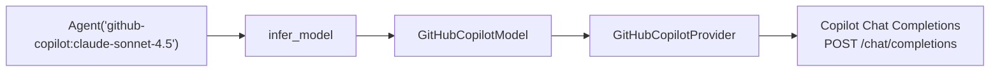
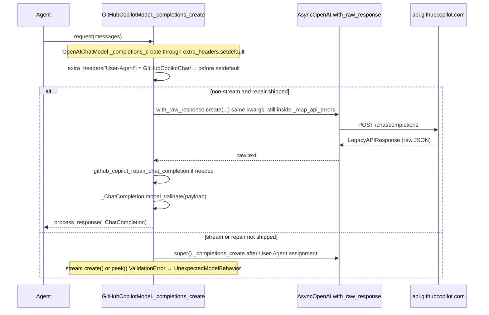

# GitHubCopilotProvider for Pydantic AI

| Field | Value |
| --- | --- |
| Author | Pydantic AI maintainers |
| Date | 2026-09-03 |
| Status | Draft |
| Audience | Pydantic AI maintainers; implementers of the follow-up PR |
| Decision already made | Pydantic AI **will** add a first-class `GitHubCopilotProvider`. This is a general public API. It is not a gh-aw-specific hack. |

This document is the spec for a plan-only PR. It does not implement code.

Issue: [#8057](https://github.com/pydantic/pydantic-ai/issues/8057)

**Closed, do not reopen:** prefix `github-copilot:`; leave `github:` / `GitHubProvider` alone until v3; v1 transport is Chat Completions only; wire IDs sent verbatim; no `KnownModelName` catalog; no device flow; no gh-aw-named knobs.

---

## Overview

GitHub Models (`GitHubProvider`, prefix `github:`) was retired on 2026-07-30 and is `@deprecated` for v3 removal. Docs already tell users GitHub recommends Azure AI Foundry or GitHub Copilot. There is no Copilot provider today. Anyone with a Copilot subscription who wants Pydantic AI is forced onto `openai-chat:<id>` plus a Copilot-proxy `OPENAI_BASE_URL`, which infers `OpenAIProvider.model_profile` → `openai_model_profile`. For a bare Claude id such as `claude-sonnet-4.5`, that function matches nothing OpenAI-specific, so `supports_thinking` is false, thinking is silently dropped, and sampling / strict-output / JSON-schema transformation follow OpenAI defaults.

This spec adds an additive prefix `github-copilot:` backed by `GitHubCopilotProvider` (auth, base URL, required Copilot headers, family profile map) and a thin `GitHubCopilotModel(OpenAIChatModel)` (Chat Completions transport, Copilot User-Agent, and — **only if the live probe observes the defect** — raw-JSON repair of Anthropic-native Chat Completions bodies). Users write `Agent('github-copilot:claude-sonnet-4.5')`. The retired `github:` prefix and `GitHubProvider` are left untouched until v3.

v1 speaks Copilot's Chat Completions surface only. Copilot is not a clean OpenAI clone. v1 does **not** implement LiteLLM's three-transport matrix. Claude thinking on `/chat/completions` is **not a v1 feature** (documented follow-up: `/v1/messages`); unified `thinking` is still forwarded as `reasoning_effort` so a Copilot 400 is visible instead of today's silent drop. Implementation runs a split live-probe checklist (required A / best-effort B). Messages (`/v1/messages`) and Responses (`/responses`) are explicit follow-up PRs.

---

## Background & Motivation

### Current state in this repo

- `pydantic_ai_slim/pydantic_ai/providers/github.py` — `GitHubProvider.name == 'github'`, base `https://models.github.ai/inference`, env `GITHUB_API_KEY`, `@deprecated` with `PydanticAIDeprecationWarning`. Always used with `OpenAIChatModel`. Profile map is publisher-prefix (`xai/`, `meta/`, `microsoft/`, …); bare names go to `openai_model_profile`.
- `docs/models/openai.md` "GitHub Models" section already states the retirement and that GitHub recommends Azure AI Foundry or GitHub Copilot.
- `infer_provider_class` / `OpenAIChatCompatibleProvider` list `github`. `Provider.name` is load-bearing for message-history replay (`providers/__init__.py`); silently reusing or renaming `github` is forbidden.
- There is no `github-copilot` string anywhere in this repository.
- `OpenAIChatModel.request` calls `self.client.chat.completions.create` then `_process_response`. The OpenAI SDK parses JSON into `chat.ChatCompletion` **before** `_process_response` / `_validate_completion`. `_validate_completion` receives an already-parsed `ChatCompletion` and is the wrong hook for Anthropic-native bodies.
- `OpenAIChatModel._completions_create` does `extra_headers.setdefault('User-Agent', get_user_agent())` (`pydantic-ai/<version>`). A client `default_headers` User-Agent loses to that `setdefault`.
- `OpenAIChatModel._process_thinking` reads a **string** on `openai_chat_thinking_field`, then `reasoning`, then `reasoning_content`. It does not read `thinking_blocks`.
- `_map_usage` (`models/openai.py`) reads Chat Completions usage as `prompt_tokens` / `completion_tokens` (api_flavor `'chat'`).
- `ThinkingPart.signature` exists for Anthropic/Bedrock/Google/OpenAI encrypted blobs. The Chat Completions send-back path (`_map_response_thinking_part`) reserializes thinking as a **string** field or tags — not as Anthropic `{type: thinking, signature}` blocks.
- `anthropic_model_profile` sets `supports_thinking=True` for every Claude id it returns, and `anthropic_disallows_sampling_settings` for `claude-fable-5`, `claude-mythos-5`, `claude-opus-4-7`/`4-8`/`5`, `claude-sonnet-5`. `OpenAIChatModel` does not read `anthropic_*` keys; it honors `openai_unsupported_model_settings`.
- OpenRouter / Cerebras / Ollama / Z.AI / Snowflake / Crusoe have their own Model class, checked in `infer_model` **before** the `OpenAIChatCompatibleProvider` catch-all. Vercel does not.

### The gap that made this visible

gh-aw's pydantic-ai engine currently:

1. Strips `copilot/` from `engine.model`.
2. Rewrites Claude hyphenated IDs to dotted IDs (`claude-sonnet-4-5` → `claude-sonnet-4.5`) on the Copilot proxy path.
3. Invokes `pai -m openai-chat:<id>` with a Copilot-proxy `OPENAI_BASE_URL`.

That path infers `OpenAIProvider`, whose `model_profile` is `openai_model_profile(model_name)`. For `claude-sonnet-4.5`:

- `supports_thinking` is false → unified `thinking` is dropped in `Model.prepare_request`.
- Sampling, `reasoning_effort`, strict-output, and the JSON-schema transformer follow OpenAI defaults, not Anthropic.

Douwe Maan (pair review of pydantic/pydantic-ai-harness #708, 2026-08-27) asked for a GitHub Copilot provider, not a revival of GitHub Models: map `copilot/` → `github-copilot:` and let the pydantic-ai provider own profiles and ID mapping.

The dotted-ID rewrite currently lives in a workflow file. It is provider knowledge. Combined with `models/AGENTS.md` (no capability split on `base_url`) and gh-aw's "custom `PAI_BASE_URL` gets the id verbatim" rule, v1 **sends the user-supplied id unchanged**.

### Product framing

- **Primary user:** any Python developer with a Copilot subscription who wants `Agent('github-copilot:claude-sonnet-4.5')`.
- **Secondary user:** gh-aw engine, after a pydantic-ai release, swapping `openai-chat:` for `github-copilot:` and deleting the dotted-ID shim.
- Do not design APIs whose only justification is gh-aw. A custom `base_url` is the general OpenAI-compatible escape hatch (already on `OpenAIProvider` / `OllamaProvider`), not a gh-aw-named parameter.
- Leave `GitHubProvider` / `github:` unchanged until v3 removal. New prefix must not collide.

### Contribution-bar check

`docs/contributing.md` "Rules for adding new models": a new model that reuses another model's logic with no extra dependency needs the vendor GitHub org to have > 20k stars. GitHub Copilot reuses the OpenAI extra and GitHub's org is well above that bar. This is in-bounds as a first-party provider.

---

## Goals & Non-Goals

### Goals

- Additive public prefix `github-copilot:` that constructs a Copilot-authenticated OpenAI-compatible client and a family-correct `ModelProfile`.
- `Agent('github-copilot:claude-sonnet-4.5')` and `Agent('github-copilot:gpt-5.4')` work for a user with a Copilot token, without wrapping `OpenAIProvider`.
- Family profile mapping by **bare model-id prefix** (Copilot IDs are not `provider/model`).
- Custom `base_url` so Copilot-compatible gateways (gh-aw api-proxy, enterprise hosts, local proxies) work without forking the provider.
- Docs, tests, and skill prefix table updated in the same implementation PR.
- Default behavior of every existing prefix, including `github:` and `openai-chat:`, unchanged.

### Non-goals (v1)

- Reviving, renaming, or changing behavior of `GitHubProvider` / `github:`.
- Changing gh-aw / pydantic-ai-harness in this repo (consumer follow-up after release).
- Copilot embeddings, realtime, CLI BYOK, or a generated agent module / MCP config / clai flags.
- Implementing LiteLLM's full Chat / Messages / Responses matrix in v1.
- Device-flow OAuth inside the library.
- A closed `KnownModelName` catalog of every Copilot id (the catalog churns weekly).
- A `github-copilot` extra (reuse `openai`).
- A token cap / `max_tokens` default.
- Pinning or changing LLM model versions.
- Pydantic AI Gateway route for Copilot.
- Pretending to be VS Code beyond the headers the Copilot API actually requires.
- Claude thinking as a working v1 feature (follow-up: `/v1/messages`).
- Streaming repair of Anthropic-native SSE (fail-closed; see Model).
- A `GitHubCopilotModelProfile` TypedDict (no Copilot-specific profile key is read in v1).

---

## Evidence (not folklore)

GitHub Copilot is **not** a clean single OpenAI Chat Completions clone. Independent implementations disagree on transport. v1 has to pick a strategy with this evidence on the page.

### 1. models.dev (`https://models.dev/providers/github-copilot`)

| Fact | Value |
| --- | --- |
| Provider id | `github-copilot` |
| API | `https://api.githubcopilot.com` |
| Package | `@ai-sdk/openai-compatible` |
| Model IDs | **Bare**: `claude-sonnet-4.5`, `claude-haiku-4.5`, `gpt-5.4`, `gemini-3.5-flash`, `claude-fable-5`, `claude-opus-4.7`, `claude-opus-4.8`, `claude-opus-5`, `claude-sonnet-5`, `grok-4.5`, `kimi-k3`, `mai-code-1.1-flash`, … — **not** `anthropic/claude-…` |
| Reasoning | Yes on most Claude / GPT-5 / Gemini / Grok / Kimi / MAI rows |
| Temperature | **No** on: `claude-fable-5`, `claude-opus-4.7`, `claude-opus-4.8`, `claude-opus-5`, `claude-sonnet-5`, `gpt-5-mini`, `gpt-5.2-codex`, `gpt-5.5`, `gpt-5.6-luna`, `gpt-5.6-sol`, `gpt-5.6-terra`, `kimi-k2.7-code`, `kimi-k3` |

This is the closest thing to a public catalog. IDs are dotted on Claude (`claude-sonnet-4.5`), not hyphenated.

### 2. LiteLLM (`litellm/llms/github_copilot/`)

Three transports: `chat/`, `messages/`, `responses/`. Default Chat Completions base `https://api.githubcopilot.com`. Auth is OAuth device-flow then **GET** `https://api.github.com/copilot_internal/v2/token` — not a raw `GITHUB_TOKEN` as the inference bearer. Docs also allow `GITHUB_COPILOT_API_BASE` for GHE.

Required / injected headers (`get_copilot_default_headers` in `common_utils.py`):

```
Authorization: Bearer <copilot api key>
copilot-integration-id: vscode-chat
editor-version: vscode/1.95.0
editor-plugin-version: copilot-chat/<version>
user-agent: GitHubCopilotChat/<version>
openai-intent: conversation-panel
x-github-api-version: 2025-04-01
x-request-id: <uuid>
```

Plus per-request: `X-Initiator: user|agent` (agent if any tool/assistant message), `Copilot-Vision-Request: true` when the body has images. LiteLLM also sends `x-vscode-user-agent-library-version: electron-fetch` — v1 does **not**, unless the omit-probe 400s.

Live API requirement, not folklore: LiteLLM issues [#13256](https://github.com/BerriAI/litellm/issues/13256) and [#18475](https://github.com/BerriAI/litellm/issues/18475) — Copilot returns `400 missing Editor-Version header for IDE auth` when `editor-version` is absent. pi found `copilot-developer-cli` as `Copilot-Integration-Id` returns **403**; `vscode-chat` works.

Newer Claude models (opus-4.7 / 4.8) return Anthropic-native content blocks **without** an OpenAI `choices` array — or with `choices: []` ([BerriAI/litellm#30927](https://github.com/BerriAI/litellm/issues/30927)) — on the Chat Completions path. LiteLLM synthesizes `choices` (`GithubCopilotConfig._synthesize_choices_for_anthropic_native`, [BerriAI/litellm#29391](https://github.com/BerriAI/litellm/issues/29391)) by reading `raw_response.json()`, rewriting, **rebuilding `httpx.Response`**, then running the OpenAI parser. That helper's `thinking_blocks` field is **not** what `OpenAIChatModel._process_thinking` reads.

Claude thinking on Chat Completions is not a solved problem. [BerriAI/litellm#28053](https://github.com/BerriAI/litellm/issues/28053) reports a live probe (quoted):

```
POST https://api.individual.githubcopilot.com/chat/completions
{ "model": "claude-haiku-4.5", "reasoning_effort": "high", ... }
→ 400 { "code": "invalid_reasoning_effort",
        "message": "model claude-haiku-4.5 does not support reasoning effort" }

POST https://api.individual.githubcopilot.com/v1/messages
{ "model": "claude-haiku-4.5", "thinking": { "type": "enabled", "budget_tokens": 16000 }, ... }
→ 200 { "content": [ { "type": "thinking", ... }, { "type": "text", ... } ] }
```

LiteLLM docs: "For GPT Codex models, only responses API is supported."

LiteLLM still documents `/chat/completions` as the primary supported endpoint.

### 3. pi (earendil-works)

Routes Copilot models by ID:

- Claude 4/5 (`claude-(haiku|sonnet|opus|fable)-[45]`) → Anthropic Messages API
- `gpt-5*`, `grok-*`, `oswe*`, `mai-*` → OpenAI Responses API
- else → OpenAI Chat Completions
- Default base `https://api.individual.githubcopilot.com`
- Token `proxy-ep` field selects host (`proxy.individual.githubcopilot.com` → `api.individual.githubcopilot.com`)
- Same required headers; `Copilot-Integration-Id: vscode-chat`

pi's OAuth notes: for non-enterprise github.com users the GitHub token can sometimes be used without exchange; enterprise needs the Copilot token endpoint. That split is unverified here and is a probe item.

### 4. GitHub Copilot SDK (official)

Streaming `assistant.usage.apiEndpoint` is typed as `"/chat/completions" | "/v1/messages" | "/responses" | "ws:/responses"`. Copilot's own service is multi-transport. Auth docs ([Authenticating the Copilot SDK](https://docs.github.com/copilot/how-tos/copilot-sdk/authenticate-copilot-sdk/authenticate-copilot-sdk)):

Supported user tokens: `gho_` (OAuth), `ghu_` (GitHub App user-to-server), `github_pat_` (fine-grained PAT with **Copilot Requests**). **Classic PAT `ghp_` is not supported.**

Env precedence for **user tokens**: `COPILOT_GITHUB_TOKEN` → `GH_TOKEN` → `GITHUB_TOKEN`. Direct **exchanged inference token**: `GITHUB_COPILOT_API_TOKEN` with `COPILOT_API_URL`.

### 5. gh-aw api-proxy (different surface)

OpenAI Chat Completions compatible. Publishes Copilot Claude models under **dotted** IDs. Rejects `copilot/<model>` with `model_not_supported`. Custom `PAI_BASE_URL` endpoints must receive the workflow ID **verbatim** (no dotted rewrite).

This is a consumer constraint on ID policy, not a second Copilot API.

### 6. Host variants

| Host | Source |
| --- | --- |
| `https://api.githubcopilot.com` | models.dev, LiteLLM default |
| `https://api.individual.githubcopilot.com` | pi default; LiteLLM #28053 probe |
| `https://api.business.githubcopilot.com` | LiteLLM comments / enterprise docs |
| `https://api.enterprise.githubcopilot.com` | LiteLLM comments |
| `https://copilot-api.<ghe-host>` | LiteLLM `GITHUB_COPILOT_API_BASE` for GHE |

v1 default is `https://api.githubcopilot.com` (widest documented). Custom `base_url` covers the rest.

### What this evidence does **not** say

- Chat Completions is sufficient for Claude thinking. It is not, on the #28053 probe.
- Chat Completions is sufficient for GPT Codex. LiteLLM says Responses-only.
- Chat Completions bodies are always OpenAI-shaped. opus-4.7/4.8 have been observed otherwise — **repair ships only if this repo's live probe sees it**.
- A three-SDK adapter is required for a useful v1.

---

## Proposed Design

### Shape in one paragraph

v1 is an OpenAI-compatible **gateway overlay** in the OpenRouter/Cerebras family, not a new vendor SDK. `GitHubCopilotProvider` subclasses `OpenAICompatibleProvider`, owns auth / base URL / HTTP lifecycle / static Copilot headers / `model_profile()`. `GitHubCopilotModel` is a thin `OpenAIChatModel` subclass whose **always-on** job is Copilot `User-Agent` (parent `setdefault` would send `pydantic-ai/…`). Its **probe-gated** job is to intercept the **raw JSON** of a non-stream Chat Completions response **before** the OpenAI SDK parses `ChatCompletion`, rewrite Anthropic-native bodies into JSON that `_process_response` actually reads, then return a `chat.ChatCompletion`. `infer_model('github-copilot:<id>')` returns `GitHubCopilotModel`. Extra is `openai`. Prefix is `github-copilot`. `Provider.name` is `'github-copilot'`.

This is the default architecture. Probe-triggered diffs are an explicit allow-list at the end of this section — not a second live design.





### Why not three transports in v1

A family-routed Chat / Responses / Messages adapter would pull in `AsyncOpenAI` **and** `AsyncAnthropic`, invent a router keyed on model-name prefixes, and still be wrong the week Copilot moves a model across endpoints. Pydantic AI's rule is: providers own auth and HTTP; profiles own family facts; model adapters own one wire format.

v1 therefore speaks **one** wire format (Chat Completions) through **one** SDK (`openai`). If the live probe (checklist A) cannot complete a basic `Agent.run('hi')` for **both** `gpt-5.4` and `claude-sonnet-4.5`, implementation **stops** and we split a Messages/Responses PR rather than shipping a dead prefix.

### Module layout

| Path | Role |
| --- | --- |
| `pydantic_ai_slim/pydantic_ai/providers/github_copilot.py` | `GitHubCopilotProvider`; optional `exchange_github_copilot_token` (allow-list) |
| `pydantic_ai_slim/pydantic_ai/models/github_copilot.py` | `GitHubCopilotModel`; module-level `github_copilot_repair_chat_completion` (only if repair ships) |
| `docs/models/github-copilot.md` | User-facing provider page |
| `docs/api/providers.md` | Autodoc `GitHubCopilotProvider` |
| `docs/api/models/github-copilot.md` | Autodoc `GitHubCopilotModel` |
| `tests/providers/test_github_copilot.py` | Construction, env, headers, profile routing |
| `tests/models/test_github_copilot.py` | VCR + `request_capture` |
| `tests/models/cassettes/test_github_copilot/` | VCR layout: `Path(test_file).parent / 'cassettes' / module` |

Do not put Copilot logic in `providers/github.py`.

### Provider

Subclass `OpenAICompatibleProvider` (`providers/_openai_compatible.py`). Constructor overloads match Vercel/OpenRouter **plus** `base_url` (OpenAIProvider/OllamaProvider escape hatch):

```python
class GitHubCopilotProvider(OpenAICompatibleProvider):
    @property
    def name(self) -> str:
        return 'github-copilot'

    @property
    def base_url(self) -> str:
        return str(self.client.base_url)

    @overload
    def __init__(self, *, openai_client: AsyncOpenAI) -> None: ...

    @overload
    def __init__(
        self,
        *,
        api_key: str | None = None,
        base_url: str | None = None,
        openai_client: None = None,
        http_client: _OpenAIHTTPClient | None = None,
    ) -> None: ...
```

**`api_key` resolution, in order:**

1. `api_key=` argument
2. `GITHUB_COPILOT_API_KEY` (pydantic-ai `{PROVIDER}_API_KEY`)
3. `GITHUB_COPILOT_API_TOKEN` (GitHub's name for the exchanged `tid=…;exp=…;proxy-ep=…` inference bearer)
4. `COPILOT_GITHUB_TOKEN` (GitHub's name for a user token intended for Copilot)

Then `missing_api_key_error(...)` naming `GITHUB_COPILOT_API_KEY` (the string `tests/providers/test_provider_names.py` matches) and `GitHubCopilotProvider(api_key=...)`. The error may also mention the two aliases.

**Deliberately not read:** `GITHUB_TOKEN`, `GH_TOKEN`, `GITHUB_API_KEY`.

If `api_key` (after resolution) starts with `ghp_`, raise `UserError` (classic PATs are unsupported — Copilot CLI / SDK docs). Same check in the exchange helper if that helper ships.

**`base_url` resolution, in order:**

1. constructor `base_url=`
2. `GITHUB_COPILOT_BASE_URL`
3. `COPILOT_API_URL` (GitHub SDK)
4. `GITHUB_COPILOT_API_BASE` (LiteLLM)
5. `https://api.githubcopilot.com`

No `/v1` suffix: Copilot Chat Completions is `POST /chat/completions` on that host (LiteLLM PR [#12418](https://github.com/BerriAI/litellm/pull/12418)). `AsyncOpenAI(base_url=...)` appends `/chat/completions`.

`openai_client` is reused as-is; `api_key` / `base_url` / `http_client` must be `None` (same asserts as `OpenAIProvider`). Copilot headers are **not** injected onto a prebuilt client (same as OpenRouter attribution headers).

#### Closed v1 header set

One version constant, shared by User-Agent and plugin version:

```python
GITHUB_COPILOT_VERSION = '0.26.7'
GITHUB_COPILOT_USER_AGENT = f'GitHubCopilotChat/{GITHUB_COPILOT_VERSION}'
GITHUB_COPILOT_EDITOR_PLUGIN_VERSION = f'copilot-chat/{GITHUB_COPILOT_VERSION}'
```

**Always sent** as `AsyncOpenAI(default_headers=...)` when the provider builds the client:

| Header | Value |
| --- | --- |
| `editor-version` | `vscode/1.95.0` |
| `copilot-integration-id` | `vscode-chat` |
| `editor-plugin-version` | `copilot-chat/0.26.7` |
| `openai-intent` | `conversation-panel` |
| `x-github-api-version` | `2025-04-01` |

**Always sent on the request** by `GitHubCopilotModel` (not only `default_headers`): `User-Agent: GitHubCopilotChat/0.26.7`. Assignment, not `setdefault`, so the parent cannot win.

**Not sent in v1 unless the omit-probe 400s** (allow-list): `x-request-id`, `x-vscode-user-agent-library-version`, `X-Initiator`, `Copilot-Vision-Request`.

If that allow-list fires:

- `X-Initiator`: `agent` iff any mapped Chat Completions message has `role` in `('tool', 'assistant')`; else `user`. Set on the request in `_completions_create`.
- `Copilot-Vision-Request: true` iff the outbound messages contain an `ImageUrl`, a `BinaryImage`, or a `BinaryContent` with `.is_image`.
- `x-request-id`: one UUID per request, set in `_completions_create`.

These are Copilot API requirements, not "pretend to be VS Code". Docs say so in those words.

### Model

```python
GitHubCopilotModelName = str

@dataclass(init=False)
class GitHubCopilotModel(OpenAIChatModel):
    def __init__(
        self,
        model_name: GitHubCopilotModelName,
        *,
        provider: Literal['github-copilot'] | Provider[AsyncOpenAI] = 'github-copilot',
        profile: ModelProfileSpec | None = None,
        settings: ModelSettings | None = None,
    ) -> None:
        super().__init__(model_name, provider=provider, profile=profile, settings=settings)
```

No `LatestGitHubCopilotModelNames` Literal. No `GitHubCopilotModelSettings` in v1.

`infer_model` (`models/__init__.py`): branch **before** the `OpenAIChatCompatibleProvider` catch-all, next to `openrouter` / `cerebras` / `ollama` / `zai` / `snowflake`:

```python
elif model_kind == 'github-copilot':
    from .github_copilot import GitHubCopilotModel
    return GitHubCopilotModel(model_name, provider=provider)
```

Also add `'github-copilot'` to `OpenAIChatCompatibleProvider` so `OpenAIChatModel(..., provider='github-copilot')` type-checks.

#### Named overrides (closed list)

| Method | Override? | Job |
| --- | --- | --- |
| `__init__` | yes | Signature above; `super().__init__(...)`. |
| `_completions_create` | yes | Delta on the parent method (below). User-Agent; repair-path `with_raw_response`; stream `ValidationError` → `UnexpectedModelBehavior`. |
| `_process_response` | **no** | Runs on `_ChatCompletion` after repair/validate. |
| `_process_thinking` | **no** | Reads the string `reasoning` field the repair JSON provides. |
| `_validate_completion` | **no** | Already-parsed body. Repair uses `_ChatCompletion.model_validate` directly, the same model this hook uses. |
| `_map_messages` | **no** | v1 does not round-trip Anthropic thinking signatures. |
| `prepare_request` | **no** | |
| `_process_streamed_response` | yes, wrap `peek()` only | Fail-closed Anthropic-native SSE → `UnexpectedModelBehavior`. |

Import `_ChatCompletion` from `pydantic_ai.models.openai` with `pyright: ignore[reportPrivateUsage]`, the same as `OpenRouterModel`.

#### `_completions_create` is a delta on the parent, not a new client call

No `OpenAIChatModel` subclass in this repo currently overrides `_completions_create`. Do not invent a parallel kwargs builder. `GitHubCopilotModel._completions_create` is `OpenAIChatModel._completions_create` (`models/openai.py`) with **only** these deltas. An implementation comment cites that method as the source of truth for every pre-`create` line and every `.create(...)` keyword argument.

**Always (every path):** keep `_get_tool_choice`, `_map_messages`, JSON `response_format`, `OpenAIChatModelSettings(**model_settings)`, `_drop_sampling_params_for_reasoning`, `_drop_unsupported_params`. Keep the `with _map_api_errors(self.model_name, self._provider.model_id_namespace):` block and the `except APIStatusError` / `_check_azure_content_filter` handler. After `extra_headers = dict(model_settings.get('extra_headers', {}))`, **assign** `extra_headers['User-Agent'] = GITHUB_COPILOT_USER_AGENT` **before** the existing `extra_headers.setdefault('User-Agent', get_user_agent())` (the `setdefault` becomes a no-op). Optional allow-list headers (`X-Initiator`, `Copilot-Vision-Request`, `x-request-id`) go on that same dict.

Then branch:

1. **`stream is True`, or repair has not shipped.** Merge the mutated `extra_headers` back onto `model_settings` and `return await super()._completions_create(...)`. That preserves every future parent kwarg. When `stream is True`, wrap that `super()` call: `ValidationError` (and SDK JSON parse errors that are not already `ModelHTTPError`) become `UnexpectedModelBehavior` with the Messages follow-up sentence. Do **not** catch `ModelHTTPError` — `_map_api_errors` already mapped HTTP 4xx/5xx.

2. **`stream is False` and repair has shipped.** Do **not** `super()`. Stay in the copied parent body. Replace **only** the line `return await self.client.chat.completions.create(...)` with:

```python
raw = await self.client.chat.completions.with_raw_response.create(
    # identical keyword arguments to the parent .create(...) call
)
payload = json.loads(raw.text)  # LegacyAPIResponse.text, a str property
if github_copilot_needs_repair(payload):
    payload = github_copilot_repair_chat_completion(payload)
elif _choices_missing_or_empty(payload):
    raise UnexpectedModelBehavior(
        f'Invalid response from {self.system} chat completions endpoint, '
        'missing Chat Completions choices and no representable content'
    )
try:
    return _ChatCompletion.model_validate(payload)
except ValidationError as e:
    raise UnexpectedModelBehavior(
        f'Invalid response from {self.system} chat completions endpoint: {e}'
    ) from e
```

That `with_raw_response.create(...)` stays inside the parent's `_map_api_errors` `try`. Do **not** call `raw.parse()` on an unrepaired body — that is the SDK `ChatCompletion` parse that drops top-level Anthropic `content` and rejects Copilot `service_tier='on_demand'`.

`_ChatCompletion` (`models/openai.py`) exists specifically for OpenAI-compatible providers: `service_tier: str | None`. `chat.ChatCompletion.model_validate` rejects `'on_demand'` (LiteLLM #30927 Copilot bodies include it). Every non-stream body on the repair-shipped path — including OpenAI-shaped `gpt-5.4` that `needs_repair` is false for — goes through `_ChatCompletion.model_validate`, matching `_validate_completion`. A string `reasoning` field survives (`extra='allow'`).

If repair has **not** shipped, do not add `github_copilot_repair_chat_completion` to the module.

#### `github_copilot_needs_repair`

`_choices_missing_or_empty(payload)` is true iff `choices` is missing or `choices == []`.

`github_copilot_needs_repair(payload: dict[str, object]) -> bool` is true iff `_choices_missing_or_empty(payload)` **and** `content` is a **non-empty** `list` or a **non-empty** `str`.

- Non-empty `choices` → False. Leave OpenAI-shaped bodies alone (still `_ChatCompletion.model_validate` when repair has shipped).
- Missing/`[]` `choices` and `content` a non-empty list or non-empty str → True → `github_copilot_repair_chat_completion`.
- Missing/`[]` `choices` and `content` absent, `None`, `''`, or `[]` (LiteLLM #29391 `max_tokens=1` probe with no content) → **not** repair. Raise `UnexpectedModelBehavior` (the `elif _choices_missing_or_empty` branch above). Do not synthesize an empty `choices=[{message: {content: None}}]` unless a live probe shows that shape is a successful empty completion.

#### Repair output JSON — what `_process_response` actually reads

`github_copilot_repair_chat_completion` is a module-level function in `models/github_copilot.py`. It returns a `dict` that `_ChatCompletion.model_validate` accepts. OpenAI SDK 3.0 `ChatCompletionMessage` has `extra='allow'`, so a string `reasoning` field survives `model_validate` and `getattr(message, 'reasoning', None)` in `_process_thinking`.

**Input `content`:**

- `str` → one text blob.
- `list` of blocks with `type`:
  - `text` — representable. Concatenate `.text` / `.thinking` string fields in order.
  - `thinking` **without** `signature` (missing or null) — representable. Concatenate `.thinking` strings with `\n`.
  - `thinking` **with** a non-null `signature` — **not representable** on Chat Completions send-back. Raise `UnexpectedModelBehavior` (fail-closed; Messages follow-up).
  - `tool_use` — representable. Map to OpenAI tool_calls.
  - `redacted_thinking`, `server_tool_use`, `web_search_tool_result`, any unknown `type` — raise `UnexpectedModelBehavior`. Never drop.

**Output dict:**

```python
{
    'id': payload.get('id') or 'chatcmpl-github-copilot-synthesized',
    'object': 'chat.completion',
    'created': payload.get('created') or 0,  # _process_response fills if 0
    'model': payload.get('model') or '<GitHubCopilotModel.model_name>',
    'choices': [{
        'index': 0,
        'finish_reason': <see map>,
        'message': {
            'role': 'assistant',
            'content': <concatenated text, or None if only tool_calls>,
            # only if unsigned thinking strings exist:
            'reasoning': <concatenated thinking text>,
            # only if tool_use blocks exist:
            'tool_calls': [{
                'id': block['id'],
                'type': 'function',
                'function': {
                    'name': block['name'],
                    'arguments': (
                        block['input'] if isinstance(block.get('input'), str)
                        else json.dumps(block.get('input') or {})
                    ),
                },
            }],
        },
    }],
    # only if payload['usage'] is a dict:
    'usage': {
        'prompt_tokens': usage.get('prompt_tokens') or usage.get('input_tokens') or 0,
        'completion_tokens': usage.get('completion_tokens') or usage.get('output_tokens') or 0,
        'total_tokens': usage.get('total_tokens') or prompt_tokens + completion_tokens,
    },
}
```

`finish_reason` (`Literal['stop', 'length', 'tool_calls', 'content_filter', 'function_call']`):

1. If any `tool_use` block → `tool_calls`.
2. Else map `stop_reason`: `end_turn` / `stop_sequence` → `stop`; `tool_use` → `tool_calls`; `max_tokens` → `length`.
3. Else if text exists → `stop`.
4. Else → `stop`.
5. Unknown `stop_reason` → `stop`.

Do **not** emit LiteLLM's `thinking_blocks` key. `_process_thinking` will not read it.

When repair ships, the Copilot overlay **also** sets `openai_chat_thinking_field='reasoning'` and `openai_chat_send_back_thinking_parts='field'` so unsigned thinking round-trips as a string field. Signed thinking never reaches this path.

Unit-test fixtures (only if repair ships), asserted through `github_copilot_repair_chat_completion` **and** through `GitHubCopilotModel._process_response` on the `_ChatCompletion`:

1. opus-4.8-shaped body: top-level `content` list, **no** `choices` key, `text` + unsigned `thinking` + `tool_use`, Anthropic `usage.input_tokens` / `output_tokens`. Include `service_tier: 'on_demand'` so `_ChatCompletion` is proven, not `chat.ChatCompletion`.
2. Same blocks with `choices: []`.
3. A `thinking` block with `signature` → `UnexpectedModelBehavior`.
4. A `redacted_thinking` block → `UnexpectedModelBehavior`.
5. Missing/`[]` `choices` and `content` absent/`null`/`''`/`[]` → `UnexpectedModelBehavior` from `_completions_create`, not a pydantic `ValidationError`.

Do not treat a LiteLLM cassette cloned from #29391 as sufficient to **ship** repair. Repair ships only on a live probe observation (allow-list). Those fixtures test the function once it has shipped.

#### Streaming — fail-closed in v1

`models/AGENTS.md` wants identical processing for `request()` and `request_stream()`. v1 does **not** rewrite Anthropic-native SSE into `ChatCompletionChunk`s.

`OpenAIChatModel.request_stream` calls `_completions_create(..., stream=True)` **before** `_process_streamed_response`. A failure inside `create(stream=True)` never reaches `peek()`. Catch in **both** places, same exception text:

- **`_completions_create` when `stream is True`:** after User-Agent assignment, `super()._completions_create(...)`. Wrap `ValidationError` (and SDK JSON parse errors that are not `ModelHTTPError`) as `UnexpectedModelBehavior`. Do not catch `ModelHTTPError`.
- **`_process_streamed_response`:** wrap `await peekable_response.peek()` the same way (parent already has `_map_api_errors` around peek). Empty peek stays `UnexpectedModelBehavior` as in the parent.

The message: streaming Anthropic-native Copilot bodies is not supported in v1; `/v1/messages` is the follow-up.

Happy-path OpenAI-shaped streams (`choices[].delta`) use that `super()` path. Required VCR: stream `gpt-5.4` and `claude-sonnet-4.5`. No chunk-rewrite algorithm in v1. Probe B streamed opus-4.8 is documentation, not a v1 implementation trigger.

This is a documented v1 exception to identical processing: non-stream repair (if shipped) can succeed where stream fail-closes on the same model. The follow-up that restores both is Messages, not a Chat Completions SSE translator.

### Profile mapping (the actual product)

Copilot model IDs are bare. Mapping is by family prefix of the model id after `casefold()`. OpenRouter's `provider/model` split does not apply.

Three-layer `merge_profile` (OpenRouter's comment in `providers/openrouter.py` is the pattern):

1. **Fallback** — `OpenAIModelProfile(json_schema_transformer=OpenAIJsonSchemaTransformer)`.
2. **Family profile** — intrinsic facts from `profiles/*`.
3. **Copilot overlay** — the closed function below. Wins on every key it sets.

Do **not** introduce `GitHubCopilotModelProfile` in v1. Overlay sets `openai_*` / generic keys only.

Family routing table (prefix match on `casefold()` of the id; first hit wins). For the `anthropic_model_profile` **call only**, replace `.` with `-` (OpenRouter). Wire id is still the user-supplied string.

| Prefix | Family function |
| --- | --- |
| `claude-` | `anthropic_model_profile` (name with `.`→`-`) |
| `gpt-`, `o1`, `o3`, `o4` | `openai_model_profile` |
| `gemini-` | `google_model_profile` |
| `grok-` | `grok_model_profile` |
| `kimi-` | `moonshotai_model_profile` |
| `mai-` | `openai_model_profile` |
| `oswe`, `raptor` | `openai_model_profile` |
| unknown | none — layer 1 only; do **not** claim `supports_thinking` |

Do **not** strip a leading `copilot/` on the wire. Profile lookup may strip a leading `copilot/` so a user who passes it still gets a family profile.

#### Closed v1 overlay

```python
from pydantic_ai.profiles.openai import SAMPLING_PARAMS, OpenAIJsonSchemaTransformer, OpenAIModelProfile

_COPILOT_TEMPERATURE_NO_PREFIXES: tuple[str, ...] = (
    # models.dev Temperature: No, matched after casefold and '.' → '-'.
    'claude-fable-5',
    'claude-opus-4-7',
    'claude-opus-4-8',
    'claude-opus-5',
    'claude-sonnet-5',
    'gpt-5-mini',
    'gpt-5-2-codex',  # gpt-5.2-codex after '.' → '-'
    'gpt-5-5',
    'gpt-5-6-luna',
    'gpt-5-6-sol',
    'gpt-5-6-terra',
    'kimi-k2-7-code',  # kimi-k2.7-code
    'kimi-k3',
)

def _github_copilot_overlay(model_name: str, family: ModelProfile | None) -> OpenAIModelProfile:
    folded = model_name.casefold()
    normalized = folded.replace('.', '-')
    overlay: OpenAIModelProfile = {}

    drop_sampling = bool(family and family.get('anthropic_disallows_sampling_settings')) or any(
        normalized.startswith(prefix) for prefix in _COPILOT_TEMPERATURE_NO_PREFIXES
    )
    if drop_sampling:
        overlay['openai_unsupported_model_settings'] = SAMPLING_PARAMS

    if folded.startswith('gemini-'):
        # Copilot Chat Completions is OpenAI tools/response_format, not Gemini generateContent.
        # google_model_profile would otherwise win with GoogleJsonSchemaTransformer (merge later-wins).
        overlay['json_schema_transformer'] = OpenAIJsonSchemaTransformer

    # thinking-field keys: unset in the default overlay.
    # If repair ships: also set openai_chat_thinking_field='reasoning'
    # and openai_chat_send_back_thinking_parts='field'.
    return overlay
```

`supports_thinking` is **not** set on the overlay (not True, not False). Family values stand. Do not force True (OpenRouter does; Copilot does not accept `reasoning` universally). Do not set False to avoid Claude 400s.

`openai_chat_supports_max_completion_tokens` is **unset** (OpenAI default `True`) unless the probe 400s `max_completion_tokens` (allow-list → `False`).

`supported_native_tools` is **not** expanded. `OpenAIChatModel.supported_native_tools()` already intersects to `WebSearchTool`.

### Thinking behavior, stated as a contract

Unified `thinking` is a **feature** (`models/AGENTS.md` rule 562), not a generic tuning setting (rule 912). Today's `openai-chat:claude-sonnet-4.5` path sets `supports_thinking=False` and **drops** it — that is the bug. v1 leaves Claude family `supports_thinking=True` from `anthropic_model_profile`, so `OpenAIChatModel._translate_thinking` sends `reasoning_effort`.

**Closed default:** forward `reasoning_effort`; do **not** set overlay `supports_thinking=False`; do **not** add a Claude-family `UserError` in v1. User docs state that **Claude thinking is a follow-up** (`/v1/messages`), not a v1 feature. The 400 is the discoverability fix.

| User action | Claude family | GPT-5 / Grok (reasoning) / Kimi (`kimi-k3`, …) |
| --- | --- | --- |
| `thinking` omitted | Nothing extra sent. Completions should work. | `reasoning_effort` omitted; model default applies. |
| `thinking=True` / `'high'` | Sends `reasoning_effort`. Copilot Chat Completions has been observed to 400 `invalid_reasoning_effort`. Documented. Not a v1 feature. | Sent as `reasoning_effort`. Probe A includes GPT-5.4. |
| `thinking=False` | Sends `reasoning_effort='none'`. `OpenAIChatModel._translate_thinking` maps `False` through `OPENAI_REASONING_EFFORT_MAP`; it only omits when `thinking is None`. On Copilot Claude that can 400 the same way `'high'` does. | Same (`'none'`). |

Inbound thinking on Chat Completions: unsigned string → `reasoning` field (only if repair shipped). Signed Anthropic thinking → `UnexpectedModelBehavior`. No `_map_messages` override to replay `signature`.

### Auth

Pydantic AI providers take a bearer key from env. Device-flow OAuth is a CLI concern. v1 does not implement device flow, does not write `~/.config/…`, and does not poll `https://github.com/login/device`.

Env / constructor order is in the Provider section.

**What the user puts in the env var:** a token Copilot's inference API accepts as `Authorization: Bearer`. Documented ways (docs page, not code):

1. Fine-grained PAT (`github_pat_`) with **Copilot Requests**.
2. OAuth user token (`gho_`) from `copilot login`.
3. Exchanged Copilot API token (`GITHUB_COPILOT_API_TOKEN`, `tid=…`).

#### Token-exchange helper (allow-list only)

Ships iff probe A shows `github_pat_` / `gho_` 401 on Chat Completions **and** GET token 200.

```python
@dataclass(frozen=True)
class GitHubCopilotExchangedToken:
    token: str
    api_base: str | None  # from endpoints.api, or proxy-ep (proxy.X → https://api.X), else None

async def exchange_github_copilot_token(
    github_token: str,
    *,
    http_client: _OpenAIHTTPClient | None = None,
) -> GitHubCopilotExchangedToken:
    """GET https://api.github.com/copilot_internal/v2/token. No device flow."""
```

- Method: **GET**.
- `ghp_` → `UserError`.
- Does **not** auto-set provider `base_url` (keeps ID policy off `base_url`). Docs tell the user to pass `api_base` as `GitHubCopilotProvider(base_url=...)` when it is set.
- Lives in `providers/github_copilot.py`.
- Opt-in: `exchanged = await exchange_github_copilot_token(...); GitHubCopilotProvider(api_key=exchanged.token, base_url=exchanged.api_base)`.

### `infer_provider` / name stability

```python
elif provider == 'github-copilot':
    from .github_copilot import GitHubCopilotProvider
    return GitHubCopilotProvider
```

`github` continues to return `GitHubProvider`. No `copilot` alias. `Provider.name` is `'github-copilot'`.

### KnownModelName

Follow Vercel/OpenRouter: **documented prefix + open model id**. Do not add `github-copilot:*` to `KnownModelName`. Do not live-fetch `/models`.

### Docs

Voice matches existing provider pages. Dedicated page because auth, headers, ID forms, and thinking caveats do not fit a Vercel-sized subsection.

**Placement:** treat Copilot like OpenRouter / Cerebras / Snowflake / Z.AI — **first-class** bullet in the first list of `docs/models/overview.md`, dedicated `docs/models/github-copilot.md`, nav entry under Models & Providers. Optionally a one-line pointer under "OpenAI-compatible Providers" so readers of the retired GitHub Models row find it. Do not *only* list it in the OpenAI-compatible list. Ollama is dedicated-page but lives only in that second list; do not pair Copilot with it.

**`docs/models/github-copilot.md`**

- Install: `pip/uv-add "pydantic-ai-slim[openai]"`.
- Token: `GITHUB_COPILOT_API_KEY` (aliases `GITHUB_COPILOT_API_TOKEN`, `COPILOT_GITHUB_TOKEN`). Classic PAT (`ghp_`) is not supported.
- Examples: `Agent('github-copilot:claude-sonnet-4.5')`, `Agent('github-copilot:gpt-5.4')`.
- Direct construction with `GitHubCopilotModel` + `GitHubCopilotProvider`.
- Custom `base_url` (`GITHUB_COPILOT_BASE_URL` / `COPILOT_API_URL` / `GITHUB_COPILOT_API_BASE`). Known hosts as examples, not separate providers.
- Model ids: bare, models.dev. Canonical Claude form is dotted. The provider does not rewrite.
- **Claude thinking is not a v1 feature.** Unified `thinking` is forwarded as `reasoning_effort` and Copilot Chat Completions has been observed to 400 it. Follow-up: `/v1/messages`.
- Sampling dropped for the overlay's Temperature: No prefixes.
- Not in v1: embeddings, realtime, guaranteed Codex / Responses.

**`docs/models/openai.md` GitHub Models section:** successor link to `github-copilot.md`.

**Skill:** `ARCHITECTURE.md` prefix table: add `GitHub Copilot | github-copilot: | github-copilot:claude-sonnet-4.5`. Mark the `github:` row retired/deprecated in the same PR.

### Tests

Follow `tests/AGENTS.md`. CI does **not** run the live-probe checklist. VCR playback does. Cassettes are maintainer-recorded (`tests/AGENTS.md`).

**`tests/conftest.py`:**

```python
@pytest.fixture(scope='session')
def github_copilot_api_key() -> str:
    return os.getenv('GITHUB_COPILOT_API_KEY', 'mock-api-key')
```

**`tests/providers/test_github_copilot.py`:** name, default base URL, env chain (including `GITHUB_COPILOT_API_TOKEN` and `COPILOT_GITHUB_TOKEN`), does not read `GITHUB_TOKEN` / `GH_TOKEN` / `GITHUB_API_KEY`, `ghp_` → `UserError`, `openai_client` / `http_client` / `base_url`, static headers on `client.default_headers`, profile routing snapshots (dotted vs hyphenated Claude, Gemini transformer is OpenAI, sampling overlay, unknown id).

**`tests/models/test_github_copilot.py`:** VCR + `request_capture`. Non-stream and stream for `gpt-5.4` and `claude-sonnet-4.5`. Assert outbound model id verbatim, `editor-version` present, `User-Agent` is `GitHubCopilotChat/0.26.7`, `reasoning_effort` present/absent per the thinking contract. Cassettes: `tests/models/cassettes/test_github_copilot/`.

**`tests/models/test_model.py` `TEST_CASES`:** add `github-copilot:claude-sonnet-4.5` expecting `GitHubCopilotModel` (or `OpenAIChatModel` if the collapse allow-list fires). Keep the existing `github:` case on `OpenAIChatModel`.

**`tests/models/test_model_settings_support.py`:** `Case('GitHubCopilotModel', ('GitHub Copilot',), http_probe(_github_copilot), ...)` with probe model `gpt-5.4` (Temperature: Yes, so sampling fields still move the payload). Add `GitHub Copilot` to `ModelSettings` `Supported by:` lists to match the probe. Skip this Case if the class collapses.

**`tests/profiles/test_resolution_matrix.py`:** Copilot snapshots for Claude / GPT / Gemini / Grok / Kimi / unknown.

**`tests/test_httpx2_sdk_readiness.py`:** construct `GitHubCopilotProvider` on the HTTPX2 path. Do **not** copy the deprecated `GitHubProvider` legacy-httpx special case.

**`tests/providers/test_provider_names.py`:** `('github-copilot', GitHubCopilotProvider, 'GITHUB_COPILOT_API_KEY')`.

**`tests/providers/test_openai_compatible_http_clients.py`:** add a `Case`.

### Probe-triggered allow-list (the only live branches in PR 1)

PR 1 implements the **default** in this spec. The PR body's first section is the probe table. The only permitted architecture diffs:

| Diff | Trigger | Default if trigger does not fire |
| --- | --- | --- |
| **Collapse `GitHubCopilotModel`** | Probe A shows Copilot accepts `User-Agent: pydantic-ai/…` **and** neither A nor B observes Anthropic-native non-stream bodies | Keep the class (User-Agent still requires it) |
| **Ship repair** (`github_copilot_repair_chat_completion`, non-stream `with_raw_response`, thinking-field overlay `'reasoning'`/`'field'`, unit fixtures) | Live non-stream Chat Completions for `claude-sonnet-4.5` (A) **or** `claude-opus-4.8` (B) has missing `choices` or `choices == []` plus `content` list/str | Do **not** ship repair. No LiteLLM-cloned fixture as a substitute. |
| **`exchange_github_copilot_token`** | A: `github_pat_` and `gho_` 401 on Chat Completions, GET `/copilot_internal/v2/token` 200 | Do not add the helper |
| **Stop / split Messages** | A cannot complete a basic text `Agent.run` for **both** `gpt-5.4` and `claude-sonnet-4.5` even without thinking | Continue |
| **`openai_chat_thinking_field`** on OpenAI-shaped bodies | Live body has a string `reasoning` or `reasoning_content` | Leave unset (repair path sets `'reasoning'` only if repair ships) |
| **`openai_chat_supports_max_completion_tokens=False`** | 400 on `max_completion_tokens` | Unset (default True) |
| **`X-Initiator` / `Copilot-Vision-Request` / `x-request-id`** | Omitting the header 400s | Do not send. If `x-request-id` does ship, add it to `HTTP_VOLATILE` in `tests/models/test_model_settings_support.py` (or pin a stable test id). A per-request UUID would otherwise make every settings-probe payload differ from baseline. |

#### Collapse diffs (only if that row fires)

- Delete `models/github_copilot.py` and `docs/api/models/github-copilot.md`.
- Do **not** add the early `infer_model` `github-copilot` branch; keep `'github-copilot'` on `OpenAIChatCompatibleProvider` so `infer_model` returns `OpenAIChatModel`.
- `TEST_CASES` expect `OpenAIChatModel`.
- No `test_model_settings_support.py` Case; no `GitHub Copilot` on `Supported by:` lists.
- Docs construct `OpenAIChatModel(..., provider=GitHubCopilotProvider(...))` instead of `GitHubCopilotModel`.
- Provider still sends static `default_headers`. User-Agent is `pydantic-ai/…`.

Do not collapse "just in case." User-Agent `setdefault` is verified in-tree; the default is the subclass.

### Observability

Existing OpenAI Chat Completions instrumentation. `ModelResponse.provider_name` is `github-copilot`. Do not log `Authorization`. No extra round-trip on the hot path unless the exchange helper is used.

v1 does **not** copy Copilot response headers (`x-copilot-service-request-id`, `x-github-request-id`) into `provider_details`. `_process_provider_details` sees the parsed `ChatCompletion` body, which has no header fields, and the default `super()._completions_create` path does not keep a `LegacyAPIResponse`. Putting those keys on every non-stream call would force `with_raw_response` even when repair does not ship. Out of v1.

### Rollout

Additive. No feature flag. Rollback is revert. No migration.

---

## API / Interface Changes

All additive.

| Surface | Change |
| --- | --- |
| `infer_model('github-copilot:<id>')` | New; returns `GitHubCopilotModel` (or `OpenAIChatModel` if collapsed) |
| `infer_provider('github-copilot')` | New |
| `OpenAIChatCompatibleProvider` | Member `'github-copilot'` |
| `GitHubCopilotProvider` / `GitHubCopilotModel` | New |
| `github:` / `GitHubProvider` | Unchanged |
| `KnownModelName` | Unchanged |
| Extras | Unchanged (`openai`) |

```python
from pydantic_ai import Agent
agent = Agent('github-copilot:claude-sonnet-4.5')
```

Custom endpoint:

```python
GitHubCopilotProvider(api_key='…', base_url=os.environ['GITHUB_COPILOT_BASE_URL'])
```

No consumer-named parameter. The same `base_url` / `GITHUB_COPILOT_BASE_URL` escape hatch covers proxies and enterprise hosts.

---

## Data Model Changes

None. Histories captured with `provider_name='github-copilot'` will not replay as `github`.

---

## Alternatives Considered

### 1. Prefix `copilot:` instead of `github-copilot:`

Shorter. Less precise. Collides with gh-aw's `copilot/<model>` id prefix. The requested string is `github-copilot:` ([#8057](https://github.com/pydantic/pydantic-ai/issues/8057)). **Rejected for v1.**

### 2. Revive / rename `GitHubProvider`

`Provider.name == 'github'` is load-bearing. Different APIs, hosts, id schemes, auth. **Rejected.**

### 3. Vercel shape: provider only, no Model class

Correct **if** Copilot accepted `pydantic-ai/…` User-Agent and never returned Anthropic-native bodies. Evidence predicts otherwise. **Not the v1 default.** Collapse is allow-listed.

### 3b. Provider-level httpx2 response/request hooks, no public Model class

A response hook could mutate JSON before the SDK parses; a request hook could overwrite User-Agent after `setdefault`. That would match "providers own HTTP" and keep `infer_model` on the Vercel catch-all.

**Rejected as the v1 default.** Mutating `httpx2.Response._content` under VCR + OpenAI SDK 3 is an unofficial contract. `with_raw_response` is an SDK-supported object (`LegacyAPIResponse.text`) with a named parse boundary. User-Agent via Model extra_headers assignment is the documented clash with `OpenAIChatModel._completions_create`. A public Model class is also the extension point for PR 2/3 without renaming `Provider.name`.

### 4. Family-routed three-transport adapter in v1

Most complete. Mega-adapter. **Rejected for v1.**

### 5. Device-flow OAuth inside `GitHubCopilotProvider()`

Unusual for Pydantic AI. Hangs `infer_provider`. **Rejected.**

### 6. Always exchange at `copilot_internal/v2/token`

Extra round-trip, internal API. **Not default.** Allow-listed helper.

### 7. Host-conditional dotted-ID rewrite

Violates `models/AGENTS.md` and gh-aw verbatim-id rule. **Rejected.**

### 8. Closed `KnownModelName` catalog

Goes stale weekly. **Rejected.**

### 9. `github-copilot` extra

No second SDK in v1. **Reuse `openai`.**

---

## Security & Privacy Considerations

| Threat | Mitigation |
| --- | --- |
| Bearer in logs / cassettes | VCR `filter_headers` includes `authorization`. |
| Classic PAT silently used | `ghp_` → `UserError` on the provider. Do not read `GITHUB_TOKEN`. |
| Header spoofing / ToS | Closed header set. No `electron-fetch` unless probed. |
| Token exchange against `copilot_internal` | Opt-in helper only. |
| `openai_client=` reuse | Caller owns headers; we do not inject. |

---

## Observability

Covered above.

---

## Rollout Plan

1. Land this plan-only spec PR.
2. Implementation PR (probe table in the body, then the default architecture plus allow-listed diffs only).
3. After release, consumers (gh-aw) switch prefixes. **Not this repo.**
4. Follow-up transports after v1 is used.

---

## Risks

| Risk | Severity | Mitigation |
| --- | --- | --- |
| Claude thinking 400s on Chat Completions | Medium (documented non-feature) | Forward `reasoning_effort`; docs; Messages follow-up |
| opus-4.8 Anthropic-native bodies crash stock parse | High if unhandled and observed | Repair only if live probe sees it; otherwise those ids are not advertised as working |
| Anthropic-native **stream** fail-closes while non-stream repair works | Medium | Documented v1 exception; Messages follow-up restores both |
| GPT Codex Responses-only | Medium | Document; don't claim they work |
| Fine-grained PAT rejected | Medium | Probe; allow-listed exchange helper |
| Header values bit-rot | Medium | One version constant; probe |
| Users confuse `github:` and `github-copilot:` | Low | Docs successor note |

---

## Live-probe checklist

Implementation records answers in the **PR 1 body**. Each A/B item is a real HTTP call with a Copilot-capable token. Do not copy LiteLLM/pi/models.dev as a substitute for A.

**CI will not run this checklist.** Maintainer records VCR locally (`tests/AGENTS.md`). Playback uses `github_copilot_api_key` (`mock-api-key` on CI).

### A — required for PR 1

1. `github_pat_` with Copilot Requests, `Authorization: Bearer`, `POST https://api.githubcopilot.com/chat/completions` — 200 or 401?
2. `gho_` OAuth token, same.
3. Classic `ghp_` — confirm reject (401/403). Provider must `UserError` before the HTTP call on `ghp_` prefix.
4. If 1–2 401: `GET https://api.github.com/copilot_internal/v2/token` then retry. Record `token`, `endpoints.api`, `proxy-ep`.
5. `https://api.githubcopilot.com/chat/completions` vs `/v1/chat/completions` vs `https://api.individual.githubcopilot.com/chat/completions`. Record which 200.
6. `AsyncOpenAI(base_url='https://api.githubcopilot.com')` actual request URL.
7. Omit `editor-version` — confirm 400 text.
8. `copilot-integration-id=vscode-chat` vs `copilot-developer-cli`.
9. `User-Agent: pydantic-ai/<ver>` vs `GitHubCopilotChat/0.26.7`.
10. Omit `x-request-id` on a text-only request.
11. Omit `X-Initiator` on a text-only first turn.
12. `claude-sonnet-4.5` vs `claude-sonnet-4-5` vs `copilot/claude-sonnet-4.5` — which 200?
13. `gpt-5.4` (and `gemini-3.5-flash` / `grok-4.5` if the plan includes them).
14. **Non-stream** `gpt-5.4`: OpenAI `choices` present?
15. **Stream** `gpt-5.4`: `ChatCompletionChunk` / `choices[].delta`?
16. **Non-stream** `claude-sonnet-4.5`: `choices` non-empty OpenAI-shaped, or missing/`[]` plus Anthropic `content`?
17. **Stream** `claude-sonnet-4.5`: OpenAI chunks or Anthropic SSE?
18. `reasoning_effort=high` on `claude-sonnet-4.5` Chat Completions — 400 or thinking returned? Field name if returned?
19. `temperature=0.2` on `claude-sonnet-4.5` (Temperature: Yes on models.dev) — 200?
20. `max_completion_tokens` vs `max_tokens` on `gpt-5.4`.
21. System-role message on `gpt-5.4` and `claude-sonnet-4.5`.
22. `reasoning_effort` on `gpt-5.4` Chat Completions.

Item "GITHUB_TOKEN in Actions with `copilot-requests: write`" is **not** in A or B. It is a workflow, not a local curl. Relocated to a follow-up note in docs if anyone needs Actions; not a PR 1 gate.

### B — best-effort (do not block PR 1)

23. Non-stream `claude-opus-4.8` (or 4.7) if the plan includes it — confirm or refute no-`choices` / `choices: []`.
24. Stream of that same id.
25. GPT Codex (`gpt-5.3-codex` or current) on Chat Completions.
26. `temperature=0.2` on a models.dev Temperature: No id (`claude-opus-5` / `gpt-5.5`) — 400 or ignored?
27. Image request using `tests/assets` JPEG as `BinaryImage` / `ImageUrl`. Omit `Copilot-Vision-Request` — 400 or 200?

**Repair ships** iff A16 or B23 shows missing `choices` or `choices == []` plus `content` list/str on a **live** non-stream response.

If B23 is skipped and A16 is OpenAI-shaped, **repair does not ship**.

**Stop / split Messages** iff A14 and A16 cannot produce assistant text even without `thinking`.

---

## Open Questions

None remaining that block implementation. Closed in Key Decisions: prefix `github-copilot:`; Chat Completions v1; explicit env bearer (with GitHub aliases); thin `GitHubCopilotModel`; forward `reasoning_effort` without overlay `supports_thinking=False` and without a Claude `UserError`.

---

## Deliberate scope (so a reviewer does not mistake them for oversights)

- `GitHubProvider` / `github:` / `GITHUB_API_KEY` left as they are, including the HTTPX2 unreadiness test.
- No Pydantic AI Gateway route.
- No Copilot embeddings / realtime / BYOK.
- No gh-aw or pydantic-ai-harness changes.
- No `KnownModelName` members.
- No `github-copilot` extra.
- No device flow.
- No Messages / Responses clients in v1.
- No streaming Anthropic-native rewrite.
- No `GitHubCopilotModelProfile` TypedDict.
- `docs/install.md` extras list unchanged.
- Native Anthropic tools stay intersected away on `OpenAIChatModel`.
- Actions `GITHUB_TOKEN` probe is not in PR 1.

---

## References

- This repo: `pydantic_ai_slim/pydantic_ai/providers/{AGENTS.md,__init__.py,_openai_compatible.py,openrouter.py,vercel.py,litellm.py,github.py,ovhcloud.py,together.py,ollama.py,openai.py,moonshotai.py,cerebras.py}`
- This repo: `pydantic_ai_slim/pydantic_ai/profiles/{AGENTS.md,openai.py,anthropic.py,google.py,grok.py,__init__.py}`
- This repo: `pydantic_ai_slim/pydantic_ai/models/{AGENTS.md,__init__.py,openai.py,openrouter.py,cerebras.py,_known_model_names.py}` — especially `OpenAIChatModel._completions_create`, `_process_response`, `_process_thinking`, `_validate_completion`, `_map_usage`
- This repo: `pydantic_ai_slim/pydantic_ai/messages.py` `ThinkingPart.signature`
- This repo: `tests/models/test_model.py` `TEST_CASES`; `tests/conftest.py` `openrouter_api_key`; `tests/test_httpx2_sdk_readiness.py`
- [models.dev GitHub Copilot](https://models.dev/providers/github-copilot)
- [LiteLLM GitHub Copilot docs](https://docs.litellm.ai/docs/providers/github_copilot)
- LiteLLM `common_utils.py`, `chat/transformation.py`; issues #28053, #13256, #18475, #29391, #30927; PR #12418
- [GitHub Copilot SDK streaming events](https://docs.github.com/copilot/how-tos/copilot-sdk/features/streaming-events)
- [Copilot SDK authentication](https://docs.github.com/copilot/how-tos/copilot-sdk/authenticate-copilot-sdk/authenticate-copilot-sdk)
- [Copilot CLI authentication](https://docs.github.com/copilot/how-tos/copilot-cli/set-up-copilot-cli/authenticate-copilot-cli)
- OpenAI Python SDK 3.0 `AsyncCompletions.with_raw_response` → `LegacyAPIResponse.text` / `.parse()`

---

## Key Decisions

**Prefix is `github-copilot:`, `Provider.name` is `'github-copilot'`.** `github` is the retired Models provider and is load-bearing for history replay. No v1 alias. See [#8057](https://github.com/pydantic/pydantic-ai/issues/8057).

**v1 transport is Chat Completions only.** models.dev packages Copilot as OpenAI-compatible. A three-SDK family router is the wrong v1 shape. Kill switch: if probe A cannot complete a basic GPT **and** Claude run, stop.

**A thin `GitHubCopilotModel(OpenAIChatModel)` ships in v1.** Constructor `provider: Literal['github-copilot'] | Provider[AsyncOpenAI] = 'github-copilot'`. The always-on override is `_completions_create` for `User-Agent: GitHubCopilotChat/0.26.7` (parent `setdefault` would send `pydantic-ai/…`). Collapse to Vercel is allow-listed only if the probe shows that User-Agent is accepted **and** no native bodies. Default is the subclass.

**Raw-JSON repair is probe-gated and is a delta on `OpenAIChatModel._completions_create`.** Keep every parent line through `extra_headers.setdefault`; assign Copilot `User-Agent` before that; when non-stream and repair has shipped, replace only `.create(...)` with `with_raw_response.create(...)` plus JSON/repair/`_ChatCompletion.model_validate` (not `chat.ChatCompletion` — Copilot `service_tier='on_demand'` fails the latter). Keep `_map_api_errors` and the `APIStatusError` content-filter `except`. On `ValidationError`, raise `UnexpectedModelBehavior` the way `_process_response` already does. Missing/`[]` `choices` with no content raises `UnexpectedModelBehavior`. Output JSON uses string `reasoning`, OpenAI `tool_calls`, remapped usage. LiteLLM's `thinking_blocks` is not used. Repair does **not** ship on folklore.

**Streaming Anthropic-native bodies fail closed in v1.** Catch `ValidationError` in `_completions_create` when `stream is True` **and** around `peek()` in `_process_streamed_response`. Do not catch `ModelHTTPError`. Happy-path OpenAI chunks are supported. No SSE rewrite.

**Thinking signatures fail closed.** A `thinking` block with `signature` raises `UnexpectedModelBehavior`. Chat Completions send-back cannot round-trip Anthropic signatures. Do not override `_map_messages` / `_process_thinking`.

**Forward `reasoning_effort`; do not overlay `supports_thinking=False`; no Claude `UserError` in v1.** Claude thinking is a documented follow-up, not a v1 feature. The 400 is the discoverability fix for today's silent drop.

**Auth env:** `api_key` arg → `GITHUB_COPILOT_API_KEY` → `GITHUB_COPILOT_API_TOKEN` → `COPILOT_GITHUB_TOKEN`. Still refuse `GITHUB_TOKEN` / `GH_TOKEN` / `GITHUB_API_KEY`. `ghp_` → `UserError`. Base URL: constructor → `GITHUB_COPILOT_BASE_URL` → `COPILOT_API_URL` → `GITHUB_COPILOT_API_BASE` → `https://api.githubcopilot.com`. Exchange helper is GET, returns `(token, api_base)`, does not set provider `base_url`.

**IDs are sent verbatim; profile lookup normalizes Claude dots to hyphens.** Host-conditional rewrites are forbidden.

**Closed overlay:** copy `anthropic_disallows_sampling_settings` into `openai_unsupported_model_settings=SAMPLING_PARAMS`; hardcoded models.dev Temperature: No prefixes (after `.`→`-`); Gemini overlay forces `OpenAIJsonSchemaTransformer`; no thinking-field keys unless repair ships; no `github_copilot_` TypedDict.

**Custom `base_url` is a constructor/env escape hatch, not a gh-aw parameter.** Default host without `/v1`.

**No `KnownModelName` freeze, no new extra, no token cap, no `GitHubProvider` behavior change.**

---

## PR Plan

Prefer **one implementation PR** after this plan-only spec PR. Probe results live in that PR's body; then implement the default architecture with the allow-list above as the only permitted diffs.

### PR 0 — this document (plan-only)

- **Title:** Specify a `GitHubCopilotProvider` for Copilot's OpenAI-compatible API
- **Files:** this spec
- **Dependencies:** none

### PR 1 — implementation (the v1 ship)

- **Title:** Add a `GitHubCopilotProvider` for Copilot's OpenAI-compatible API
- **Dependencies:** PR 0
- **First checklist item:** paste probe A (and B if run) into the PR body; then implement the default; apply only allow-listed diffs.
- **Files / components:**
  - `pydantic_ai_slim/pydantic_ai/providers/github_copilot.py`
  - `pydantic_ai_slim/pydantic_ai/models/github_copilot.py`
  - `pydantic_ai_slim/pydantic_ai/providers/__init__.py` — `infer_provider_class`
  - `pydantic_ai_slim/pydantic_ai/models/__init__.py` — early `infer_model` branch **and** `'github-copilot'` on `OpenAIChatCompatibleProvider`
  - `pydantic_ai_slim/pydantic_ai/settings.py` — `Supported by:` bullets (`GitHub Copilot`)
  - `docs/models/github-copilot.md`, `docs/navigation.yml`, `docs/models/overview.md` (first-class list), `docs/models/openai.md` successor link, `docs/api/providers.md`, `docs/api/models/github-copilot.md`
  - `pydantic_ai_slim/pydantic_ai/.agents/skills/building-pydantic-ai-agents/references/ARCHITECTURE.md` — add Copilot; mark `github:` retired
  - `tests/conftest.py` — `github_copilot_api_key`
  - `tests/providers/test_github_copilot.py`
  - `tests/providers/test_provider_names.py`
  - `tests/providers/test_openai_compatible_http_clients.py`
  - `tests/models/test_github_copilot.py`
  - `tests/models/cassettes/test_github_copilot/`
  - `tests/models/test_model.py` — `TEST_CASES`
  - `tests/models/test_model_settings_support.py` — Case + `_github_copilot` factory
  - `tests/profiles/test_resolution_matrix.py`
  - `tests/test_httpx2_sdk_readiness.py` — HTTPX2 construction; do not copy `GitHubProvider`'s legacy-httpx branch
  - `providers/github_copilot.py` `exchange_github_copilot_token` — **only** if the allow-list row fires
- **Description:** Extra is `openai`. Do not touch `GitHubProvider` behavior. Fill the PR template; the AI-generated-code checkbox is for the human author.

### PR 2 — Claude Messages transport (follow-up, not v1)

- **Title:** Route `github-copilot:` Claude models through Copilot's `/v1/messages` API
- **Dependencies:** PR 1 released; probe A18 still a 400 (or a new confirmed defect)
- **Description:** Restores Claude thinking (including signatures) and streaming. Same `Provider.name`.

### PR 3 — OpenAI Responses transport (follow-up, not v1)

- **Title:** Route `github-copilot:` GPT Codex and Responses-only models through `/responses`
- **Dependencies:** PR 1; probe B25 showing Chat Completions cannot serve those ids
- **Description:** Same prefix. Route by client class / profile flag, never `base_url`.

PR 2 and PR 3 are independently mergeable. Neither blocks PR 1. Neither changes `github:`.
