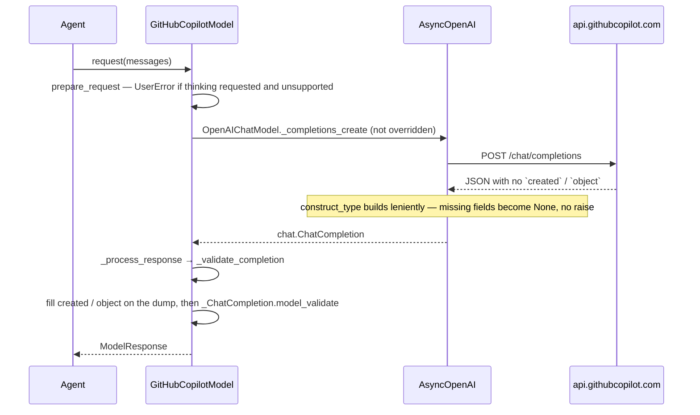

# GitHubCopilotProvider for Pydantic AI

| Field | Value |
| --- | --- |
| Author | Pydantic AI maintainers |
| Date | 2026-09-03 |
| Status | Draft |
| Audience | Pydantic AI maintainers; implementers of the follow-up PR |
| Decision already made | Pydantic AI **will** add a first-class `GitHubCopilotProvider`. This is a general public API. It is not a gh-aw-specific hack. |

This document is the spec for a plan-only PR. It does not implement code.

Issue: [#8057](https://github.com/pydantic/pydantic-ai/issues/8057)

**Closed, do not reopen:** prefix `github-copilot:`; leave `github:` / `GitHubProvider` alone until v3; v1 transport is Chat Completions only; wire IDs sent verbatim; no `KnownModelName` catalog; no device flow; no gh-aw-named knobs.

Every design claim below is grounded in the live probe results in [Live probe results](#live-probe-results), run against `https://api.githubcopilot.com` on 2026-09-03. External-implementation evidence (LiteLLM, pi, models.dev) is retained only where the probe could not reach it, and is labelled as such. Where the two disagree, the probe wins.

---

## Overview

GitHub Models (`GitHubProvider`, prefix `github:`) was retired on 2026-07-30 and is `@deprecated` for v3 removal. Docs already tell users GitHub recommends Azure AI Foundry or GitHub Copilot. There is no Copilot provider today.

The status quo is worse than #8057 describes. Anyone with a Copilot subscription is forced onto `openai-chat:<id>` plus a Copilot-proxy `OPENAI_BASE_URL`, and that path **does not work at all**: Copilot's non-stream Chat Completions body omits `created` and `object`, so `OpenAIChatModel._validate_completion` — the parent, unmodified — raises `ValidationError` on both fields before any of the profile questions matter. The silent-thinking-drop that #8057 reports is real but secondary; it is only reachable on ids whose responses happen to carry `created`.

This spec adds an additive prefix `github-copilot:` backed by `GitHubCopilotProvider` (auth, base URL, Copilot client headers, family profile map) and a thin `GitHubCopilotModel(OpenAIChatModel)` whose single job is a `_validate_completion` override that fills Copilot's missing envelope fields, plus a `prepare_request` override that raises on a thinking request the transport cannot form. Users write `Agent('github-copilot:claude-haiku-4.5')`. The retired `github:` prefix and `GitHubProvider` are left untouched until v3.

v1 speaks Copilot's Chat Completions surface only. Messages (`/v1/messages`) and Responses (`/responses`) are explicit follow-up PRs, and the probe found a distinct live error code (`unsupported_api_for_model`) that tells us exactly which ids need them.

---

## Live probe results

Run 2026-09-03 against `https://api.githubcopilot.com/chat/completions` with a `gho_` OAuth token from an Individual Copilot plan. These supersede every folklore claim from LiteLLM / pi / models.dev that they contradict.

### Auth and transport

| # | Probe | Result |
| --- | --- | --- |
| A1 | `github_pat_` (fine-grained PAT), `Authorization: Bearer` | **401** `unauthorized: AuthenticateToken authentication failed` |
| A2 | `gho_` OAuth token, same | **200** |
| A4 | `GET https://api.github.com/copilot_internal/v2/token` with a `gho_` token | **403** |
| A5 | `POST /chat/completions` | **200**. `POST /v1/chat/completions` → **404** `404 page not found` |
| A6 | `AsyncOpenAI(base_url='https://api.githubcopilot.com')` request URL | appends `/chat/completions`; no `/v1` suffix |

**A2 is the load-bearing result.** A working user token needs no exchange, so the token-exchange helper does not ship. A1 means a fine-grained PAT is not a supported credential on this plan even though GitHub's SDK docs list `github_pat_` — recorded as a docs caveat, not as client-side validation.

### Headers — none of the Copilot client headers proved to be required

| # | Probe | Result |
| --- | --- | --- |
| A7 | Omit `editor-version` | **200** |
| A8 | `copilot-integration-id: copilot-developer-cli` | **200** |
| A9 | `User-Agent: pydantic-ai/2.0.0` | **200** |
| A10 | Omit `x-request-id` | **200** (omitted on every probe above) |
| A11 | Omit `X-Initiator` on a full tool-call round trip (assistant `tool_calls` + `tool` message) | **200** |
| B27 | Image request (`image_url` data URI) with and without `Copilot-Vision-Request` | **200** both ways |

This refutes LiteLLM [#13256](https://github.com/BerriAI/litellm/issues/13256) / [#18475](https://github.com/BerriAI/litellm/issues/18475) ("400 missing Editor-Version header for IDE auth") and pi's report that `copilot-developer-cli` returns 403, at least for this host and plan. Those reports may still hold for enterprise hosts we cannot reach.

**Consequence:** the header set is no longer justified as "Copilot API requirements". See [Provider](#provider) for what v1 sends and why.

### Response shape

| # | Probe | Result |
| --- | --- | --- |
| A14 | Non-stream `gpt-5.4` | **200**, OpenAI-shaped `choices`. Top-level keys: `choices`, `copilot_usage`, `id`, `model`, `service_tier`, `usage`. **No `created`. No `object`.** |
| A15 | Stream `gpt-5.4` | OpenAI `ChatCompletionChunk`s with `choices[].delta`; `created` **is** present on chunks |
| A16 | Non-stream `claude-haiku-4.5` | **200**, OpenAI-shaped `choices`. Keys include `created`; **no `object`** |
| A17 | Stream `claude-haiku-4.5` | not reached — see model availability |
| B23 | Non-stream `claude-opus-4.8` | **400** `model_not_supported` |

`message` carries a `padding` extra field on GPT ids. No Anthropic-native `content` block body was observed on any reachable id.

**Consequence:** `created`/`object` absence is the real defect, and it is asymmetric — non-stream `gpt-5.4` lacks both, `claude-haiku-4.5` lacks only `object`, streamed chunks lack neither. The repair machinery for Anthropic-native bodies does **not** ship.

### Model availability and per-model capability

`GET https://api.githubcopilot.com/models` returns a live catalog with per-model `capabilities.supports`: `reasoning_effort` (as an explicit value list), `vision`, `structured_outputs`, `tool_calls`, `streaming`, `parallel_tool_calls`, `max_thinking_budget` / `min_thinking_budget`.

| # | Probe | Result |
| --- | --- | --- |
| A12 | `claude-sonnet-4.5`, `claude-sonnet-4-5`, `copilot/claude-sonnet-4.5` | **400** `model_not_supported` (all three) |
| A13 | `gpt-5.4` | **200** |
| — | `claude-haiku-4.5` | **200** — the only Anthropic id on this plan's catalog |
| B26 | `temperature=0.2` on `gpt-5-mini`, `kimi-k3`, `kimi-k2.7-code` | **200** on all three |
| B26 | `gpt-5.5`, `gpt-5.6-sol` | **400** `model_not_supported` |
| B25 | `gpt-5.6-luna`, `gpt-5.6-terra` | **400** `unsupported_api_for_model`: `model "…" is not accessible via the /chat/completions endpoint` |

Two consequences, both significant:

1. **`claude-sonnet-4.5` is not a usable canonical example.** It is the id in #8057, in success criterion 1, in every docs example and test case in the previous draft of this plan — and it 400s on a real Individual plan. Availability is per-subscription. Docs and tests use `claude-haiku-4.5` and `gpt-5.4`, which are verified reachable, and the docs say plainly that available ids depend on the plan and are listed by `GET /models`.
2. **The models.dev "Temperature: No" table is wrong.** Three ids the previous draft hardcoded as sampling-restricted accept `temperature`. That hardcoded list does not ship. See [Profile mapping](#profile-mapping).

`unsupported_api_for_model` is a distinct, machine-readable signal that an id is listed but Responses-only. It is the trigger for PR 3, and PR 1 documents it rather than guessing which ids are affected.

### Thinking

| # | Probe | Result |
| --- | --- | --- |
| A18 | `reasoning_effort: 'high'` on `claude-haiku-4.5` | **400** `invalid_reasoning_effort`: `model claude-haiku-4.5 does not support reasoning effort` |
| A18b | `reasoning_effort: 'none'` on `claude-haiku-4.5` | **400**, same code |
| A22 | `reasoning_effort: 'high'` on `gpt-5.4` | **200** |
| A19 | `temperature=0.2` on `claude-haiku-4.5` | **200** |
| A20 | `max_completion_tokens` on `gpt-5.4` | **200**. `max_tokens` → **400** `Unsupported parameter: 'max_tokens' … Use 'max_completion_tokens' instead` |
| A21 | `system` role message on `gpt-5.4` and `claude-haiku-4.5` | **200** both |

The `/models` catalog agrees: `claude-haiku-4.5` reports `max_thinking_budget`/`min_thinking_budget` but **no `reasoning_effort` key**, while every GPT / Gemini / Grok / Kimi reasoning id reports an explicit `reasoning_effort` value list. Copilot Claude supports thinking — just not through `reasoning_effort` on Chat Completions. This confirms LiteLLM [#28053](https://github.com/BerriAI/litellm/issues/28053) on a different id.

**A18b is the decisive new fact.** `reasoning_effort: 'none'` 400s too, so the previous draft's "forward it, the 400 is the discoverability fix" would break code that merely *disables* thinking. See [Thinking contract](#thinking-contract).

### Not probed

- Enterprise / business hosts (`api.business.*`, `api.enterprise.*`, GHE `copilot-api.*`). No access. The `base_url` escape hatch covers them; nothing in v1 is conditioned on them.
- `gho_` vs `github_pat_` behavior on a Business/Enterprise plan.
- Any Anthropic-native `content` body (LiteLLM [#29391](https://github.com/BerriAI/litellm/issues/29391) / [#30927](https://github.com/BerriAI/litellm/issues/30927)). The ids those reports name are not reachable on this plan.

---

## Background & Motivation

### Current state in this repo

- `pydantic_ai_slim/pydantic_ai/providers/github.py` — `GitHubProvider.name == 'github'`, base `https://models.github.ai/inference`, env `GITHUB_API_KEY`, `@deprecated` with `PydanticAIDeprecationWarning`. Always used with `OpenAIChatModel`. Profile map is publisher-prefix (`xai/`, `meta/`, `microsoft/`, …); bare names go to `openai_model_profile`.
- `docs/models/openai.md` "GitHub Models" section already states the retirement and that GitHub recommends Azure AI Foundry or GitHub Copilot.
- `infer_provider_class` / `OpenAIChatCompatibleProvider` list `github`. `Provider.name` is load-bearing for message-history replay (`providers/__init__.py`); silently reusing or renaming `github` is forbidden.
- There is no `github-copilot` string anywhere in this repository.
- `OpenAIChatModel.request` calls `self.client.chat.completions.create`, then `_process_response`, which calls `self._validate_completion(response)` (`models/openai.py`).
- **The OpenAI SDK builds response models with non-validating `construct_type`.** Missing required fields become `None` and unknown fields are kept in `model_extra`; nothing raises at parse time. `models/zai.py` documents this ("the openai SDK builds them leniently"). Validation happens only in `_validate_completion`, which does `_ChatCompletion.model_validate(response.model_dump())` — and `model_dump()` carries the extras through.
- `_validate_completion` is the established override point for gateway body quirks. `OpenRouterModel` (`models/openrouter.py`), `ZaiModel` and `SnowflakeModel` all override it. `OpenRouterModel`'s version re-reads the same dict on `ValidationError` to recover OpenRouter's error-envelope and nested-provider shapes.
- `_ChatCompletion` (`models/openai.py`) widens `service_tier` to `str | None` for OpenAI-compatible providers. `created: int` and `object: Literal['chat.completion']` are **not** widened.
- `OpenAIChatModel._completions_create` does `extra_headers.setdefault('User-Agent', get_user_agent())` (`pydantic-ai/<version>`), so a client `default_headers` User-Agent loses to it. Probe A9 shows Copilot accepts that value, so no override is needed.
- `OpenAIChatModel.prepare_request` already raises `UserError` for an unsupported feature (`WebSearchTool` on Chat Completions). That is the precedent shape for a transport that cannot form a requested feature.
- `Model.prepare_request` (`models/__init__.py`) drops unified `thinking` **silently** when `supports_thinking` is false. That silence is the #8057 complaint.
- `models/AGENTS.md` line 22: "Raise explicit errors for unsupported model features (e.g. function tools, JSON/native output modes) that can't be formed for a given model — never silently skip or degrade." Line 8: "Silently ignore unsupported generic tuning settings (`temperature`, sampling params, penalties, …)". The two are explicitly mutually exclusive and `thinking` is a capability, not a knob that shades output.
- `anthropic_model_profile` sets `supports_thinking=True` for every Claude id it returns, and matches **hyphenated** ids (`claude-sonnet-4-5`). By contrast `grok_model_profile` matches **dotted** ids (`grok-4.5`, `grok-4.3`) and `moonshotai_model_profile` matches dotted (`kimi-k2.5`, `kimi-k3`). Normalizing `.`→`-` globally would break the latter two.
- `Provider.model_id_namespace` defaults to `name`. With no `KnownModelName` entries, `_suggest_known_model_id_from_provider_error` finds no candidates and returns `None` — degrades harmlessly.
- genai-prices has **no** `github-copilot` provider and no entry matching `https://api.githubcopilot.com` (verified against the shipped snapshot: 41 providers, none matching). `context_window` will be unset and cost unresolvable for every Copilot model.
- OpenRouter / Cerebras / Ollama / Z.AI / Snowflake / Crusoe have their own Model class, checked in `infer_model` **before** the `OpenAIChatCompatibleProvider` catch-all. Vercel does not.
- `pyproject.toml` sets `xfail_strict = true`, so `@pytest.mark.xfail` fails the suite the moment the test starts passing. `tests/providers/test_gateway_catalog.py` uses this to track an external dependency ("an XPASS means the literal can likely be restored").

### The gap that made this visible

gh-aw's pydantic-ai engine strips `copilot/` from `engine.model`, rewrites Claude hyphenated IDs to dotted IDs on the Copilot proxy path, and invokes `pai -m openai-chat:<id>` with a Copilot-proxy `OPENAI_BASE_URL`.

Douwe Maan (pair review of pydantic/pydantic-ai-harness #708, 2026-08-27) asked for a GitHub Copilot provider, not a revival of GitHub Models: map `copilot/` → `github-copilot:` and let the pydantic-ai provider own profiles and ID mapping.

The dotted-ID rewrite currently lives in a workflow file. It is provider knowledge. Combined with `models/AGENTS.md` (no capability split on `base_url`) and gh-aw's "custom `PAI_BASE_URL` gets the id verbatim" rule, v1 **sends the user-supplied id unchanged**.

### Product framing

- **Primary user:** any Python developer with a Copilot subscription who wants `Agent('github-copilot:claude-haiku-4.5')`.
- **Secondary user:** gh-aw engine, after a pydantic-ai release, swapping `openai-chat:` for `github-copilot:` and deleting the dotted-ID shim.
- Do not design APIs whose only justification is gh-aw. A custom `base_url` is the general OpenAI-compatible escape hatch, not a gh-aw-named parameter.
- Leave `GitHubProvider` / `github:` unchanged until v3 removal. New prefix must not collide.

### Contribution-bar check

`docs/contributing.md` "Rules for adding new models": a new model that reuses another model's logic with no extra dependency needs the vendor GitHub org to have > 20k stars. GitHub Copilot reuses the OpenAI extra and GitHub's org is well above that bar. This is in-bounds as a first-party provider.

---

## Goals & Non-Goals

### Goals

- Additive public prefix `github-copilot:` that constructs a Copilot-authenticated OpenAI-compatible client and a family-correct `ModelProfile`.
- `Agent('github-copilot:claude-haiku-4.5')` and `Agent('github-copilot:gpt-5.4')` work for a user with a Copilot token, without wrapping `OpenAIProvider`.
- Family profile mapping by **bare model-id prefix** (Copilot IDs are not `provider/model`).
- Custom `base_url` so Copilot-compatible gateways (gh-aw api-proxy, enterprise hosts, local proxies) work without forking the provider.
- Docs, tests, and skill prefix table updated in the same implementation PR.
- Default behavior of every existing prefix, including `github:` and `openai-chat:`, unchanged.

### Non-goals (v1)

- Reviving, renaming, or changing behavior of `GitHubProvider` / `github:`.
- Changing gh-aw / pydantic-ai-harness in this repo (consumer follow-up after release).
- Copilot embeddings, realtime, CLI BYOK, or a generated agent module / MCP config / clai flags.
- Implementing LiteLLM's full Chat / Messages / Responses matrix in v1.
- Device-flow OAuth inside the library.
- A closed `KnownModelName` catalog of every Copilot id (the catalog is per-subscription and churns weekly).
- Runtime fetching of `GET /models` on the request path.
- A `github-copilot` extra (reuse `openai`).
- A token cap / `max_tokens` default.
- Pinning or changing LLM model versions.
- Pydantic AI Gateway route for Copilot.
- Claude thinking as a working v1 feature (follow-up: `/v1/messages`).
- Repairing Anthropic-native Chat Completions bodies (not observed; see A16 / B23).
- Client-side API-key format validation.
- Adding `github-copilot` to genai-prices (tracked separately; see [Deliberate scope](#deliberate-scope)).

---

## Proposed Design

### Shape in one paragraph

v1 is an OpenAI-compatible **gateway overlay** in the OpenRouter/Cerebras family, not a new vendor SDK. `GitHubCopilotProvider` subclasses `OpenAICompatibleProvider` and owns auth / base URL / HTTP lifecycle / client headers / `model_profile()`. `GitHubCopilotModel` is a thin `OpenAIChatModel` subclass with exactly two overrides: `_validate_completion`, which fills the `created` / `object` fields Copilot omits before delegating to the parent's validation model; and `prepare_request`, which raises `UserError` when unified `thinking` is requested on an id whose profile says the Chat Completions transport cannot form it. `infer_model('github-copilot:<id>')` returns `GitHubCopilotModel`. Extra is `openai`. Prefix is `github-copilot`. `Provider.name` is `'github-copilot'`.

There is no probe-gated allow-list any more. The probes have been run; this is the design they produced.




### Why not three transports in v1

A family-routed Chat / Responses / Messages adapter would pull in `AsyncOpenAI` **and** `AsyncAnthropic`, invent a router keyed on model-name prefixes, and still be wrong the week Copilot moves a model across endpoints. Pydantic AI's rule is: providers own auth and HTTP; profiles own family facts; model adapters own one wire format.

v1 speaks **one** wire format (Chat Completions) through **one** SDK (`openai`). Probe A13 / A16 confirm a basic `Agent.run` completes for both a GPT and a Claude id on that transport, so the previous draft's stop-and-split kill switch is satisfied and retired.

### Module layout

| Path | Role |
| --- | --- |
| `pydantic_ai_slim/pydantic_ai/providers/github_copilot.py` | `GitHubCopilotProvider`, `GitHubCopilotModelProfile`, family map |
| `pydantic_ai_slim/pydantic_ai/models/github_copilot.py` | `GitHubCopilotModel` |
| `docs/models/github-copilot.md` | User-facing provider page |
| `docs/api/providers.md` | Autodoc `GitHubCopilotProvider` |
| `docs/api/models/github_copilot.md` | Autodoc `GitHubCopilotModel` (underscore matches the module name, as `bedrock_mantle.md` does) |
| `tests/providers/test_github_copilot.py` | Construction, env, headers, profile routing |
| `tests/models/test_github_copilot.py` | VCR + `request_capture` |
| `tests/models/cassettes/test_github_copilot/` | VCR layout: `Path(test_file).parent / 'cassettes' / module` |

Do not put Copilot logic in `providers/github.py`.

### Provider

Subclass `OpenAICompatibleProvider` (`providers/_openai_compatible.py`). Constructor overloads match Vercel/OpenRouter **plus** `base_url` (OpenAIProvider/OllamaProvider escape hatch):

```python
class GitHubCopilotProvider(OpenAICompatibleProvider):
    @property
    def name(self) -> str:
        return 'github-copilot'

    @property
    def base_url(self) -> str:
        return str(self.client.base_url)

    @overload
    def __init__(self, *, openai_client: AsyncOpenAI) -> None: ...

    @overload
    def __init__(
        self,
        *,
        api_key: str | None = None,
        base_url: str | None = None,
        openai_client: None = None,
        http_client: _OpenAIHTTPClient | None = None,
    ) -> None: ...
```

**`api_key` resolution, in order:**

1. `api_key=` argument
2. `GITHUB_COPILOT_API_KEY` (pydantic-ai `{PROVIDER}_API_KEY`)
3. `GITHUB_COPILOT_API_TOKEN` (GitHub's name for an exchanged `tid=…;exp=…;proxy-ep=…` inference bearer)
4. `COPILOT_GITHUB_TOKEN` (GitHub's name for a user token intended for Copilot)

Then `missing_api_key_error(...)` naming `GITHUB_COPILOT_API_KEY` (the string `tests/providers/test_provider_names.py` matches) and `GitHubCopilotProvider(api_key=...)`. The error may also mention the two aliases. Reading more than one env var is precedented (`GoogleProvider` reads `GOOGLE_API_KEY` / `GEMINI_API_KEY`).

**Deliberately not read:** `GITHUB_TOKEN`, `GH_TOKEN`, `GITHUB_API_KEY`.

**No client-side key-format validation.** The previous draft raised `UserError` on a `ghp_` prefix. No provider in `pydantic_ai_slim/pydantic_ai/providers/` validates key format, and a client-side allowlist would have to be unbroken by a release if GitHub ever widens the accepted set. Probe A1 shows a `github_pat_` — which GitHub's own SDK docs list as supported — already 401s on this plan, so a prefix allowlist would also be *wrong*, not merely unprecedented. Copilot's own 401 is the error; the docs page names the token types that are known to work.

**`base_url` resolution, in order:**

1. constructor `base_url=`
2. `GITHUB_COPILOT_BASE_URL`
3. `COPILOT_API_URL` (GitHub SDK)
4. `GITHUB_COPILOT_API_BASE` (LiteLLM)
5. `https://api.githubcopilot.com`

No `/v1` suffix: probe A5 confirms `/chat/completions` is the path and `/v1/chat/completions` 404s. `AsyncOpenAI(base_url=...)` appends `/chat/completions` (A6).

`openai_client` is reused as-is; `api_key` / `base_url` / `http_client` must be `None` (same asserts as `OpenAIProvider`). Copilot headers are **not** injected onto a prebuilt client (same as OpenRouter attribution headers).

#### Client headers

One version constant, shared by User-Agent and plugin version:

```python
GITHUB_COPILOT_VERSION = '0.26.7'
GITHUB_COPILOT_EDITOR_PLUGIN_VERSION = f'copilot-chat/{GITHUB_COPILOT_VERSION}'
```

Sent as `AsyncOpenAI(default_headers=...)` when the provider builds the client:

| Header | Value |
| --- | --- |
| `editor-version` | `vscode/1.95.0` |
| `copilot-integration-id` | `vscode-chat` |
| `editor-plugin-version` | `copilot-chat/0.26.7` |
| `openai-intent` | `conversation-panel` |
| `x-github-api-version` | `2025-04-01` |

**These are not documented as required, and this repo's probe could not make any of them required** (A7, A8, A10, A11, B27 all returned 200 without them). They are sent because every other Copilot client sends them and enterprise/GHE hosts — which we cannot reach — are reported to enforce `editor-version`. The code comment says exactly that: parity with other Copilot clients, unverified as required on `api.githubcopilot.com`, cheap insurance for hosts we cannot probe. Do not describe them as API requirements.

**No `User-Agent` override.** Probe A9 confirms Copilot accepts `pydantic-ai/<version>`, which is what `OpenAIChatModel._completions_create` sends via `extra_headers.setdefault`. Sending a `GitHubCopilotChat/…` User-Agent would be impersonation with no functional justification.

**Not sent:** `x-request-id`, `x-vscode-user-agent-library-version`, `X-Initiator`, `Copilot-Vision-Request`. All four were probed as absent and all returned 200, including on a tool-call round trip (A11) and an image request (B27). A per-request `x-request-id` UUID would additionally make every settings-probe payload differ from baseline in `tests/models/test_model_settings_support.py`.

### Model

```python
GitHubCopilotModelName = str

@dataclass(init=False)
class GitHubCopilotModel(OpenAIChatModel):
    def __init__(
        self,
        model_name: GitHubCopilotModelName,
        *,
        provider: Literal['github-copilot'] | Provider[AsyncOpenAI] = 'github-copilot',
        profile: ModelProfileSpec | None = None,
        settings: ModelSettings | None = None,
    ) -> None:
        super().__init__(model_name, provider=provider, profile=profile, settings=settings)
```

No `LatestGitHubCopilotModelNames` Literal. No `GitHubCopilotModelSettings` in v1.

`infer_model` (`models/__init__.py`): branch **before** the `OpenAIChatCompatibleProvider` catch-all, next to `openrouter` / `cerebras` / `ollama` / `zai` / `snowflake`:

```python
elif model_kind == 'github-copilot':
    from .github_copilot import GitHubCopilotModel
    return GitHubCopilotModel(model_name, provider=provider)
```

Also add `'github-copilot'` to `OpenAIChatCompatibleProvider` so `OpenAIChatModel(..., provider='github-copilot')` type-checks.

#### Named overrides (closed list — exactly two)

| Method | Override? | Job |
| --- | --- | --- |
| `__init__` | yes | Signature above; `super().__init__(...)`. |
| `_validate_completion` | **yes** | Fill `created` / `object` before the parent's validation model. |
| `prepare_request` | **yes** | `UserError` on a thinking request the transport cannot form. |
| `_completions_create` | **no** | User-Agent is accepted as-is (A9); nothing else differs. |
| `_process_response` | no | Runs on the `_ChatCompletion` the override returns. |
| `_process_thinking` | no | No Copilot thinking field on this transport. |
| `_map_messages` | no | v1 does not round-trip Anthropic thinking signatures. |
| `_process_streamed_response` | no | Streamed chunks carry `created` and OpenAI `delta` shape (A15). |

Import `_ChatCompletion` from `pydantic_ai.models.openai` with `pyright: ignore[reportPrivateUsage]`, the same as `OpenRouterModel`.

#### `_validate_completion` — the whole repair

The OpenAI SDK's `construct_type` never raises, so an envelope missing `created` / `object` reaches `_validate_completion` with those attributes set to `None`. `model_dump()` carries them as `None`, and `_ChatCompletion.model_validate` then fails with `created: int_type` and `object: literal_error` — verified against a live Copilot body. This is exactly the hook `OpenRouterModel`, `ZaiModel` and `SnowflakeModel` already use for gateway envelope quirks.

```python
@override
def _validate_completion(self, response: chat.ChatCompletion) -> _ChatCompletion:
    # Copilot's Chat Completions envelope omits `created` (and `object` on every id observed),
    # which the OpenAI SDK builds as `None` rather than rejecting. Fill them before validation;
    # `_process_response` treats a zero `created` as "no provider timestamp".
    payload = response.model_dump()
    if payload.get('created') is None:
        payload['created'] = 0
    if payload.get('object') is None:
        payload['object'] = 'chat.completion'
    return _ChatCompletion.model_validate(payload)
```

`_ChatCompletion` rather than `chat.ChatCompletion`: Copilot returns `service_tier: 'default'` on GPT ids and LiteLLM [#30927](https://github.com/BerriAI/litellm/issues/30927) reports `'on_demand'`, which only the widened model accepts. This matches what the parent's own `_validate_completion` returns, so `_process_response` is unchanged.

Two things this deliberately does **not** do:

- **No `with_raw_response` and no copy of the parent `_completions_create` body.** The previous draft required both, on the premise that `_validate_completion` "receives an already-parsed `ChatCompletion` and is the wrong hook". That premise is false — the SDK's parse is non-validating and lossless for unknown top-level keys — and copying the parent's ~40-keyword `.create(...)` call into a subclass would silently drop any keyword a future parent adds.
- **No Anthropic-native body repair.** Probes A16 and B23 found no `choices`-less body on any reachable id, and the ids LiteLLM #29391 / #30927 name are not available on this plan. Shipping repair on a cloned LiteLLM fixture would be shipping untested-against-reality machinery. If a user reports one, the fix lands in this same method with a real cassette.

#### Streaming

Probe A15 shows Copilot streams OpenAI `ChatCompletionChunk`s with `choices[].delta` and a `created` field, so `_process_streamed_response` is not overridden and streaming needs no repair.

The previous draft added a fail-closed wrapper catching `ValidationError` around `create(stream=True)` and `peek()`. That wrapper would never fire: the same lenient construction means an Anthropic-native SSE payload yields a chunk with `choices=None` and no exception, and the failure surfaces later as `TypeError: 'NoneType' object is not iterable` when the parent iterates `chunk.choices` — verified. Since no such stream was observed, v1 ships no wrapper at all rather than a handler for an exception that cannot occur.

### Profile mapping

Copilot model IDs are bare. Mapping is by family prefix of the model id after `casefold()`. OpenRouter's `provider/model` split does not apply.

Three-layer `merge_profile` (OpenRouter's comment in `providers/openrouter.py` is the pattern):

1. **Fallback** — `OpenAIModelProfile(json_schema_transformer=OpenAIJsonSchemaTransformer)`.
2. **Family profile** — intrinsic facts from `profiles/*`.
3. **Copilot overlay** — the closed function below. Wins on every key it sets.

Family routing table (prefix match on `casefold()` of the id; first hit wins):

| Prefix | Family function | ID normalization |
| --- | --- | --- |
| `claude-` | `anthropic_model_profile` | `.` → `-` |
| `gpt-`, `o1`, `o3`, `o4` | `openai_model_profile` | none |
| `gemini-` | `google_model_profile` | none |
| `grok-` | `grok_model_profile` | none |
| `kimi-` | `moonshotai_model_profile` | none |
| `mai-`, `oswe`, `raptor`, `exec-agent-` | `openai_model_profile` | none |
| unknown | none — layer 1 only; do **not** claim `supports_thinking` | — |

**The dot-to-hyphen rewrite is Anthropic-only, and that is load-bearing.** `anthropic_model_profile` matches hyphenated ids (`claude-sonnet-4-5`), but `grok_model_profile` matches **dotted** (`grok-4.5`, `grok-4.3`) and `moonshotai_model_profile` matches **dotted** (`kimi-k2.5`, `kimi-k3`). Normalizing globally would silently blank the Grok and Kimi profiles. Do not "tidy" this into a shared normalization step.

Do **not** strip a leading `copilot/` on the wire. Profile lookup may strip a leading `copilot/` so a user who passes it still gets a family profile.

#### Overlay

```python
class GitHubCopilotModelProfile(OpenAIModelProfile, total=False):
    """Profile for models used with GitHubCopilotModel.

    ALL FIELDS MUST BE `github_copilot_` PREFIXED SO YOU CAN MERGE THEM WITH OTHER MODELS.
    """

    github_copilot_supports_reasoning_effort: bool
    """Whether Copilot's Chat Completions endpoint accepts `reasoning_effort` for this model.

    Copilot rejects the parameter outright for Anthropic models — including
    `reasoning_effort='none'` — even though those models support thinking through
    `/v1/messages`. `GET https://api.githubcopilot.com/models` reports the accepted
    values per model and omits the key entirely for Anthropic ids."""
```

```python
def _github_copilot_overlay(model_name: str, family: ModelProfile | None) -> GitHubCopilotModelProfile:
    folded = model_name.removeprefix('copilot/').casefold()
    overlay = GitHubCopilotModelProfile(
        # Copilot rejects `max_tokens` with an explicit "use max_completion_tokens" 400.
        openai_chat_supports_max_completion_tokens=True,
        github_copilot_supports_reasoning_effort=not folded.startswith('claude-'),
    )

    if family and family.get('anthropic_disallows_sampling_settings'):
        overlay['openai_unsupported_model_settings'] = SAMPLING_PARAMS

    if folded.startswith('gemini-'):
        # Copilot Chat Completions is OpenAI tools/response_format, not Gemini generateContent.
        # google_model_profile would otherwise win with GoogleJsonSchemaTransformer (merge later-wins).
        overlay['json_schema_transformer'] = OpenAIJsonSchemaTransformer

    return overlay
```

**The hardcoded models.dev "Temperature: No" prefix list does not ship.** Probe B26 sent `temperature=0.2` to three ids on that list — `gpt-5-mini`, `kimi-k3`, `kimi-k2.7-code` — and all three returned 200. The list was folklore and it was wrong. Sampling restriction now comes only from the family profile's own `anthropic_disallows_sampling_settings`, plus the parent's existing `_drop_sampling_params_for_reasoning`, both of which are derived from verified provider behavior.

`supports_thinking` is **not** set on the overlay. Family values stand: Claude keeps `supports_thinking=True` from `anthropic_model_profile` (the model genuinely thinks — this transport just can't ask it to), and `github_copilot_supports_reasoning_effort=False` is what gates the request. Do not force `supports_thinking=True` the way OpenRouter does; Copilot does not accept `reasoning_effort` universally.

`supported_native_tools` is **not** expanded. `OpenAIChatModel.supported_native_tools()` already intersects to `WebSearchTool`.

#### Keeping the family table honest

`GET https://api.githubcopilot.com/models` is the authoritative per-model capability source: it reports `reasoning_effort` value lists, `vision`, `structured_outputs`, `tool_calls`, `streaming`, and thinking budgets. It is **not** called at runtime — the catalog is per-subscription, and a network call on the request path would violate the "providers own auth and HTTP, profiles own family facts" split.

It is the source a maintainer regenerates the family table from. The docs page points users at it for "which ids can I use", which is the honest answer given availability varies by plan.

### Thinking contract

Copilot Claude supports thinking; Copilot's **Chat Completions** transport cannot express it. `reasoning_effort` is rejected for both `'high'` and `'none'` (A18, A18b), and `/models` omits the `reasoning_effort` key for `claude-haiku-4.5` while reporting `max_thinking_budget`.

`models/AGENTS.md` line 22 governs: *"Raise explicit errors for unsupported model features … that can't be formed for a given model — never silently skip or degrade."* Unified `thinking` is a capability, not one of line 8's generic tuning knobs — its absence removes `ThinkingPart`s from the response rather than shading the output. The existing shape for this is `OpenAIChatModel.prepare_request` raising `UserError` for `WebSearchTool`.

```python
@override
def prepare_request(
    self,
    model_settings: ModelSettings | None,
    model_request_parameters: ModelRequestParameters,
) -> tuple[ModelSettings | None, ModelRequestParameters]:
    # Copilot rejects `reasoning_effort` outright for Anthropic models, so a thinking request
    # can't be formed on this transport. `thinking=False` asks for nothing, so it's satisfied
    # by doing nothing rather than by an error.
    if (
        model_settings
        and model_settings.get('thinking') not in (None, False)
        and not self.profile.get('github_copilot_supports_reasoning_effort', True)
    ):
        raise UserError(
            f'`thinking` is not supported with `GitHubCopilotModel` and model {self.model_name!r}: '
            "GitHub Copilot's chat completions API rejects `reasoning_effort` for Anthropic models. "
            'Use a model whose Copilot catalog entry lists `reasoning_effort`, or omit `thinking`.'
        )
    return super().prepare_request(model_settings, model_request_parameters)
```

**`thinking=False` never raises.** It asks the model *not* to think, which the transport already satisfies; raising there would break code that merely disables thinking, and probe A18b shows forwarding it produces a 400. It is dropped, as `Model.prepare_request` already does when `supports_thinking` is false.

| User action | Claude family | GPT-5 / Gemini / Grok / Kimi (reasoning ids) |
| --- | --- | --- |
| `thinking` omitted | Nothing sent. Completions work (A16). | `reasoning_effort` omitted; model default applies. |
| `thinking=True` / `'high'` | `UserError` before the request, naming `/v1/messages` as the path that supports it. | Sent as `reasoning_effort` (A22: 200). |
| `thinking=False` | Dropped silently, no request-level error. | Sent as `reasoning_effort='none'` where the catalog lists `none`. |

Alternatives considered and rejected are recorded in [Alternatives Considered](#alternatives-considered) §10.

### Auth

Pydantic AI providers take a bearer key from env. Device-flow OAuth is a CLI concern. v1 does not implement device flow, does not write `~/.config/…`, and does not poll `https://github.com/login/device`.

**No token-exchange helper.** The previous draft allow-listed `exchange_github_copilot_token` for the case where a user token 401s and `GET /copilot_internal/v2/token` 200s. Probe A2 shows a `gho_` OAuth token works directly against `/chat/completions`, and probe A4 shows that exchange endpoint returns **403** anyway. Neither half of the trigger holds. A user on a plan that needs an exchanged token can obtain it out of band and pass it as `GITHUB_COPILOT_API_TOKEN`.

**What the user puts in the env var** (docs page, not code):

1. OAuth user token (`gho_`) from `copilot login` or `gh auth token` — **verified working** (A2).
2. Exchanged Copilot API token (`tid=…`), for plans that require one.
3. Fine-grained PAT (`github_pat_`) with **Copilot Requests** — listed by GitHub's SDK docs, but **401 on the Individual plan probed here** (A1). Documented with that caveat rather than promised.

Classic PAT (`ghp_`) is not supported per GitHub's docs. That is a docs statement; the library does not inspect the token.

### `infer_provider` / name stability

```python
elif provider == 'github-copilot':
    from .github_copilot import GitHubCopilotProvider
    return GitHubCopilotProvider
```

`github` continues to return `GitHubProvider`. No `copilot` alias. `Provider.name` is `'github-copilot'`, so `model_id_namespace` is `'github-copilot'`; with no `KnownModelName` entries the "did you mean" suggester finds no candidates and returns `None`, which is the intended consequence of not shipping a catalog.

### KnownModelName

Follow Vercel/OpenRouter: **documented prefix + open model id**. Do not add `github-copilot:*` to `KnownModelName`. Availability is per-subscription — probe A12 shows `claude-sonnet-4.5` 400s on an Individual plan — so a frozen literal would advertise ids many users cannot reach.

### Docs

Voice matches existing provider pages. Dedicated page because auth, ID availability, and thinking caveats do not fit a Vercel-sized subsection.

**Placement:** treat Copilot like OpenRouter / Cerebras / Snowflake / Z.AI — **first-class** bullet in the first list of `docs/models/overview.md`, dedicated `docs/models/github-copilot.md`, nav entry under Models & Providers. Optionally a one-line pointer under "OpenAI-compatible Providers" so readers of the retired GitHub Models row find it.

**`docs/models/github-copilot.md`**

- Install: `pip/uv-add "pydantic-ai-slim[openai]"`.
- Token: `GITHUB_COPILOT_API_KEY` (aliases `GITHUB_COPILOT_API_TOKEN`, `COPILOT_GITHUB_TOKEN`). An OAuth user token (`gho_`) is the verified-working form; a fine-grained PAT is documented by GitHub but was rejected on the plan we tested; classic PATs (`ghp_`) are unsupported.
- Examples: `Agent('github-copilot:claude-haiku-4.5')`, `Agent('github-copilot:gpt-5.4')`.
- **Available model ids depend on your Copilot plan.** List yours with `GET https://api.githubcopilot.com/models`. An id your plan does not include returns `400 model_not_supported`; an id that exists but is Responses-only returns `400 unsupported_api_for_model`.
- Direct construction with `GitHubCopilotModel` + `GitHubCopilotProvider`.
- Custom `base_url` (`GITHUB_COPILOT_BASE_URL` / `COPILOT_API_URL` / `GITHUB_COPILOT_API_BASE`). Known hosts as examples, not separate providers.
- Model ids are bare and sent verbatim; the provider does not rewrite them.
- **Claude thinking is not supported on this transport.** Requesting it raises `UserError`; `/v1/messages` is the follow-up.
- Not in v1: embeddings, realtime, Responses-only models, no pricing/context-window data (see the genai-prices issue).

**`docs/models/openai.md` GitHub Models section:** successor link to `github-copilot.md`.

**Skill:** `ARCHITECTURE.md` prefix table: add `GitHub Copilot | github-copilot: | github-copilot:claude-haiku-4.5`. Mark the `github:` row retired/deprecated in the same PR.

---

## Tests

Follow `tests/AGENTS.md`. CI does not make live Copilot calls; VCR playback does. Cassettes are maintainer-recorded.

**`tests/conftest.py`:**

```python
@pytest.fixture(scope='session')
def github_copilot_api_key() -> str:
    return os.getenv('GITHUB_COPILOT_API_KEY', 'mock-api-key')
```

**`tests/providers/test_github_copilot.py`:** name, default base URL, env chain (including `GITHUB_COPILOT_API_TOKEN` and `COPILOT_GITHUB_TOKEN`), does not read `GITHUB_TOKEN` / `GH_TOKEN` / `GITHUB_API_KEY`, `openai_client` / `http_client` / `base_url`, client headers on `client.default_headers`, profile routing snapshots (Claude dotted **and** hyphenated resolve to the same profile; Grok and Kimi dotted ids keep their family profile — the regression guard for the normalization rule; Gemini transformer is OpenAI; unknown id gets no `supports_thinking`).

**`tests/models/test_github_copilot.py`:** VCR + `request_capture`. Non-stream and stream for `gpt-5.4` and `claude-haiku-4.5`. Assert outbound model id verbatim, `User-Agent` is `pydantic-ai/<version>` (not a Copilot UA), `reasoning_effort` present on `gpt-5.4` with `thinking` and absent without.

**The envelope regression test is the point of the whole PR.** A cassette whose non-stream body omits `created` and `object` must produce a `ModelResponse`; run it against unmodified `OpenAIChatModel` once while writing it to confirm it fails there.

**`tests/models/test_model.py` `TEST_CASES`:** add `github-copilot:claude-haiku-4.5` expecting `GitHubCopilotModel`. Keep the existing `github:` case on `OpenAIChatModel`.

**`tests/models/test_model_settings_support.py`:** `Case('GitHubCopilotModel', ('GitHub Copilot',), http_probe(_github_copilot), ...)` with probe model `gpt-5.4`. Add `GitHub Copilot` to `ModelSettings` `Supported by:` lists to match the probe.

**`tests/profiles/test_resolution_matrix.py`:** Copilot snapshots for Claude / GPT / Gemini / Grok / Kimi / unknown.

**`tests/test_httpx2_sdk_readiness.py`:** construct `GitHubCopilotProvider` on the HTTPX2 path. Do **not** copy the deprecated `GitHubProvider` legacy-httpx special case.

**`tests/providers/test_provider_names.py`:** `('github-copilot', GitHubCopilotProvider, 'GITHUB_COPILOT_API_KEY')`.

**`tests/providers/test_openai_compatible_http_clients.py`:** add a `Case`.

### Requirements encoded as tests that fail until met

Every unmet requirement gets a test asserting the **desired end state**, marked `xfail`. `pyproject.toml` sets `xfail_strict = true`, so the suite fails the moment one starts passing — that XPASS is the signal to delete the marker and, where relevant, land the dependent change. `tests/providers/test_gateway_catalog.py::test_unsupported_gateway_known_model_name_smoke_test` is the precedent, including its reason-string convention ("an XPASS means the literal can likely be restored").

| Requirement | Test asserts | `xfail` reason |
| --- | --- | --- |
| genai-prices knows `github-copilot` | `lookup_context_window(GitHubCopilotModel('gpt-5.4', …))` is not `None` | Blocked on the genai-prices issue. XPASS means the entry shipped — drop the marker and add the context-window assertion to the profile snapshot. |
| Claude thinking works on Copilot | `Agent('github-copilot:claude-haiku-4.5')` with `thinking=True` returns a `ThinkingPart` | Blocked on PR 2 (`/v1/messages`). Today it raises `UserError`; XPASS means the Messages transport landed. |
| Responses-only ids are reachable | a `gpt-5.6-*` id completes a basic run | Blocked on PR 3 (`/responses`). Today Copilot returns `unsupported_api_for_model`. |
| A fine-grained PAT authenticates | `github_pat_` credential completes a request | Probe A1 says 401 on the Individual plan. XPASS means GitHub widened it (or a Business plan differs) and the docs caveat can go. |

Each is a real test with a real assertion, not a placeholder — the `xfail` marker records *why* it does not pass yet, and every one of them names the artifact that will make it pass.

---

## API / Interface Changes

All additive.

| Surface | Change |
| --- | --- |
| `infer_model('github-copilot:<id>')` | New; returns `GitHubCopilotModel` |
| `infer_provider('github-copilot')` | New |
| `OpenAIChatCompatibleProvider` | Member `'github-copilot'` |
| `GitHubCopilotProvider` / `GitHubCopilotModel` / `GitHubCopilotModelProfile` | New |
| `github:` / `GitHubProvider` | Unchanged |
| `KnownModelName` | Unchanged |
| Extras | Unchanged (`openai`) |

```python
from pydantic_ai import Agent
agent = Agent('github-copilot:claude-haiku-4.5')
```

Custom endpoint:

```python
GitHubCopilotProvider(api_key='…', base_url=os.environ['GITHUB_COPILOT_BASE_URL'])
```

---

## Data Model Changes

None. Histories captured with `provider_name='github-copilot'` will not replay as `github`.

---

## Alternatives Considered

### 1. Prefix `copilot:` instead of `github-copilot:`

Shorter. Less precise. Collides with gh-aw's `copilot/<model>` id prefix. The requested string is `github-copilot:` ([#8057](https://github.com/pydantic/pydantic-ai/issues/8057)). **Rejected.**

### 2. Revive / rename `GitHubProvider`

`Provider.name == 'github'` is load-bearing. Different APIs, hosts, id schemes, auth. **Rejected.**

### 3. Vercel shape: provider only, no Model class

Attractive once probe A9 removed the User-Agent justification. **Still rejected:** Copilot omits `created` and `object`, which makes the parent's `_validate_completion` raise, so a Model class is mandatory — just for a different reason than the previous draft gave. A public Model class is also the extension point for PR 2/3 without renaming `Provider.name`.

### 3b. `with_raw_response` + a copied `_completions_create` body

The previous draft's default, on the premise that `_validate_completion` sees an already-parsed object and cannot reach a non-OpenAI body. **Rejected: the premise is false.** The OpenAI SDK's `construct_type` does not validate — missing fields become `None`, unknown top-level keys survive in `model_extra`, and `model_dump()` exposes both. `OpenRouterModel._validate_completion` already recovers non-OpenAI shapes from exactly that dict. Copying the parent's ~40-keyword `.create(...)` call would also silently drop future parent kwargs.

### 3c. Provider-level httpx2 response/request hooks

Mutating `httpx2.Response._content` under VCR + OpenAI SDK 3 is an unofficial contract, and `_validate_completion` is a supported hook that reaches the same data. **Rejected.**

### 4. Family-routed three-transport adapter in v1

Most complete. Mega-adapter. **Rejected for v1** — but `unsupported_api_for_model` (B25) now gives PR 3 a precise, machine-readable trigger.

### 5. Device-flow OAuth inside `GitHubCopilotProvider()`

Unusual for Pydantic AI. Hangs `infer_provider`. **Rejected.**

### 6. Token exchange at `copilot_internal/v2/token`

**Rejected on evidence, not taste.** A `gho_` token works directly (A2) and the exchange endpoint returns 403 (A4).

### 7. Host-conditional dotted-ID rewrite

Violates `models/AGENTS.md` and gh-aw's verbatim-id rule. Probe A12 also shows the hyphenated form 400s identically, so a rewrite would fix nothing. **Rejected.**

### 8. Closed `KnownModelName` catalog

Goes stale weekly *and* varies by subscription (A12). **Rejected.**

### 9. `github-copilot` extra

No second SDK in v1. **Reuse `openai`.**

### 10. Thinking on Copilot Claude — the three shapes not chosen

- **Overlay `supports_thinking=False`.** Drops `thinking` silently. Rejected: `models/AGENTS.md` line 22 forbids silently degrading a feature, and the silent drop is what #8057 was filed about.
- **Drop with a `UserWarning` plus a span event.** Has precedent in shape (`_drop_sampling_params_for_reasoning` warns; `models/anthropic.py::_report_input_transformations` adds a span event) — but both precedents cover a *conditionally* unhonorable setting or a provider-reported drop, not a capability the transport structurally cannot form. Would require arguing `thinking` is a line-8 tuning setting, against this plan's own position.
- **Forward it and let Copilot 400.** The previous draft's choice, on the premise that the 400 is a discoverability fix. Rejected once probe A18b showed `reasoning_effort='none'` 400s too: shipping it would knowingly break code that merely disables thinking.

---

## Security & Privacy Considerations

| Threat | Mitigation |
| --- | --- |
| Bearer in logs / cassettes | VCR `filter_headers` includes `authorization`. |
| Wrong GitHub token used | Do not read `GITHUB_TOKEN` / `GH_TOKEN` / `GITHUB_API_KEY`. Docs name the token types. |
| Client impersonation / ToS | No `GitHubCopilotChat/…` User-Agent — `pydantic-ai/<version>` is accepted (A9) and is what we send. Remaining headers are the documented Copilot client set, sent for parity, not to pose as VS Code. |
| `openai_client=` reuse | Caller owns headers; we do not inject. |

---

## Observability

Existing OpenAI Chat Completions instrumentation. `ModelResponse.provider_name` is `github-copilot`. Do not log `Authorization`.

v1 does not copy Copilot response headers (`x-copilot-service-request-id`, `x-github-request-id`) into `provider_details`: `_process_provider_details` sees the parsed body, which has no header fields, and reaching them would require `with_raw_response` on every call. Copilot's `copilot_usage` body field is likewise not surfaced in v1.

`created` is filled with `0` when absent, which `_process_response` treats as "no provider timestamp" rather than a 1970 timestamp — the same handling `OpenRouterModel` relies on.

---

## Rollout

Additive. No feature flag. Rollback is revert. No migration.

---

## Risks

| Risk | Severity | Mitigation |
| --- | --- | --- |
| Model availability varies by plan; docs examples may not work for a reader | High | Docs lead with `GET /models` and explain both 400 codes. Tests use ids verified on a real plan. |
| Envelope shape differs again on an unprobed host | Medium | `_validate_completion` fills defensively rather than asserting a shape; a new gap lands in the same method with a cassette. |
| Anthropic-native bodies appear on a plan we could not reach | Medium | Not implemented on folklore. `_validate_completion` is the single place a real report gets fixed. |
| Enterprise hosts enforce headers we send but could not verify | Low | We send them anyway; comment records they are unverified. |
| No pricing / context-window data | Medium | Tracked genai-prices issue plus an `xfail` test that XPASSes when it lands. |
| Header values bit-rot | Low | One version constant. |
| Users confuse `github:` and `github-copilot:` | Low | Docs successor note. |

---

## Open Questions

None blocking implementation. Settled by probe or by decision: prefix `github-copilot:`; Chat Completions v1; explicit env bearer with GitHub aliases; thin `GitHubCopilotModel` with two overrides; `UserError` on an unformable thinking request; no key-format validation; no exchange helper; no repair; no hardcoded sampling table.

---

## Deliberate scope

Choices a reviewer could mistake for oversights.

- `GitHubProvider` / `github:` / `GITHUB_API_KEY` left as they are, including the HTTPX2 unreadiness test.
- **genai-prices has no `github-copilot` entry, so `context_window` is unset and cost is unresolvable.** Out of scope for this repo's PR; tracked by an issue on `pydantic/genai-prices` and by the `xfail` test above. Not silently accepted.
- No Pydantic AI Gateway route; no Copilot embeddings / realtime / BYOK.
- No gh-aw or pydantic-ai-harness changes.
- No `KnownModelName` members; no `github-copilot` extra; no device flow.
- No Messages / Responses clients in v1. `unsupported_api_for_model` ids are documented, not routed.
- No Anthropic-native body repair and no streaming rewrite — neither shape was observed on a reachable id.
- No client-side API-key format validation, deliberately reversing the previous draft.
- No hardcoded models.dev sampling-restriction table — probe B26 falsified it.
- No `GitHubCopilotChat` User-Agent — probe A9 removed the need.
- `docs/install.md` extras list unchanged.
- Native Anthropic tools stay intersected away on `OpenAIChatModel`.

---

## References

- This repo: `pydantic_ai_slim/pydantic_ai/providers/{AGENTS.md,__init__.py,_openai_compatible.py,openrouter.py,vercel.py,github.py,ollama.py,openai.py}`
- This repo: `pydantic_ai_slim/pydantic_ai/profiles/{AGENTS.md,openai.py,anthropic.py,google.py,grok.py,moonshotai.py}`
- This repo: `pydantic_ai_slim/pydantic_ai/models/{AGENTS.md,__init__.py,openai.py,openrouter.py,zai.py,snowflake.py}` — especially `OpenAIChatModel._completions_create`, `_process_response`, `_validate_completion`, `prepare_request`, and `_ChatCompletion`
- This repo: `tests/providers/test_gateway_catalog.py` (`xfail` convention); `pyproject.toml` `xfail_strict`
- [models.dev GitHub Copilot](https://models.dev/providers/github-copilot) — catalog reference; its Temperature column was falsified by probe B26
- [LiteLLM GitHub Copilot docs](https://docs.litellm.ai/docs/providers/github_copilot); issues #28053 (confirmed by A18), #13256 / #18475 (not reproduced — A7), #29391 / #30927 (not reachable on the probed plan)
- [GitHub Copilot SDK streaming events](https://docs.github.com/copilot/how-tos/copilot-sdk/features/streaming-events)
- [Copilot SDK authentication](https://docs.github.com/copilot/how-tos/copilot-sdk/authenticate-copilot-sdk/authenticate-copilot-sdk) — lists `github_pat_` as supported; A1 did not reproduce that
- OpenAI Python SDK 3.0 `construct_type` lenient response construction

---

## Key Decisions

**Prefix is `github-copilot:`, `Provider.name` is `'github-copilot'`.** `github` is the retired Models provider and is load-bearing for history replay. No v1 alias.

**v1 transport is Chat Completions only.** Verified end-to-end for `gpt-5.4` and `claude-haiku-4.5` (A13, A16).

**`GitHubCopilotModel` ships, with exactly two overrides.** `_validate_completion` fills the `created` / `object` fields Copilot omits — without it, the plain happy path raises `ValidationError` inside the parent. `prepare_request` raises `UserError` on a thinking request the transport cannot form. Nothing else is overridden; there is no `_completions_create` override and no copied parent body.

**No `with_raw_response`, no Anthropic-native repair, no streaming wrapper.** The OpenAI SDK's parse is non-validating, so `_validate_completion` reaches everything; and no `choices`-less body or Anthropic SSE was observed on any reachable id.

**Thinking on Copilot Claude raises `UserError`; `thinking=False` is a no-op.** `reasoning_effort` is rejected for `'high'` and `'none'` alike (A18/A18b), and `models/AGENTS.md` line 22 forbids silently degrading a feature. Gated by `github_copilot_supports_reasoning_effort` on `GitHubCopilotModelProfile`.

**Auth env:** `api_key` arg → `GITHUB_COPILOT_API_KEY` → `GITHUB_COPILOT_API_TOKEN` → `COPILOT_GITHUB_TOKEN`. Never `GITHUB_TOKEN` / `GH_TOKEN` / `GITHUB_API_KEY`. **No key-format validation** and **no exchange helper** — a `gho_` token works directly and the exchange endpoint 403s. Base URL: constructor → `GITHUB_COPILOT_BASE_URL` → `COPILOT_API_URL` → `GITHUB_COPILOT_API_BASE` → `https://api.githubcopilot.com`, no `/v1`.

**IDs are sent verbatim; only the `anthropic_model_profile` lookup normalizes dots to hyphens.** Grok and Kimi profile functions match dotted ids, so a global normalization would blank them.

**Overlay is minimal:** `openai_chat_supports_max_completion_tokens=True`, `github_copilot_supports_reasoning_effort`, Anthropic-derived sampling restriction, Gemini JSON-schema transformer. No hardcoded models.dev sampling table — B26 falsified it.

**No `KnownModelName` freeze, no new extra, no token cap, no `GitHubProvider` behavior change.**

**Every unmet requirement is an `xfail` test, not a comment.** genai-prices coverage, Claude thinking, Responses-only ids, and fine-grained PAT auth each assert the desired end state and fail until it holds; `xfail_strict` turns the fix into an XPASS the suite reports.

---

## PR Plan

The probes are done, so PR 1 implements a settled design rather than branching on live results.

### PR 0 — this document (plan-only)

- **Title:** Specify a `GitHubCopilotProvider` for Copilot's OpenAI-compatible API
- **Files:** this spec
- **Dependencies:** none

### PR 1 — implementation (the v1 ship)

- **Title:** Add a `GitHubCopilotProvider` for Copilot's OpenAI-compatible API
- **Dependencies:** PR 0
- **Body:** the probe table from [Live probe results](#live-probe-results), so reviewers can see which design choices are evidence-backed.
- **Files / components:**
  - `pydantic_ai_slim/pydantic_ai/providers/github_copilot.py`
  - `pydantic_ai_slim/pydantic_ai/models/github_copilot.py`
  - `pydantic_ai_slim/pydantic_ai/providers/__init__.py` — `infer_provider_class`
  - `pydantic_ai_slim/pydantic_ai/models/__init__.py` — early `infer_model` branch **and** `'github-copilot'` on `OpenAIChatCompatibleProvider`
  - `pydantic_ai_slim/pydantic_ai/settings.py` — `Supported by:` bullets (`GitHub Copilot`)
  - `docs/models/github-copilot.md`, `docs/navigation.yml`, `docs/models/overview.md`, `docs/models/openai.md` successor link, `docs/api/providers.md`, `docs/api/models/github_copilot.md`
  - `pydantic_ai_slim/pydantic_ai/.agents/skills/building-pydantic-ai-agents/references/ARCHITECTURE.md`
  - `tests/conftest.py` — `github_copilot_api_key`
  - `tests/providers/test_github_copilot.py`, `tests/providers/test_provider_names.py`, `tests/providers/test_openai_compatible_http_clients.py`
  - `tests/models/test_github_copilot.py`, `tests/models/cassettes/test_github_copilot/`
  - `tests/models/test_model.py` — `TEST_CASES`
  - `tests/models/test_model_settings_support.py` — Case + `_github_copilot` factory
  - `tests/profiles/test_resolution_matrix.py`
  - `tests/test_httpx2_sdk_readiness.py`
- **Description:** Extra is `openai`. Do not touch `GitHubProvider` behavior. Fill the PR template; the AI-generated-code checkbox is for the human author.

### PR A — genai-prices `github-copilot` provider (other repo, parallel)

- **Repo:** `pydantic/genai-prices`
- **Why:** no provider entry matching `github-copilot` or `https://api.githubcopilot.com`, so Copilot models get no `context_window` and no cost.
- **Unblocks:** the genai-prices `xfail` in PR 1.
- Independent of PR 1; neither blocks the other.

### PR 2 — Claude Messages transport (follow-up)

- **Title:** Route `github-copilot:` Claude models through Copilot's `/v1/messages` API
- **Dependencies:** PR 1 released
- **Trigger:** probe A18/A18b — `reasoning_effort` rejected for Anthropic ids on Chat Completions
- **Description:** Restores Claude thinking (including signatures) and flips `github_copilot_supports_reasoning_effort` handling. Turns the thinking `UserError` into working behavior, which the `xfail` test reports as an XPASS. Same `Provider.name`.

### PR 3 — OpenAI Responses transport (follow-up)

- **Title:** Route `github-copilot:` Responses-only models through `/responses`
- **Dependencies:** PR 1
- **Trigger:** probe B25 — `gpt-5.6-luna` / `gpt-5.6-terra` return `unsupported_api_for_model` on `/chat/completions`
- **Description:** Same prefix. Route by client class / profile flag, never `base_url`.

PR 2 and PR 3 are independently mergeable. Neither blocks PR 1. Neither changes `github:`.
