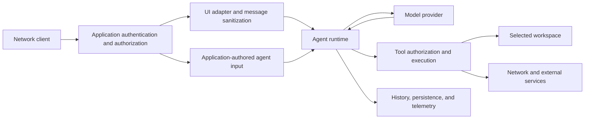

# Pydantic AI threat model

Working draft for maintainer review.

This document maps the security boundaries in Pydantic AI, its harness, and its CLI clients. It helps reviewers identify attacker-controlled inputs, the resources those inputs can reach, and which component owns each control. Component documentation defines the exact options and limitations.

## Scope and deployment profiles

The same agent can run inside applications with different authority. Evaluate a report against the affected profile.

| Profile | Authority and boundary |
|---|---|
| Server application using `Agent` | The application owns authentication, tenant identity, tool permissions, provider credentials, and access to stored state. |
| Server application using a UI adapter | Client-submitted protocol messages cross an adapter boundary before reaching the agent. The hosting application still owns HTTP and session security. |
| Local CLI or harness tools | Python tools and local commands use the authority of the launching process unless a configured execution backend provides isolation. |
| Sandboxed or remote workspace | The selected backend, provider, credentials, mounts, network settings, and lifetime define the execution boundary. |
| Durable agent | The application and execution engine own access to persisted workflow state, queues, credentials, and replay infrastructure. |

See [UI adapters](docs/ui/overview.md), [workspaces](docs/workspace.md), [CLAI 2](src/pydantic_clai2/README.md), and [durable execution](docs/durable_execution/overview.md).

## Assets and adversaries

Review these assets:

- User conversations, tool results, memory, persisted run state, and deferred actions.
- Server instructions, provider identifiers, credentials, internal endpoints, and telemetry.
- Files, processes, network destinations, and external services reachable by tools or provider credentials.
- Availability and cost of model requests, tool execution, downloads, and shared resources.

An attacker may control a network request, client-submitted history, a URL, downloaded content, an MCP response, a repository file, or content the model uses to choose tool arguments. Treat model-generated arguments as untrusted inputs to the tool implementation.

Trusted application code chooses the agent's tools, dependencies, credentials, and execution backend. Installing executable plugins or granting tool access delegates authority. Schema validation and model instructions do not establish the caller's permission to exercise that authority.

## Data flow

The hosting application controls which clients may enter this flow. Adapters, tools, download transports, execution backends, and state stores enforce different controls after entry. Check each crossing in both directions: incoming data can select an operation or resource, and outgoing data can disclose protected information.

## Core boundaries

### UI history and server-state disclosure

Protocol-derived history is client-controlled. UI adapters sanitize that input before execution. Direct `message_history` supplied to `Agent.run` is an application-authored path; an application accepting history from a client must apply the corresponding validation and authorization.

Review incoming fields that can select provider state, instructions, uploaded files, download policy, tool calls, run identity, or a workspace. Review outgoing fields that can reveal server instructions, internal endpoints, provider details, or other users' state. Use explicit opt-in controls where an adapter supports trusting input or disclosing additional state.

Sanitization does not authenticate a client or prove that a submitted tool call or approval came from a genuine paused run. The application must authorize deferred actions and state access.

Canonical guidance: [adapter trust model](docs/ui/overview.md), [deferred tools](docs/deferred-tools.md), and the [approval provenance follow-up](https://github.com/pydantic/pydantic-ai/issues/6452).

### HTTP and browser-origin security

A UI adapter is mounted in an application that owns authentication, authorization, sessions, CORS, and CSRF protection. A JSON content-type check narrows accepted requests; applications using cookie authentication must also apply an appropriate CSRF policy.

A local web interface has its own browser-origin and host-access boundary. A browser visiting an unrelated site can still issue requests toward loopback services. The built-in web interface checks allowed hosts and JSON content types; those checks do not authenticate a user. Exposing that interface to untrusted clients requires application authentication. Evaluate the CLI web profile separately from an adapter mounted in a server application.

Canonical guidance: [UI deployment](docs/ui/overview.md) and [web interface](docs/web.md).

### URL fetching and provider file references

URLs can select resources reachable with the server's network access or a provider's credentials. Server-side request forgery (SSRF) review covers schemes, resolved addresses, redirects, alternate address forms, response size, and each transport that performs a fetch.

Local downloads use `safe_download` for address, redirect, and response-size checks. Private addresses are blocked by default, and metadata addresses remain blocked when local URLs are enabled. `WebFetch()` uses provider-native fetching by default; a configured local fallback uses the library's downloader.

A provider-resolved uploaded-file identifier or cloud-storage URL can exercise provider credentials without using the library's local downloader. Review client-supplied references at the adapter boundary and local downloads at their transport boundary.

Applications that opt into local/private destinations must authorize those destinations. Native provider tools and custom tools have the behavior and credentials of their provider or implementation.

Canonical guidance: [web fetching](docs/capabilities/web-fetch.md), [multimodal input](docs/input.md), [adapter trust model](docs/ui/overview.md), and [local download controls](pydantic_ai_slim/pydantic_ai/_ssrf.py).

### Tool actions, approvals, and prompt injection

Tool implementations must authorize the requested action using trusted application identity and policy. Pydantic validation checks the argument schema; a valid argument can still name an unauthorized account, file, URL, or operation.

Untrusted content can influence model decisions. Instructions, delimiters, model judgment, and an approval label are not substitutes for authorization in tool code. An approval mechanism protects only the operations it actually intercepts; preserve that control through delegated, resumed, and background execution paths.

Canonical guidance: [function tools](docs/tools.md), [advanced tools](docs/tools-advanced.md), [deferred tools](docs/deferred-tools.md), and [dependencies](docs/dependencies.md).

### MCP connections and agent configuration

MCP connections exchange tool arguments and content with a configured server. Local MCP is the default capability path; provider-native MCP is an explicit opt-in. The application chooses trusted server endpoints, credentials, and tools, and authorizes the operations it exposes. Transport authentication does not establish the identity of the application's own caller.

Agent specs can select configured capabilities and providers. YAML/JSON parsing and Pydantic validation establish the configuration's shape. The application must decide who can supply configuration that grants those capabilities or selects endpoints and resources.

Canonical guidance: [MCP capability](docs/capabilities/mcp.md), [MCP clients](docs/mcp/client.md), and [agent specs](docs/agent-spec.md).

### Persistent state and tenant identity

The application must bind conversations, response identifiers, memory namespaces, deferred results, and workspace reattachment to the authorized user. An identifier supplied by a client is not proof of ownership.

Treat storage backends and durable execution infrastructure according to the deployment's trust assumptions. Durable execution does not add an integrity or tenant-authorization guarantee to an otherwise untrusted state store. Persistence also does not roll back an external side effect after a crash.

Canonical guidance: [message history](docs/message-history.md), [persistence](docs/persistence.md), [durable execution](docs/durable_execution/overview.md), [harness memory](docs/harness/memory.md), and [step persistence](docs/harness/step-persistence.md).

### Telemetry and secrets

Messages, tool arguments, results, files, and provider details can contain secrets. When instrumentation is enabled, its defaults include content. Text content, binary content, and model-request parameters have separate collection controls. Review redaction, access controls, and export destinations as part of the deployment.

A setting that suppresses one content field does not establish that the same content is absent from every event, exception, or integration. Local conversation and credential stores also need their documented access protections.

Canonical guidance: [Logfire](docs/logfire.md), [instrumentation](docs/capabilities/instrumentation.md), and [CLAI 2 storage and authentication](src/pydantic_clai2/README.md).

### Availability and resource lifetime

Review how untrusted input affects downloads, queued requests, model usage, tool runtime, persisted work, and background jobs. Distinguish application admission policy from library-owned allocation and cleanup.

Usage limits, timeouts, and concurrency limits control different resources. Evaluate normal completion, exceptions, cancellation, partial consumption, and recovery against the documented lifetime of each allocation. Scope the consequence to the affected pool, process, backend, or service.

An output-length cap does not bound downloading, parsing, or conversion work performed before truncation. Review where each limit is applied. Per-run usage limits also do not establish tenant-wide admission or provider spend controls.

Canonical guidance: [agent usage limits](docs/agent.md), [timeouts](docs/timeouts.md), [model concurrency](docs/models/overview.md), and [background tools](docs/harness/background-tools.md).

## Harness and CLI execution boundaries

| Surface | Existing control | Responsibility and limitation |
|---|---|---|
| File tools | Resolved-path checks and configured allow, deny, and read-only patterns. | These are tool-specific guardrails. The backend's path-resolution support and check/use races matter. Shell commands can reach resources outside these checks. |
| Shell tools | Workspace selection, command filters, timeouts, and output limits. | Command filters are not process isolation. Local execution uses the OS user's authority; detached jobs have a separate lifetime. |
| Bubblewrap | Configured mounts, user namespace, temporary directory, and network restrictions. | Host-file visibility and same-user process access have documented limits. Extra mounts and network settings change exposure. |
| SSH and cloud workspaces | Commands and file operations run through the configured remote account or provider. | Account permissions, provider isolation, network access, credentials, and cleanup define the boundary. |
| Plugins and MCP | CLAI 2 has project-declaration approval and MCP configuration trust checks. | Approved executable code and stdio servers run with the launching user's authority. Remote tools receive arguments and return untrusted content. |
| Delegation and persistence | Child histories, tool selection, state snapshots, and effect records. | Separate histories do not isolate shared dependencies or workspaces. Recovery requires application decisions about unfinished external effects. |

Canonical guidance: [filesystem security model](docs/harness/filesystem.md#security-model), [shell command controls](docs/harness/shell.md), [Bubblewrap](docs/harness/bubblewrap-sandbox.md), [SSH](docs/harness/ssh-workspace.md), [E2B](docs/harness/e2b-sandbox.md), [Modal](docs/harness/modal-sandbox.md), [Sprites](docs/harness/sprites-sandbox.md), [plugins](src/pydantic_clai2/PLUGINS.md), [subagents](docs/harness/subagents.md), and [step persistence](docs/harness/step-persistence.md).

Stock CLAI 2 is a broad local-execution profile: its default Coder has unrestricted file access and uses a local workspace unless configured otherwise. Launching from a directory does not contain its commands or file access. Environment filtering covers selected credential names and does not isolate other secrets or files readable by the OS user. See the [CLAI 2 README](src/pydantic_clai2/README.md).

ACP integrations can delegate filesystem access and approvals to a client. Evaluate that client's authorization alongside the server's enabled tools; the client-backed filesystem toolset does not add a sandbox. See the [ACP client toolsets](src/pydantic_ai_harness/pydantic_ai_harness/experimental/acp/_client_toolsets.py).

## Published failure patterns

These precedents show what to examine when a component or control changes. Read each advisory for its affected versions and conditions.

| Pattern | Review focus | Published examples |
|---|---|---|
| URL checks and network resolution disagree | Alternate address forms, hostname normalization, redirects, metadata access, and domain-list semantics. | [Metadata protection](https://github.com/pydantic/pydantic-ai/security/advisories/GHSA-cg7w-rg45-pc59), [domain-list bypass](https://github.com/pydantic/pydantic-ai/security/advisories/GHSA-22h6-qm39-v87j). |
| Limits apply after expensive work | Streaming download caps, conversion complexity, intermediate memory, and event-loop responsiveness. | [Download size](https://github.com/pydantic/pydantic-ai/security/advisories/GHSA-v2xh-2vp8-57h8), [conversion cost](https://github.com/pydantic/pydantic-ai/security/advisories/GHSA-v36g-jcw9-x7cw). |
| A browser reaches a privileged local endpoint | Origin, host, content type, and request-controlled UI assets. | [Cross-origin requests](https://github.com/pydantic/pydantic-ai/security/advisories/GHSA-h4xc-3qfq-jf93), [DNS rebinding](https://github.com/pydantic/pydantic-ai/security/advisories/GHSA-q2xc-rrxj-58x9), [UI asset selection](https://github.com/pydantic/pydantic-ai/security/advisories/GHSA-wjp5-868j-wqv7). |
| Client history changes execution or provider access | The surviving history tail, uploaded-file references, and authorization independent of client approval state. | [History sanitization](https://github.com/pydantic/pydantic-ai/security/advisories/GHSA-jpr8-2v3g-wgf9), [uploaded files](https://github.com/pydantic/pydantic-ai/security/advisories/GHSA-h7p7-w5gc-xj3w). |
| Redaction misses another export channel | Events, exceptions, status text, instructions, templates, and every integration that emits content. | [Retry content](https://github.com/pydantic/pydantic-ai/security/advisories/GHSA-3gh4-cghq-f8v4), [additional trace channels](https://github.com/pydantic/pydantic-ai/security/advisories/GHSA-4x9p-g9wm-8q7f). |

## Proposed report-evaluation questions

Use the affected component's current documented boundary when evaluating a report.

1. What version, deployment profile, and configuration is affected?
2. What input can the attacker control, and what access is required?
3. Which implementation path carries that input to the protected resource?
4. What concrete confidentiality, integrity, or availability consequence can be reproduced?
5. Which library control or application responsibility governs that path?
6. Does the reproduction use a reasonable configuration consistent with documentation?
7. Does the proposed fix repair that boundary, or introduce a new guarantee?
8. Which regression test proves the boundary and the relevant completion/error paths?

A configuration-dependent report needs explicit deployment assumptions. For library scoring, use [FIRST's guidance for reasonable embedding scenarios](https://www.first.org/cvss/v3.1/user-guide#3-7-scoring-vulnerabilities-in-software-libraries-and-similar). Severity scoring and the decision to publish an advisory require separate maintainer judgment.

## Keeping this model current

Update this document when a change adds an input path, transfers authority, changes a trust or disclosure default, or changes an execution backend's guarantee. Keep option-level details in their canonical component documentation.

For a change crossing a boundary, trace the incoming value to its authorization or validation and trace the outgoing value to its audience. Include a regression test for the specific control. Review adapter protocols, local/provider transports, execution backends, and cancellation or recovery paths that share the affected mechanism.
