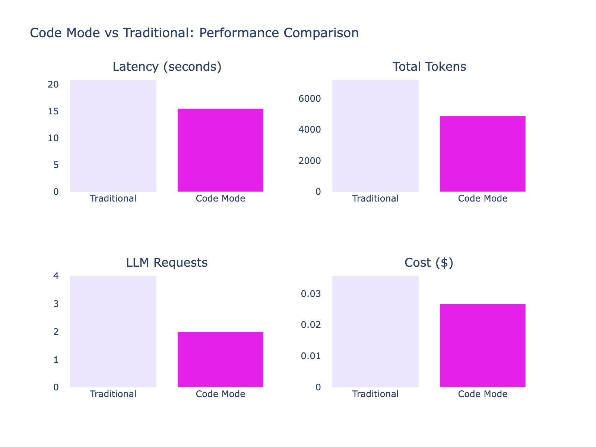

# Code Mode vs Traditional Tool Calling

Performance comparison running the same complex task 10 times in each mode.

## Results



| Metric | Traditional | Code Mode | Savings |
|--------|-------------|-----------|---------|
| **Latency** | 20.77s | 15.50s | **25.4%** |
| **Total Tokens** | 7,159 | 4,867 | **32.0%** |
| **LLM Requests** | 4 | 2 | **50.0%** |
| **Cost** | $0.036 | $0.027 | **25.2%** |

## Task

Analyze engineering team spending with discount savings:
1. Get all team members from the 'engineering' team
2. For each member, fetch their completed orders
3. For each order, get product details and check for discounts
4. Calculate discount amounts for qualifying orders
5. Find the team member who saved the most

**Expected answer:** Bob with $150 savings (Monitor, 15% off)

## Why Code Mode Wins

**Traditional mode** requires multiple round-trips:
- Request 1: Get team members → 4 members
- Request 2: Get orders for each member (4 tool calls)
- Request 3: Get product + discount for each order (8 tool calls)
- Request 4: Final analysis and response

**Code mode** does it in 2 requests:
- Request 1: LLM generates Python code that calls all tools and computes the result
- Request 2: Final response with analysis

## Reproduce

```bash
# Run evals (10 iterations each mode)
source .env && uv run python demos/code_mode/run_evals.py

# Fetch data from Logfire
source .env && uv run python demos/code_mode/analysis/fetch_data.py

# Generate charts
uv run --with plotly --with pandas --with kaleido python demos/code_mode/analysis/plot_charts.py
```
