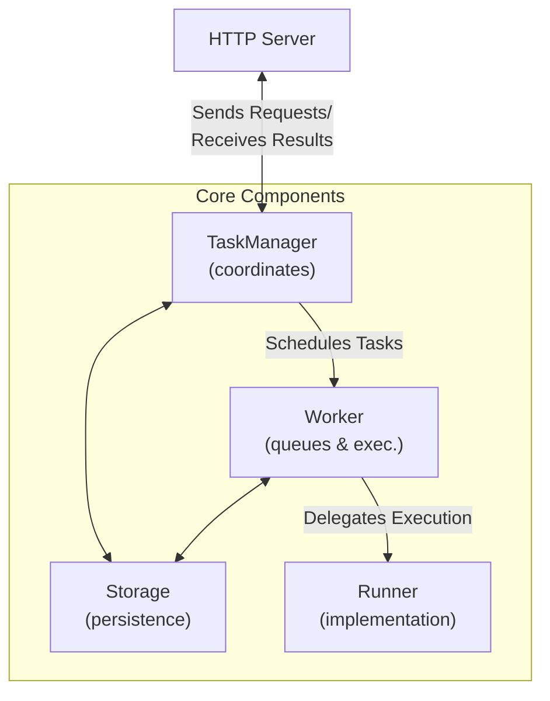

# Agent2Agent (A2A) Protocol

The Agent2Agent (A2A) Protocol is an open standard introduced by Google
that enables communication and interoperability between AI agents, regardless
of the framework or vendor they are built on. This protocol addresses one of
the biggest challenges in enterprise AI adoption: getting agents built on
different platforms to work together seamlessly.

## What is A2A?

A2A provides a common language for AI agents to communicate with each other,
allowing them to discover capabilities, negotiate interaction modes, and
securely work together. The protocol facilitates:

- **Agent Discovery**: Agents can advertise their capabilities through "Agent Cards" (JSON metadata files) that describe what they can do
- **Task Management**: A standardized way to initiate, track, and complete tasks between agents
- **Secure Collaboration**: Enterprise-grade authentication and authorization mechanisms
- **Rich Communication**: Support for multimodal content exchange (text, structured data, files)
- **Real-time Updates**: Streaming capabilities for long-running tasks

## How A2A Works

At its core, A2A is built on existing web standards (HTTP, JSON-RPC,
Server-Sent Events) and follows a client-server model where:

1. A client agent formulates a task request
2. A remote agent processes the request and sends back results
3. Both agents exchange messages and artifacts through a well-defined protocol

The central unit of work in A2A is a **Task**, which progresses through various
states (submitted, working, input-required, completed, failed, canceled).
Tasks contain messages and can produce artifacts as results.

## FastA2A

To make it easier to implement A2A servers, we've implemented FastA2A,
a library built on top of Starlette and Pydantic to bring A2A to Python.

You can use FastA2A with any agentic framework (it's not exclusive
to PydanticAI). That said, we have a convenience function to create an
A2A server from an existing PydanticAI agent.

```python
from pydantic_ai.a2a import FastA2A
from pydantic_ai.agent import Agent

# Create an A2A server from an existing agent
agent = Agent('anthropic:claude-3-5-sonnet-latest', name='My A2A Agent')
a2a_server = FastA2A.from_agent(
    agent,
    url="http://localhost:8000",
    description="A helpful agent that can assist with various tasks"
)

if __name__ == "__main__":
    import uvicorn

    uvicorn.run(a2a_server, host="0.0.0.0", port=8000)
```

### Design

We built `FastA2A` with the following design in mind:



You can bring your own `Storage`, `Worker` and `Runner`.

By default, if using the `from_agent` method, the `TaskManager` will use an
in-memory called `InMemoryStorage` and a `Worker` that runs the tasks in the
same process.

#### Storage

The `Storage` is responsible for saving and loading tasks.

You can bring your own `Storage` by subclassing the `Storage` class and
overriding the `save_task` and `load_task` methods.

#### Worker

The `Worker` is responsible for both scheduling tasks and executing them.

#### Runner

The `Runner` is the component that defines how the task is executed.
