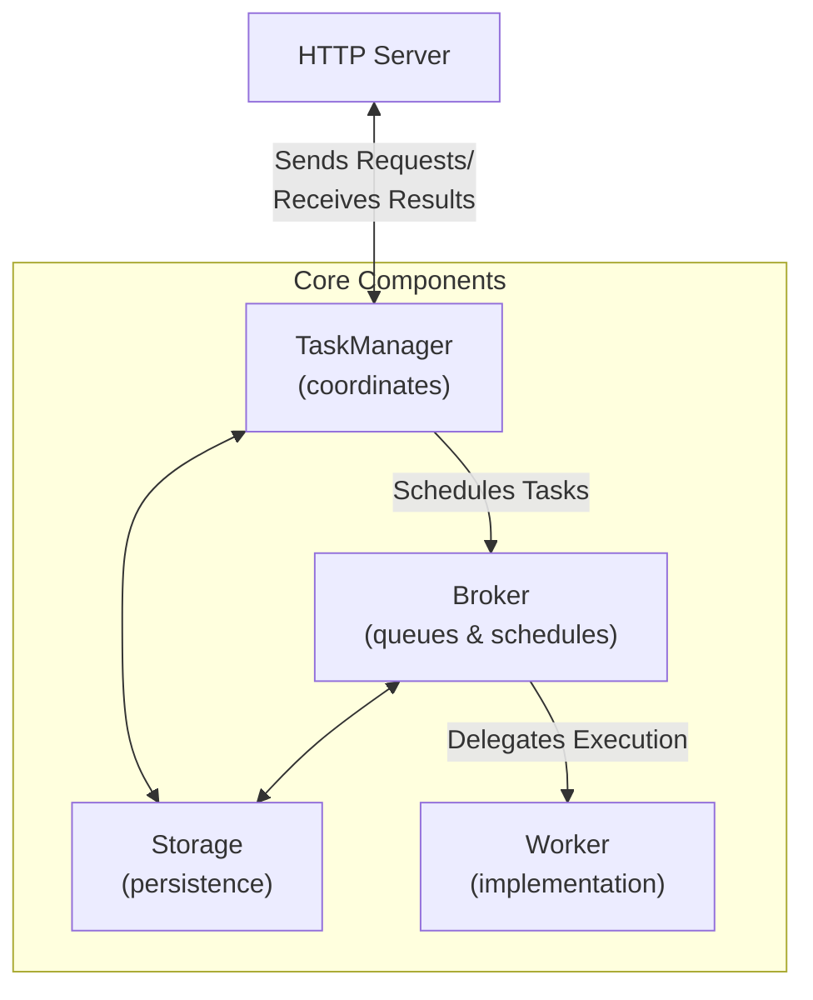

# Agent2Agent (A2A) Protocol

The [Agent2Agent (A2A) Protocol](https://google.github.io/A2A/) is an open standard introduced by Google that enables
communication and interoperability between AI agents, regardless of the framework or vendor they are built on.

At Pydantic, we built the [FastA2A](#fasta2a) library to make it easier to implement the A2A protocol in Python.

We also built a convenience method that expose PydanticAI agents as A2A servers - let's have a quick look at how to use it:

```py {title="agent_to_a2a.py" hl_lines="4"}
from pydantic_ai import Agent

agent = Agent('openai:gpt-4.1', instructions='Be fun!')
app = agent.to_a2a()
```

_You can run the example with `uvicorn agent_to_a2a:app --host 0.0.0.0 --port 8000`_

This will expose the agent as an A2A server, and you can start sending requests to it.

See more about [exposing PydanticAI agents as A2A servers](#pydanticai-agent-to-a2a-server).

## FastA2A

**FastA2A** is an agentic framework agnostic implementation of the A2A protocol in Python.
The library is designed to be used with any agentic framework, and is **not exclusive to PydanticAI**.

### Design

**FastA2A** is built on top of [Starlette](https://starlette.io), which means it's fully compatible with any ASGI server.

Given the nature of the A2A protocol, it's important to understand the design before using it, as a developer
you'll need to provide some components:

- [`Storage`][fasta2a.Storage]: to save and load tasks
- [`Broker`][fasta2a.Broker]: to schedule tasks
- [`Worker`][fasta2a.Worker]: to execute tasks

Let's have a look at how those components fit together:



FastA2A allows you to bring your own [`Storage`][fasta2a.Storage], [`Broker`][fasta2a.Broker] and [`Worker`][fasta2a.Worker].


### Installation

FastA2A is available on PyPI as [`fasta2a`](https://pypi.org/project/fasta2a/) so installation is as simple as:

```bash
pip/uv-add fasta2a
```

The only dependencies are:

- [starlette](https://starlette.io): to expose the A2A server as an [ASGI application](https://asgi.readthedocs.io/en/latest/)
- [pydantic](https://pydantic.dev): to validate the request/response messages
- [opentelemetry-api](https://opentelemetry-python.readthedocs.io/en/latest): to provide tracing capabilities

You can install PydanticAI with the `a2a` extra to include **FastA2A**:

```bash
pip/uv-add 'pydantic-ai-slim[a2a]'
```

### PydanticAI Agent to A2A Server

To expose a PydanticAI agent as an A2A server, you can use the `to_a2a` method:

```python {title="agent_to_a2a.py"}
from pydantic_ai import Agent

agent = Agent('openai:gpt-4.1', instructions='Be fun!')
app = agent.to_a2a()
```

Since `app` is an ASGI application, it can be used with any ASGI server.

```bash
uvicorn agent_to_a2a:app --host 0.0.0.0 --port 8000
```

Since the goal of `to_a2a` is to be a convenience method, it accepts the same arguments as the [`FastA2A`][fasta2a.FastA2A] constructor.

### Interacting with the A2A Server using a Client

For client-server interaction, we can create a client using the [`A2AClient`][fasta2a.client.A2AClient] class, which enables us to send and get tasks from the agent. In FastA2A, we expose two methods `send_task` and `get_task` to do so.
```python
from fasta2a.client import A2AClient

client = A2AClient(base_url='http://localhost:8000')
```

To send a task for execution, we create a [`Message`][fasta2a.schema.Message] object and pass it to the client's `send_task` function. (example from [Google](https://google.github.io/A2A/tutorials/python/6-interact-with-server/#understanding-the-client-code)):
```python
from fasta2a.client import A2AClient
from fasta2a.schema import Message

client = A2AClient(base_url='http://localhost:8000')

async def send_message():
    send_message_payload = Message(
        role='user',
        parts=[
            {'type': 'text', 'text': 'How much is 10 USD in INR?'}
        ]
    )

    response = await client.send_task(message=send_message_payload)
    print(response)
    """
    {
        'jsonrpc': '2.0',
        'id': '09cd5ee1-81ca-4779-8679-47c002e5a09f',
        'result': {
            'id': 'b6e6cce0-bd98-43c7-8104-c5ce0836f2f6',
            'session_id': 'c0642116-b579-427e-a5e1-4bb2b41244f8',
            'status': {
                'state': 'submitted',
                'timestamp': '2025-05-14T12:33:50.618260'
            },
            'history': [
                {'role': 'user', 'parts': [{'type': 'text', 'text': 'how much is 10 USD in INR?'}]}
            ]
        }
    }
    """
```

Ensure that you call the main method using `asyncio.run` to execute the asynchronous code.

We can use the `get_task` function to get the status and result from the task, however we need the result ID from the response in order to do so. Note that the task may still be in-progress on the agent's side while this is taking place.
```python {hl_lines="3 17-20"}
from fasta2a.client import A2AClient

client = A2AClient(base_url='http://localhost:8000')

async def send_message(send_message_payload):
    response = await client.send_task(message=send_message_payload)
    response_task_id = str(response['result']['id'])
    processed_task_response = await client.get_task(task_id=response_task_id)
    print(processed_task_response)
    """
    {
        'jsonrpc': '2.0',
        'id': None,
        'result': {
            'id': '...',
            'session_id': '...',
            'status': {
                'state': 'working',
                'timestamp': '2025-05-14T19:36:45.963421'
            },
            'history': [
                {'role': 'user', 'parts': [{'type': 'text', 'text': 'how much is 10 USD in INR?'}]}
            ]
        }
    }
    """
```

In the case that you are debugging A2A using a client, you may want to add in a delay to retrieve the fulfilled response that you want from the agent.
```python {hl_lines="10"}
import time

from fasta2a.client import A2AClient

client = A2AClient(base_url='http://localhost:8000')

async def send_message(send_message_payload):
    response = await client.send_task(message=send_message_payload)
    response_task_id = str(response['result']['id'])
    time.sleep(2) # Adding in a delay to ensure that we get a fulfilled response.
    processed_task_response = await client.get_task(task_id=response_task_id)
    print(processed_task_response)
    """
    {
        'jsonrpc': '2.0',
        'id': None,
        'result': {
            'id': '...',
            'session_id': '...',
            'status': {
                'state': 'completed', 'timestamp': '2025-05-14T19:13:07.759377'
            },
            'history': [
                {'role': 'user', 'parts': [{'type': 'text', 'text': 'how much is 10 USD in INR?'}]}
            ],
            'artifacts': [
                {'name': 'result', 'parts': [{'type': 'text', 'text': 'As of October 26, 2023, at 11:10 AM PST, 10 USD is approximately **833.18 INR**.\n\nKeep in mind that exchange rates fluctuate constantly, so this is just an estimate. For the most accurate conversion, you should check a real-time currency converter like Google Finance, XE.com, or a similar service just before you need the information.\n'}], 'index': 0}
            ]
        }
    }
    """
```

Here's the full code:
```python {title="a2a_client.py"}
import time

from fasta2a.client import A2AClient
from fasta2a.schema import Message

client = A2AClient(base_url='http://localhost:8000')

async def send_message():
    send_message_payload = Message(
        role='user',
        parts=[
            {'type': 'text', 'text': 'How much is 10 USD in INR?'}
        ]
    )

    task_response = await client.send_task(message=send_message_payload)
    task_response_result_id = str(task_response['result']['id'])
    time.sleep(2) # <- Just for task fulfillment.
    fulfilled_task_response = await client.get_task(task_id=task_response_result_id)
    print(fulfilled_task_response['result']['artifacts'])
    """
    [
        {
            'name': 'result',
            'parts': [{'type': 'text', 'text': 'As of October 26, 2023, at 11:10 AM PST, 10 USD is approximately **833.18 INR**.\n\nKeep in mind that exchange rates fluctuate constantly, so this is just an estimate. For the most accurate conversion, you should check a real-time currency converter like Google Finance, XE.com, or a similar service just before you need the information.\n'}],
            'index': 0
        }
    ]
    """
```
_(This example is complete, it can be run "as is" — you'll need to add `asyncio.run(main())` to run `main`)_
