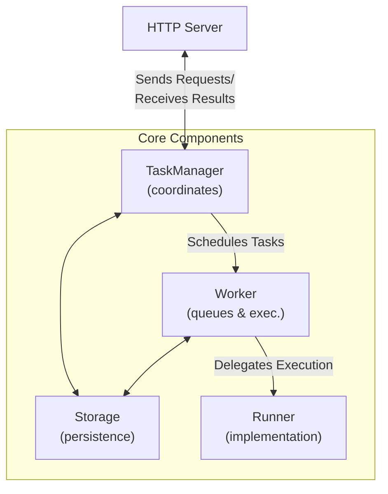

## FastA2A

!!! warning
    This page is WIP.

To make it easier to implement A2A servers, we've implemented FastA2A,
a library built on top of Starlette and Pydantic to bring A2A to Python.

You can use FastA2A with any agentic framework (it's not exclusive
to PydanticAI). That said, we have a convenience function to create an
A2A server from an existing PydanticAI agent.

```python {title="a2a.py}
from pydantic_ai.a2a import FastA2A
from pydantic_ai.agent import Agent

# Create an A2A server from an existing agent
agent = Agent('anthropic:claude-3-5-sonnet-latest', name='My A2A Agent')
app = FastA2A.from_agent(
    agent,
    url='http://localhost:8000',
    description='A helpful agent that can assist with various tasks'
)
```

Then you can run the server with:

```bash
uvicorn a2a:app --host 0.0.0.0 --port 8000
```

### Design

We built `FastA2A` with the following design in mind:



You can bring your own `Storage`, `Worker` and `Runner`.

By default, if using the `from_agent` method, the `TaskManager` will use an
in-memory called `InMemoryStorage` and a `Worker` that runs the tasks in the
same process.

#### Storage

The `Storage` is responsible for saving and loading tasks.

You can bring your own `Storage` by subclassing the `Storage` class and
overriding the `save_task` and `load_task` methods.

#### Worker

The `Worker` is responsible for both scheduling tasks and executing them.

#### Runner

The `Runner` is the component that defines how the task is executed.
