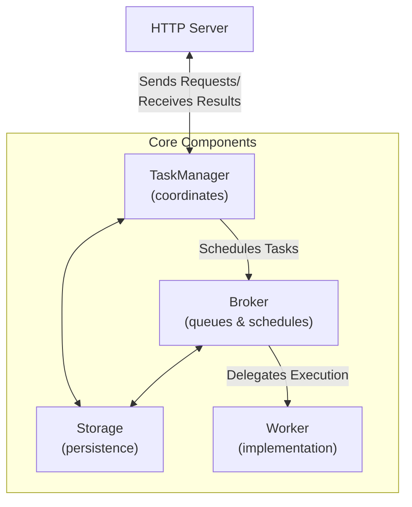

# FastA2A

To make it easier to implement A2A servers, we've implemented FastA2A,
a library built on top of Starlette and Pydantic to bring A2A to Python.

## Creating an A2A Server

You can use FastA2A with any agentic framework (it's not exclusive
to PydanticAI). That said, we provide a convenience method on `pydantic_ai.Agent` to create an
A2A server from an existing PydanticAI agent.

```python
from pydantic_ai import Agent

# Create your agent
agent = Agent(model=your_model, output_type=your_output_type)

# Convert it to an A2A app
app = agent.to_a2a()
```

You can then run the server with:

```bash
uvicorn your_module:app --host 0.0.0.0 --port 8000
```

## Message Types

A2A supports different message part types to enable rich communication between clients and agents. Each message consists of a role (typically 'user' or 'agent') and one or more parts of different types.

### Text Messages

Text messages are the most basic form of communication, consisting of plain text content.

```python
from fasta2a.schema import Message, TextPart

message = Message(role='user', parts=[TextPart(text='Hello, world!', type='text')])
```

The `TextPart` contains:
- `type`: Always "text" for text messages
- `text`: The actual text content

### File Messages

File messages allow sharing files with the agent. Files can be provided in two ways:

#### File URL

When the file is accessible via a URL, you can reference it using the URL and specify its MIME type:

```python
from fasta2a.schema import Message, FilePart

message = Message(
    role='user',
    parts=[
        FilePart(
            type='file',
            file={
                'url': 'https://example.com/file.txt',  # URL to the file
                'mime_type': 'text/plain',              # MIME type of the file
            },
        )
    ],
)
```

#### File Content

For smaller files, you can embed the content directly in the message:

```python
from fasta2a.schema import Message, FilePart

message = Message(
    role='user',
    parts=[
        FilePart(
            type='file',
            file={
                'data': 'This is the content of the file',  # File content is base64 encoded
                'mime_type': 'text/plain',                  # MIME type of the file
            },
        )
    ],
)
```

File messages are useful for sending documents, images, or other binary data to the agent for processing.

### Data Messages

Data messages allow sending structured data in JSON format to the agent:

```python
from fasta2a.schema import Message, DataPart

message = Message(
    role='user',
    parts=[
        DataPart(
            type='data',
            data={
                'name': 'John Doe',
                'age': 30,
                'preferences': ['reading', 'coding'],
                'metadata': {
                    'user_id': '12345',
                    'session': 'abc123'
                }
            }
        )
    ],
)
```

### Combining Multiple Parts

You can combine multiple parts in a single message:

```python
from fasta2a.schema import Message, TextPart, DataPart, FilePart

message = Message(
    role='user',
    parts=[
        TextPart(type='text', text='Here is my resume and some additional information:'),
        FilePart(
            type='file',
            file={'url': 'https://example.com/resume.pdf', 'mime_type': 'application/pdf'},
        ),
        DataPart(
            type='data',
            data={'years_experience': 5, 'skills': ['Python', 'FastAPI', 'ML']}
        )
    ],
)
```

This allows for rich, multimodal interactions with your agent.

## Using a Custom Storage

By default, FastA2A uses an in-memory storage. You can provide a custom storage implementation:

```python
from fasta2a.storage import InMemoryStorage

storage = InMemoryStorage()
app = agent.to_a2a(storage=storage)
```

## Design

We built `FastA2A` with the following design in mind:



You can bring your own `Storage`, `Broker` and `Worker`.

### Storage

The `Storage` is responsible for saving and loading tasks.

You can bring your own `Storage` by subclassing the `Storage` class and
overriding the `save_task` and `load_task` methods.

### Broker

The `Broker` is responsible for scheduling tasks and managing the execution queue.

### Worker

The `Worker` is the component that defines how the task is executed. It receives tasks from the
broker and processes them according to the defined logic.
