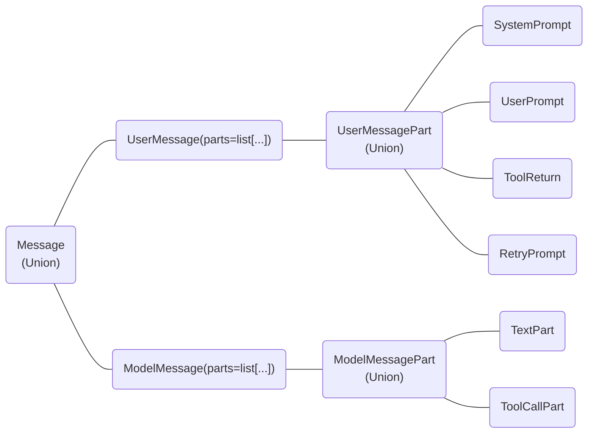

# `pydantic_ai.messages`

The structure of [Message][pydantic_ai.messages.Message] can be shown as a graph:

```mermaid
graph RL
    SystemPrompt(SystemPrompt) --- UserMessagePart
    UserPrompt(UserPrompt) --- UserMessagePart
    ToolReturn(ToolReturn) --- UserMessagePart
    RetryPrompt(RetryPrompt) --- UserMessagePart
    TextPart(TextPart) --- ModelMessagePart
    ToolCallPart(ToolCallPart) --- ModelMessagePart
    UserMessagePart("UserMessagePart<br>(Union)") --- UserMessage
    UserMessage("UserMessage(parts=list[...])") --- Message
    ModelMessagePart("ModelMessagePart<br>(Union)") --- ModelMessage
    ModelMessage("ModelMessage(parts=list[...])") --- Message("Message<br>(Union)")
```

::: pydantic_ai.messages
