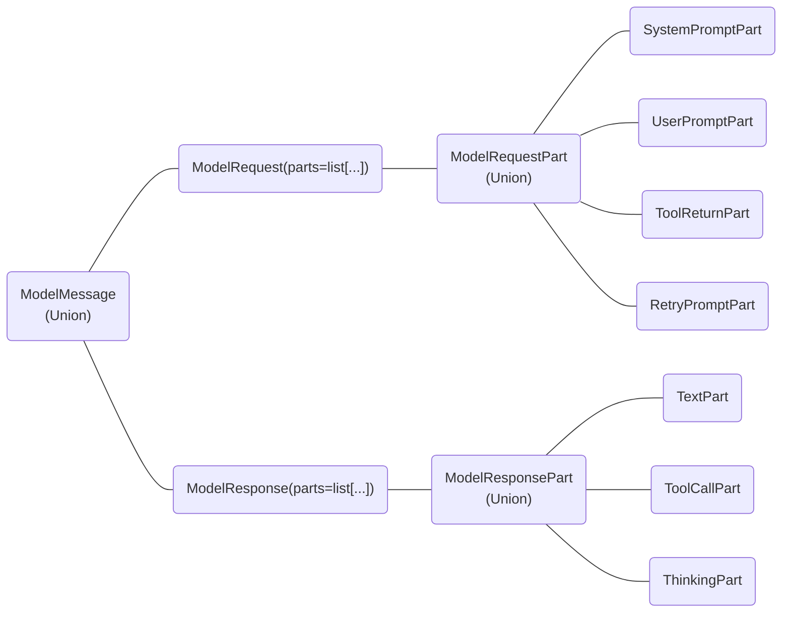

# `pydantic_ai.messages`

The structure of [`ModelMessage`][pydantic_ai.messages.ModelMessage] can be shown as a graph:

## Citations

[`TextPart`][pydantic_ai.messages.TextPart] objects can include citations that reference sources used by the model. Citations are stored in the `citations` field and can be one of three types:

- [`URLCitation`][pydantic_ai.messages.URLCitation]: Used by OpenAI models, contains URL, title, and character indices
- [`ToolResultCitation`][pydantic_ai.messages.ToolResultCitation]: Used by Anthropic models, contains tool information and citation data
- [`GroundingCitation`][pydantic_ai.messages.GroundingCitation]: Used by Google models, contains grounding and citation metadata

The [`Citation`][pydantic_ai.messages.Citation] type alias represents the union of all citation types.

For more information, see the [Accessing Citations](../../citations/accessing_citations.md) guide.

::: pydantic_ai.messages
