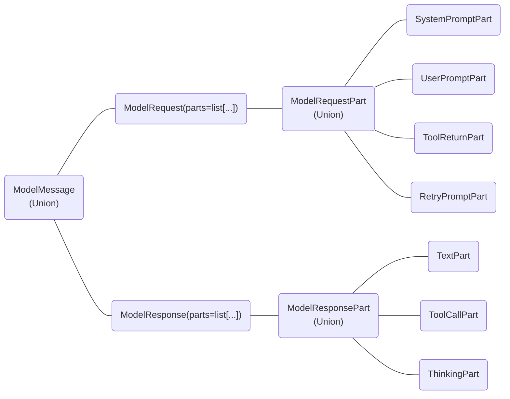

# `pydantic_ai.messages`

The structure of [`ModelMessage`][pydantic_ai.messages.ModelMessage] can be shown as a graph:

```mermaid
graph RL
    SystemPromptPart(SystemPromptPart) --- ModelRequestPart
    UserPromptPart(UserPromptPart) --- ModelRequestPart
    ToolReturnPart(ToolReturnPart) --- ModelRequestPart
    RetryPromptPart(RetryPromptPart) --- ModelRequestPart
    TextPart(TextPart) --- ModelResponsePart
    ToolCallPart(ToolCallPart) --- ModelResponsePart
    ThinkingPart(ThinkingPart) --- ModelResponsePart
    ModelRequestPart("ModelRequestPart<br>(Union)") --- ModelRequest
    ModelRequest("ModelRequest(parts=list[...])") --- ModelMessage
    ModelResponsePart("ModelResponsePart<br>(Union)") --- ModelResponse
    ModelResponse("ModelResponse(parts=list[...])") --- ModelMessage("ModelMessage<br>(Union)")
```

::: pydantic_ai.messages

::: pydantic_ai.messages.ToolSearchArgs

::: pydantic_ai.messages.ToolSearchReturnContent

::: pydantic_ai.messages.ToolSearchCallPart

::: pydantic_ai.messages.ToolSearchReturnPart

::: pydantic_ai.messages.NativeToolSearchCallPart

::: pydantic_ai.messages.NativeToolSearchReturnPart
