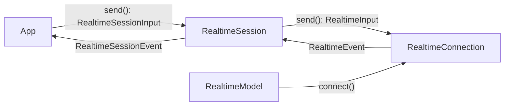

# `pydantic_ai.realtime`

Support for **realtime, bidirectional speech-to-speech models** (OpenAI Realtime, and any other
provider that streams audio in and out over a persistent connection).

Unlike [`Model`][pydantic_ai.models.Model], which is request-response, a realtime model opens a
long-lived connection: you stream audio (or text/images) in, and consume audio, transcripts, and
tool calls as they arrive. The high-level entry point is
[`Agent.realtime_session`][pydantic_ai.agent.Agent.realtime_session], which wires the agent's tools and
instructions into a session and runs the tool loop for you. See the [Realtime guide](../realtime.md)
for a walkthrough.

The flow of a session:

A [`RealtimeModel`][pydantic_ai.realtime.RealtimeModel] opens a
[`RealtimeConnection`][pydantic_ai.realtime.RealtimeConnection] (the provider-specific transport).
A [`RealtimeSession`][pydantic_ai.realtime.RealtimeSession] wraps that connection: it translates the
low-level codec events into the shared message/part event vocabulary from
[`pydantic_ai.messages`][pydantic_ai.messages], builds ordinary
[`ModelMessage`][pydantic_ai.messages.ModelMessage] history, and executes tools automatically —
intercepting each [`ToolCall`][pydantic_ai.realtime.ToolCall], running it, sending the
[`ToolResult`][pydantic_ai.realtime.ToolResult] back, and emitting a
[`FunctionToolCallEvent`][pydantic_ai.messages.FunctionToolCallEvent] then a
[`FunctionToolResultEvent`][pydantic_ai.messages.FunctionToolResultEvent]. Tools listed in
`background_tools` run concurrently so the model can keep speaking while they work.

## Overview

**Provider abstractions & session**

| Object | Role |
| --- | --- |
| [`RealtimeModel`][pydantic_ai.realtime.RealtimeModel] | Provider ABC; `connect()` opens a connection. |
| [`RealtimeModelSettings`][pydantic_ai.realtime.RealtimeModelSettings] | Settings shared by realtime providers. |
| [`RealtimeConnection`][pydantic_ai.realtime.RealtimeConnection] | Provider ABC; `send()` content in, iterate events out. |
| [`RealtimeSession`][pydantic_ai.realtime.RealtimeSession] | Wraps a connection with automatic (sync/background) tool dispatch. |
| [`ToolRunner`][pydantic_ai.realtime.ToolRunner] | Async callable a session uses to execute a tool by name. |

**Inputs** — you feed a [`RealtimeSessionInput`][pydantic_ai.realtime.RealtimeSessionInput] into
[`RealtimeSession.send`][pydantic_ai.realtime.RealtimeSession.send]:
data — [`AudioInput`][pydantic_ai.realtime.AudioInput],
[`TextInput`][pydantic_ai.realtime.TextInput],
[`ImageInput`][pydantic_ai.realtime.ImageInput];
control verbs — [`CommitAudio`][pydantic_ai.realtime.CommitAudio],
[`ClearAudio`][pydantic_ai.realtime.ClearAudio],
[`CreateResponse`][pydantic_ai.realtime.CreateResponse],
[`CancelResponse`][pydantic_ai.realtime.CancelResponse],
[`TruncateOutput`][pydantic_ai.realtime.TruncateOutput].

The low-level [`RealtimeConnection.send`][pydantic_ai.realtime.RealtimeConnection.send] accepts the
superset [`RealtimeInput`][pydantic_ai.realtime.RealtimeInput], which additionally includes
[`ToolResult`][pydantic_ai.realtime.ToolResult] — the session sends those itself as each tool
completes, so it is deliberately excluded from what a caller passes to `session.send()`.

**Connection events** — [`RealtimeEvent`][pydantic_ai.realtime.RealtimeEvent], the low-level codec
vocabulary yielded by a connection:
[`AudioDelta`][pydantic_ai.realtime.AudioDelta],
[`Transcript`][pydantic_ai.realtime.Transcript],
[`InputTranscript`][pydantic_ai.realtime.InputTranscript],
[`ToolCall`][pydantic_ai.realtime.ToolCall],
[`TurnCompleteEvent`][pydantic_ai.realtime.TurnCompleteEvent],
[`SpeechStartedEvent`][pydantic_ai.realtime.SpeechStartedEvent],
[`SpeechStoppedEvent`][pydantic_ai.realtime.SpeechStoppedEvent],
[`SessionUsageEvent`][pydantic_ai.realtime.SessionUsageEvent],
[`RateLimitsEvent`][pydantic_ai.realtime.RateLimitsEvent],
[`ReconnectedEvent`][pydantic_ai.realtime.ReconnectedEvent],
[`SourcesEvent`][pydantic_ai.realtime.SourcesEvent],
[`SessionErrorEvent`][pydantic_ai.realtime.SessionErrorEvent].

**Session events** — [`RealtimeSessionEvent`][pydantic_ai.realtime.RealtimeSessionEvent], yielded by a
session. The session translates codec events into the shared vocabulary from
[`pydantic_ai.messages`][pydantic_ai.messages]: content streams as
[`PartStartEvent`][pydantic_ai.messages.PartStartEvent] /
[`PartDeltaEvent`][pydantic_ai.messages.PartDeltaEvent] /
[`PartEndEvent`][pydantic_ai.messages.PartEndEvent] (carrying
[`SpeechPart`][pydantic_ai.messages.SpeechPart]s and
[`ToolCallPart`][pydantic_ai.messages.ToolCallPart]s), tool execution as
[`FunctionToolCallEvent`][pydantic_ai.messages.FunctionToolCallEvent] /
[`FunctionToolResultEvent`][pydantic_ai.messages.FunctionToolResultEvent], and the rest as the
control-plane events above (`TurnCompleteEvent`, `SpeechStartedEvent`, `SpeechStoppedEvent`, `SessionUsageEvent`,
`RateLimitsEvent`, `ReconnectedEvent`, `SourcesEvent`, `SessionErrorEvent`).

::: pydantic_ai.realtime

## OpenAI provider

The OpenAI Realtime API provider. Requires the `realtime` and `openai` optional groups
(`pip install "pydantic-ai-slim[realtime,openai]"`).

[`OpenAIRealtimeModel`][pydantic_ai.realtime.openai.OpenAIRealtimeModel] configures the session,
including turn-taking via [`ServerVAD`][pydantic_ai.realtime.openai.ServerVAD] /
[`SemanticVAD`][pydantic_ai.realtime.openai.SemanticVAD] (or `None` for push-to-talk) and resilience
via [`ReconnectPolicy`][pydantic_ai.realtime.ReconnectPolicy].

::: pydantic_ai.realtime.openai

## Gemini provider

The Gemini Live API provider. Requires the `google` optional group
(`pip install "pydantic-ai-slim[google]"`).

[`GoogleRealtimeModel`][pydantic_ai.realtime.google.GoogleRealtimeModel] runs over the `google-genai`
SDK (which manages the WebSocket transport). Gemini expects **16 kHz** PCM input (output is 24 kHz),
produces one response modality per session, and natively accepts live video frames sent as
[`ImageInput`][pydantic_ai.realtime.ImageInput]. It exposes Gemini Live's configuration as optional
fields — turn-taking via [`AutomaticVAD`][pydantic_ai.realtime.google.AutomaticVAD] plus
`activity_handling`/`turn_coverage`, voice via [`MultiSpeaker`][pydantic_ai.realtime.google.MultiSpeaker],
long-session [`ContextCompression`][pydantic_ai.realtime.google.ContextCompression], and resilience via
session resumption + [`ReconnectPolicy`][pydantic_ai.realtime.ReconnectPolicy]. Generation
parameters use [`GoogleRealtimeModelSettings`][pydantic_ai.realtime.google.GoogleRealtimeModelSettings].

::: pydantic_ai.realtime.google

## xAI Grok Voice provider

The xAI Grok Voice realtime API provider. Requires the `realtime` and `xai` optional groups
(`pip install "pydantic-ai-slim[realtime,xai]"`).

xAI's realtime API is a clone of the OpenAI Realtime protocol, so
[`XaiRealtimeModel`][pydantic_ai.realtime.xai.XaiRealtimeModel] reuses the OpenAI codec (event
mapping, seeding, the WebSocket connection) and reuses [`ServerVAD`][pydantic_ai.realtime.openai.ServerVAD]
for turn-taking (or `None` for push-to-talk). It diverges only where xAI does: it supports
cancellation-based interruption but not output truncation, has no image input, and surfaces input
transcription at the end of each user turn. Authentication comes from an
[`XaiProvider`][pydantic_ai.providers.xai.XaiProvider], mirroring [`XaiModel`][pydantic_ai.models.xai.XaiModel].

::: pydantic_ai.realtime.xai
