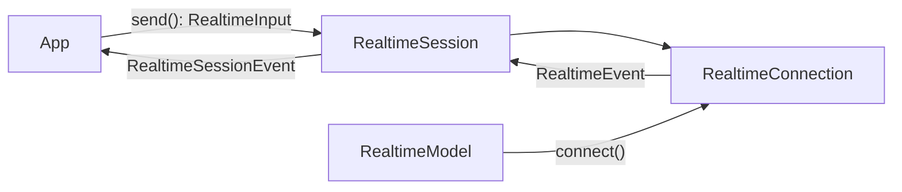

# `pydantic_ai.realtime`

Support for **realtime, bidirectional speech-to-speech models** (OpenAI Realtime, and any other
provider that streams audio in and out over a persistent connection).

Unlike [`Model`][pydantic_ai.models.Model], which is request-response, a realtime model opens a
long-lived connection: you stream audio (or text/images) in, and consume audio, transcripts, and
tool calls as they arrive. The high-level entry point is
[`Agent.realtime_session`][pydantic_ai.Agent.realtime_session], which wires the agent's tools and
instructions into a session and runs the tool loop for you. See the [Realtime guide](../realtime.md)
for a walkthrough.

The flow of a session:

A [`RealtimeModel`][pydantic_ai.realtime.RealtimeModel] opens a
[`RealtimeConnection`][pydantic_ai.realtime.RealtimeConnection] (the provider-specific transport).
A [`RealtimeSession`][pydantic_ai.realtime.RealtimeSession] wraps that connection and adds automatic
tool execution: it intercepts each [`ToolCall`][pydantic_ai.realtime.ToolCall], runs it, sends the
[`ToolResult`][pydantic_ai.realtime.ToolResult] back, and emits
[`ToolCallStarted`][pydantic_ai.realtime.ToolCallStarted] /
[`ToolCallCompleted`][pydantic_ai.realtime.ToolCallCompleted] bookends. Tools listed in
`background_tools` run concurrently so the model can keep speaking while they work.

## Overview

**Provider abstractions & session**

| Object | Role |
| --- | --- |
| [`RealtimeModel`][pydantic_ai.realtime.RealtimeModel] | Provider ABC; `connect()` opens a connection. |
| [`RealtimeConnection`][pydantic_ai.realtime.RealtimeConnection] | Provider ABC; `send()` content in, iterate events out. |
| [`RealtimeSession`][pydantic_ai.realtime.RealtimeSession] | Wraps a connection with automatic (sync/background) tool dispatch. |
| [`ToolRunner`][pydantic_ai.realtime.ToolRunner] | Async callable a session uses to execute a tool by name. |

**Inputs** — [`RealtimeInput`][pydantic_ai.realtime.RealtimeInput], sent via `send()`:
data — [`AudioInput`][pydantic_ai.realtime.AudioInput],
[`TextInput`][pydantic_ai.realtime.TextInput],
[`ImageInput`][pydantic_ai.realtime.ImageInput],
[`ToolResult`][pydantic_ai.realtime.ToolResult];
control verbs — [`CommitAudio`][pydantic_ai.realtime.CommitAudio],
[`ClearAudio`][pydantic_ai.realtime.ClearAudio],
[`CreateResponse`][pydantic_ai.realtime.CreateResponse],
[`CancelResponse`][pydantic_ai.realtime.CancelResponse],
[`TruncateOutput`][pydantic_ai.realtime.TruncateOutput].

**Connection events** — [`RealtimeEvent`][pydantic_ai.realtime.RealtimeEvent], yielded by a connection:
[`AudioDelta`][pydantic_ai.realtime.AudioDelta],
[`Transcript`][pydantic_ai.realtime.Transcript],
[`InputTranscript`][pydantic_ai.realtime.InputTranscript],
[`ToolCall`][pydantic_ai.realtime.ToolCall],
[`TurnComplete`][pydantic_ai.realtime.TurnComplete],
[`SpeechStarted`][pydantic_ai.realtime.SpeechStarted],
[`SpeechStopped`][pydantic_ai.realtime.SpeechStopped],
[`Usage`][pydantic_ai.realtime.Usage],
[`RateLimits`][pydantic_ai.realtime.RateLimits],
[`Reconnected`][pydantic_ai.realtime.Reconnected],
[`SessionError`][pydantic_ai.realtime.SessionError].

**Session events** — [`RealtimeSessionEvent`][pydantic_ai.realtime.RealtimeSessionEvent], yielded by a
session: the connection events above, with `ToolCall` replaced by
[`ToolCallStarted`][pydantic_ai.realtime.ToolCallStarted] and
[`ToolCallCompleted`][pydantic_ai.realtime.ToolCallCompleted].

::: pydantic_ai.realtime

## OpenAI provider

The OpenAI Realtime API provider. Requires the `realtime` optional group
(`pip install "pydantic-ai-slim[realtime]"`).

[`OpenAIRealtimeModel`][pydantic_ai.realtime.openai.OpenAIRealtimeModel] configures the session,
including turn-taking via [`ServerVAD`][pydantic_ai.realtime.openai.ServerVAD] /
[`SemanticVAD`][pydantic_ai.realtime.openai.SemanticVAD] (or `None` for push-to-talk) and resilience
via [`ReconnectPolicy`][pydantic_ai.realtime.openai.ReconnectPolicy].

::: pydantic_ai.realtime.openai
