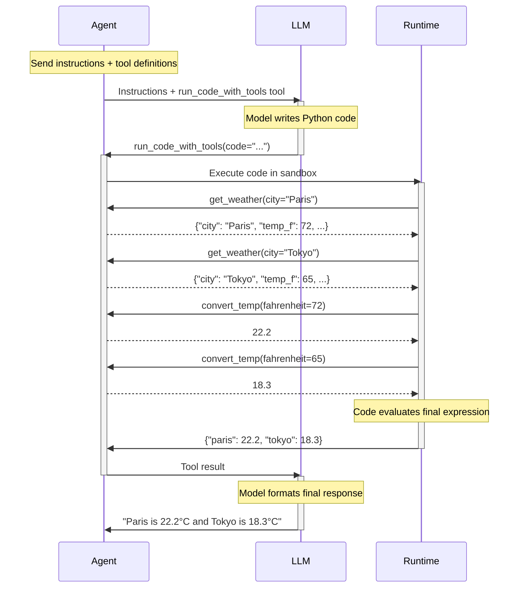

# Code Mode

!!! warning "Experimental"
    Code mode is an experimental feature under active development. The API may change in future releases.

Code mode is a [toolset](toolsets.md) that replaces individual [tool](tools.md) calls with a single `run_code_with_tools` tool, allowing the model to write and execute Python code that orchestrates multiple tools at once — with loops, conditionals, variables, and parallel execution.

With standard tool calling, each tool invocation is a separate round-trip to the model. If an agent needs to fetch 10 items and look up details for each one, that's 11 model calls. With code mode, the model writes a script that does it all in one step:

```python {test="skip" lint="skip"}
items = await get_items(category="electronics")

# Fire all detail lookups concurrently
futures = [get_details(id=item["id"]) for item in items]
details = [await f for f in futures]

# Process locally — no model calls needed
total = sum(d["price"] for d in details if d["in_stock"])
{"total": total, "count": len(details)}
```

Code mode wraps any existing toolset — including [`FunctionToolset`][pydantic_ai.toolsets.FunctionToolset], [MCP servers](mcp/client.md), or [custom toolsets](toolsets.md#building-a-custom-toolset) — so tools still go through the normal Pydantic AI pipeline with validation, [tracing](logfire.md), and [dependency injection](dependencies.md).

!!! info "Further reading"
    - [Anthropic: Tool use via code](https://www.anthropic.com/engineering/code-execution-with-mcp)
    - [Cloudflare: Code mode in production](https://blog.cloudflare.com/code-mode/)

## Installation

Code mode requires a runtime to execute the generated code. For the recommended [Monty](#monty-runtime) runtime:

```bash
pip/uv-add "pydantic-ai-slim[monty]"
```

## Quick Start

[`CodeModeToolset`][pydantic_ai.toolsets.code_mode.CodeModeToolset] wraps an existing toolset and exposes its tools as callable Python functions to the model:

```python {title="code_mode_example.py" test="skip" lint="skip"}
from pydantic_ai import Agent
from pydantic_ai.toolsets import CodeModeToolset, FunctionToolset


def get_weather(city: str) -> dict:
    """Get current weather for a city."""
    return {'city': city, 'temp_f': 72, 'condition': 'sunny'}


def convert_temp(fahrenheit: float) -> float:
    """Convert Fahrenheit to Celsius."""
    return round((fahrenheit - 32) * 5 / 9, 1)


tools = FunctionToolset(tools=[get_weather, convert_temp])  # (1)!

agent = Agent(
    'anthropic:claude-sonnet-4-5',
    toolsets=[CodeModeToolset(tools)],  # (2)!
)

result = agent.run_sync("What's the weather in Paris and Tokyo, in Celsius?")
print(result.output)
```

1. Define tools using a standard [`FunctionToolset`][pydantic_ai.toolsets.FunctionToolset]. Any [toolset](toolsets.md) works here.
2. Wrap the toolset with [`CodeModeToolset`][pydantic_ai.toolsets.code_mode.CodeModeToolset]. The model now sees a single `run_code_with_tools` tool instead of individual `get_weather` and `convert_temp` tools. The default runtime is [Monty](#monty-runtime).

The model sees `get_weather` and `convert_temp` as callable Python functions inside the sandbox, and writes code like:

```python {test="skip" lint="skip"}
future_paris = get_weather(city="Paris")  # starts immediately
future_tokyo = get_weather(city="Tokyo")  # starts immediately
paris = await future_paris  # wait for result
tokyo = await future_tokyo

paris_c = await convert_temp(fahrenheit=paris["temp_f"])
tokyo_c = await convert_temp(fahrenheit=tokyo["temp_f"])

{"paris": paris_c, "tokyo": tokyo_c}
```

Both cities are looked up in parallel, then both temperatures are converted — all in a single model call.

## How It Works

When the model calls `run_code_with_tools`, the [`CodeModeToolset`][pydantic_ai.toolsets.code_mode.CodeModeToolset]:

1. Generates Python function signatures from the wrapped tools so the model knows what's available
2. Builds a [prompt](#customizing-the-prompt) describing the execution model (fire-then-await parallelism, keyword-only arguments, etc.)
3. Sends the model's code to the [runtime](#runtimes) for execution
4. Intercepts function calls made by the code and routes them through the normal Pydantic AI tool pipeline (with validation, tracing, and dependency injection)
5. Returns the result back to the model

The execution model exposed to the model works as follows:

- Each `run_code_with_tools` call runs in an isolated environment — variables don't persist between calls
- Functions are async — call with `await`, e.g. `result = await get_items()`
- To run independent calls concurrently, fire them first (which starts them immediately), then `await` the results
- The last expression evaluated is the return value
- All function arguments must be keyword-only

Execution errors (syntax, type, or runtime) are automatically sent back to the model so it can fix its code and try again, up to `max_retries` times (default 3).



## Runtimes

Code mode uses a pluggable runtime to execute generated code. You can pass a runtime instance or a string shorthand (`'monty'` or `'docker'`) to [`CodeModeToolset`][pydantic_ai.toolsets.code_mode.CodeModeToolset]:

```python {test="skip" lint="skip"}
# These are equivalent:
CodeModeToolset(tools, runtime='monty')
CodeModeToolset(tools, runtime=MontyRuntime())
```

The runtime you choose determines the execution environment, security boundaries, and available Python features.

### Monty Runtime

[Monty](https://github.com/pydantic/monty) is a minimal, secure Python interpreter built by the Pydantic team specifically for code mode. It is the default runtime.

!!! danger "Early Stage — Not for Untrusted Prompts"
    Monty is under active development. **Do not use it in production systems where untrusted user prompts are passed directly to the model** — the model could be manipulated into generating malicious code. While Monty is designed for safe sandboxed execution, it has not yet undergone the level of hardening required for adversarial inputs. This restriction will be relaxed as Monty matures.

[`MontyRuntime`][pydantic_ai.runtime.MontyRuntime] runs a restricted Python subset directly in your process — no containers, no network, no cold starts:

```python {test="skip" lint="skip"}
from pydantic_ai.runtime import MontyRuntime
from pydantic_ai.toolsets import CodeModeToolset, FunctionToolset

tools = FunctionToolset(tools=[...])
toolset = CodeModeToolset(tools, runtime=MontyRuntime())  # (1)!
```

1. Equivalent to `CodeModeToolset(tools)` or `CodeModeToolset(tools, runtime='monty')`, since Monty is the default.

Monty type-checks generated code (via [ty](https://github.com/astral-sh/ty)) before execution, catching errors early and giving the model precise feedback to fix its code. It can also freeze and restore its full interpreter state via snapshot-based checkpointing, enabling efficient resume without re-executing code from scratch.

Because Monty runs a restricted Python subset, the runtime automatically instructs the model about what's not available: no imports, no classes, no decorators — only the provided functions and builtins.

### Driver-Based Runtimes

For environments that need full CPython compatibility (arbitrary imports, C extensions) or stronger isolation guarantees, the [`DriverBasedRuntime`][pydantic_ai.runtime.DriverBasedRuntime] base class supports executing code in any sandbox that can run a Python process. It uses a lightweight [driver script](https://github.com/pydantic/pydantic-ai/blob/main/pydantic_ai_slim/pydantic_ai/runtime/_driver.py) that communicates over stdin/stdout.

#### Docker

[`DockerRuntime`][pydantic_ai.runtime.DockerRuntime] runs code inside a Docker container with hardened security defaults. The runtime manages the full container lifecycle automatically:

```python {test="skip" lint="skip"}
from pydantic_ai import Agent
from pydantic_ai.runtime import DockerRuntime
from pydantic_ai.toolsets import CodeModeToolset, FunctionToolset

tools = FunctionToolset(tools=[...])
agent = Agent(
    'anthropic:claude-sonnet-4-5',
    toolsets=[CodeModeToolset(tools, runtime=DockerRuntime())],  # (1)!
)

result = await agent.run('...')  # (2)!
```

1. No container ID needed — the runtime creates a security-hardened container automatically.
2. The container is created when the agent starts and removed when it finishes. No manual cleanup required.

By default, managed containers run with restrictive security settings:

- `--network none` — no network access
- `--cap-drop ALL` — all Linux capabilities dropped
- `--read-only` — read-only root filesystem
- `--security-opt no-new-privileges` — no privilege escalation
- `--user nobody` — unprivileged user
- `--memory 512m` — memory limit with swap disabled
- `--pids-limit 256` — process count limit
- `--cpus 1` — CPU limit
- `--tmpfs /tmp:noexec,nosuid,size=64m` — writable scratch space

Override specific settings with [`DockerSecuritySettings`][pydantic_ai.runtime.DockerSecuritySettings]:

```python {test="skip" lint="skip"}
from pydantic_ai.runtime import DockerRuntime, DockerSecuritySettings

runtime = DockerRuntime(
    security=DockerSecuritySettings(network=True),  # (1)!
)
```

1. Allow network access while keeping all other security defaults.

For pre-existing containers, pass a `container_id` to use the runtime without lifecycle management:

```python {test="skip" lint="skip"}
runtime = DockerRuntime(container_id='my-sandbox-container')
```

#### Building a Custom Runtime

To support a new sandbox environment (e.g., E2B, Firecracker, WebAssembly), implement the [`DriverTransport`][pydantic_ai.runtime.DriverTransport] protocol:

```python {test="skip" lint="skip"}
from pydantic_ai.runtime import DriverTransport


class MyTransport(DriverTransport):
    async def read_line(self) -> bytes: ...
    async def write_line(self, data: bytes) -> None: ...
    async def read_stderr(self) -> bytes: ...
    async def kill(self) -> None: ...
```

Then subclass [`DriverBasedRuntime`][pydantic_ai.runtime.DriverBasedRuntime] and implement `_start_driver()` to launch your sandbox and return the transport. All protocol handling, tool dispatch, and checkpoint/resume logic is inherited.

## MCP and Other Toolsets

Code mode works with any [toolset](toolsets.md), including [MCP servers](mcp/client.md). Tool names that aren't valid Python identifiers (e.g. `search-records`) are automatically sanitized (to `search_records`) so the model can call them naturally from code.

```python {test="skip" lint="skip"}
from pydantic_ai import Agent
from pydantic_ai.mcp import MCPServerStdio
from pydantic_ai.toolsets import CodeModeToolset

server = MCPServerStdio('uv', args=['run', 'my-mcp-server'])

agent = Agent(
    'anthropic:claude-sonnet-4-5',
    toolsets=[CodeModeToolset(server)],
)
```

## Customizing the Prompt

The tool description that explains available functions and the execution model to the model is generated by [`build_default_code_mode_description`][pydantic_ai.toolsets.code_mode.build_default_code_mode_description]. You can customize it by passing a `description` to [`CodeModeToolset`][pydantic_ai.toolsets.code_mode.CodeModeToolset] — either a string to replace just the preamble text, or a [`DescriptionFunc`][pydantic_ai.toolsets.code_mode.DescriptionFunc] callback for full control:

```python {test="skip" lint="skip"}
from pydantic_ai.toolsets import CodeModeToolset, FunctionToolset

tools = FunctionToolset(tools=[...])

# Pass a string to customize the preamble while keeping the default structure:
code_toolset = CodeModeToolset(
    tools,
    description='Use this tool to run Python code that calls the available functions.',
)
```

```python {test="skip" lint="skip"}
from pydantic_ai._python_signature import FunctionSignature, TypeSignature
from pydantic_ai.toolsets import CodeModeToolset, FunctionToolset


def my_description_func(
    signatures: list[FunctionSignature],
    referenced_types: list[TypeSignature],
    runtime_instructions: str | None,
) -> str:
    funcs = '\n'.join(str(sig) for sig in signatures)
    return f'Write Python code using these functions:\n\n{funcs}'


tools = FunctionToolset(tools=[...])
code_toolset = CodeModeToolset(
    tools,
    description=my_description_func,
)
```

## Known Limitations

- **Tool approval and deferral** — [deferred tools](deferred-tools.md) (tools that require approval or external execution) are not yet supported in code mode.
- **Streaming** — code mode does not currently support streaming partial results.
- **Monty's restricted Python** — Monty runs a subset of Python: no imports, no classes, no decorators. The model is instructed about these restrictions, but complex code may need a [driver-based runtime](#driver-based-runtimes) with full CPython.

## See Also

- [Toolsets](toolsets.md) — managing collections of tools, including composition, filtering, and dynamic toolsets
- [Function Tools](tools.md) — defining the tools that code mode wraps
- [MCP Client](mcp/client.md) — using MCP servers as toolsets with code mode
- [Dependencies](dependencies.md) — dependency injection, which works through code mode's tool pipeline
- [Logfire](logfire.md) — tracing and debugging agent runs, including code mode tool calls
