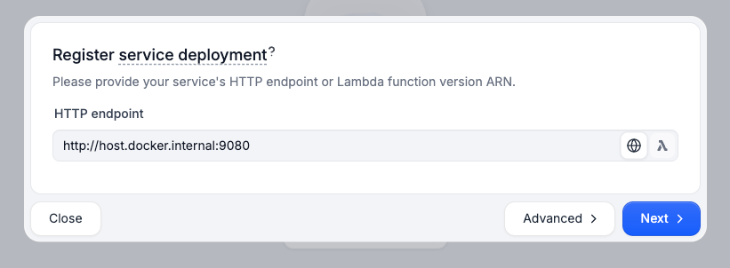
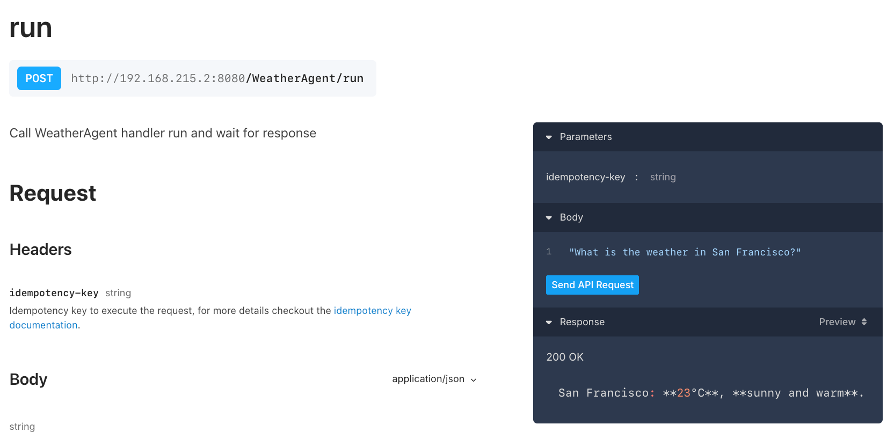
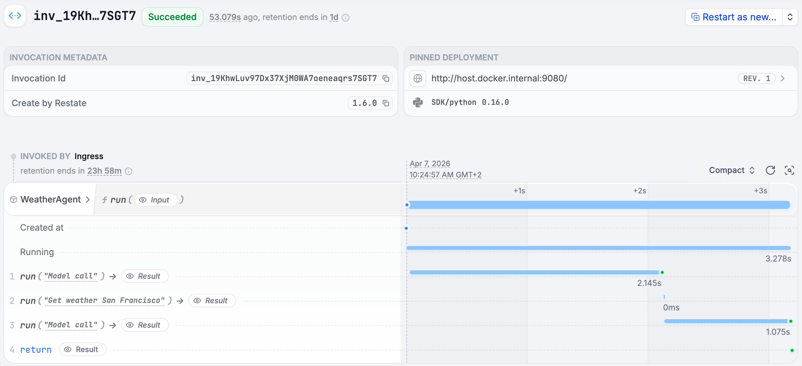
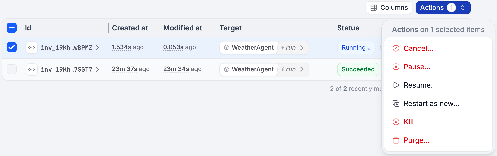

# Durable Execution with Restate

[Restate](https://restate.dev) is a lightweight durable execution runtime with first-class support for AI agents. The Pydantic AI integration is provided via the [Restate Python SDK](https://github.com/restatedev/sdk-python/tree/main).

## Durable Execution

Restate makes your agent **durable** by recording every step of its execution in a journal. If your process crashes mid-execution, Restate replays the journal, skips completed steps, and resumes from exactly where it left off.

Your agent runs in a regular HTTP handler inside a Restate **service**. The Restate Server sits in front of your application and manages orchestration, journaling, and retries. Services run like regular Docker containers or serverless functions.

A durable agent has three building blocks:

1. The **handler**: your agent logic, exposed as an HTTP endpoint in a Restate service.
2. **LLM calls**: persisted so responses are not re-fetched on recovery — saving cost and time.
3. **Tool executions**: wrapped in durable steps so side effects are not duplicated.

```text
                    Clients 
               (HTTP, Kafka, etc.)
                      |
                      v
            +---------------------+
            |   Restate Server    |      (Journals execution,
            +---------------------+       retries on failure,
                     ^                    manages state)
                     |
        Journal      |   Replay on
        steps,       |   recovery,
        retries      |   schedule calls
                     v
+------------------------------------------------------+
|               Application Process                    |
|   +----------------------------------------------+   |
|   |         Restate Service Handler              |   |
|   |           (Agent Run Loop)                   |   |
|   |    [ Durable Steps (Tool, MCP, Model) ]      |   |
|   +----------------------------------------------+   |
|         |           |                |               |
+------------------------------------------------------+
          |           |                |
          v           v                v
      [External APIs, services, databases, etc.]
```

See the [Restate documentation](https://docs.restate.dev/ai/patterns/durable-agents) for more information.

## Durable Agent

Any Pydantic AI agent can be made durable by wrapping it with `RestateAgent` from the Restate SDK and running it inside a Restate service handler.

Install the Restate SDK:

```bash
pip install pydantic-ai "restate_sdk[serde]" hypercorn
```

Here is a complete example of a durable Pydantic AI agent with Restate:

```python {title="restate_agent.py" test="skip" lint="skip"}
import restate
from pydantic_ai import Agent, RunContext
from restate.ext.pydantic import RestateAgent, restate_context

weather_agent = Agent(  # (1)!
    'openai:gpt-5.2',
    system_prompt='You are a helpful agent that provides weather updates.',
)


@weather_agent.tool()
async def get_weather(_run_ctx: RunContext[None], city: str) -> dict:
    """Get the current weather for a given city."""

    # Do durable tool steps using the Restate context
    async def call_weather_api(city: str) -> dict:
        return {'temperature': 23, 'description': 'Sunny and warm.'}

    return await restate_context().run_typed(  # (2)!
        f'Get weather {city}', call_weather_api, city=city
    )


restate_agent = RestateAgent(weather_agent)  # (3)!

agent_service = restate.Service('WeatherAgent')


@agent_service.handler()
async def run(_ctx: restate.Context, prompt: str) -> str:  # (4)!
    result = await restate_agent.run(prompt)
    return result.output


app = restate.app(services=[agent_service])  # (5)!

if __name__ == "__main__":  # (6)!
    import hypercorn
    import asyncio
    conf = hypercorn.Config()
    conf.bind = ["0.0.0.0:9080"]
    asyncio.run(hypercorn.asyncio.serve(app, conf))
```

1. Define your agent and tools as you normally would with Pydantic AI.
2. Use `restate_context()` actions inside tools to make their execution durable. The result is persisted and retried until it succeeds. Side effects won't be duplicated on recovery.
3. `RestateAgent` wraps the agent so every LLM response is saved in the Restate Server and replayed during recovery.
4. The Restate service handler gives the agent a durable execution context and exposes it as an HTTP endpoint.
5. `restate.app()` creates the application that can be served.
6. Run the application with an ASGI server like Hypercorn.

To run the agent:

```bash
# Terminal 1: Start the Restate Server
docker run --name restate_dev --rm \
-p 8080:8080 -p 9070:9070 -p 9071:9071 \
--add-host=host.docker.internal:host-gateway \
docker.restate.dev/restatedev/restate:latest

# Terminal 2: Start your agent service
python restate_agent.py
```

Go to the Restate UI at `http://localhost:9070` and register the agent service at `http://host.docker.internal:9080`.



Click on the `run` handler to go to the playground and send a request, for example `"What is the weather in San Francisco?"`.



Navigate to the invocations tab and click on the invocation to see the execution trace.



See the [Restate agent quickstart](https://docs.restate.dev/ai-quickstart) for more details.

## Beyond Durable Execution

Restate offers a broader set of capabilities that go beyond recovery from failures, to better support production AI agent systems.

### Durable Sessions

Restate **Virtual Objects** give your agents persistent, isolated sessions keyed by an ID (such as a user or conversation ID). Each session maintains its own state that survives crashes and restarts, with built-in concurrency control. 

```python {title="restate_chat_session.py" test="skip" lint="skip"}
agent = Agent(
    "openai:gpt-4o-mini",
    system_prompt="You are a helpful assistant.",
)
restate_agent = RestateAgent(agent)

chat_session = restate.VirtualObject("ChatSession")


@chat_session.handler()
async def message(ctx: restate.ObjectContext, req: ChatMessage) -> str:
    # Load message history from Restate's durable key-value store
    history = await ctx.get("messages", serde=MessageSerde())

    result = await restate_agent.run(req.message, message_history=history)

    # Store updated history back in Restate state
    ctx.set("messages", result.all_messages(), serde=MessageSerde())
    return result.output
```

Each `ChatSession` key (e.g. a user ID) gets its own isolated state. Concurrent requests to the same session are automatically queued, preventing race conditions. See the [Restate sessions documentation](https://docs.restate.dev/ai/patterns/sessions) for more details.

### Human-in-the-Loop with pause/resume

Restate **awakeables** are durable promises that pause the agent until an external event resolves them — such as a human approval via an HTTP call. The agent suspends without consuming compute and survives restarts. On serverless infrastructure like AWS Lambda, you pay nothing while the agent waits.

```python {title="restate_approval.py" test="skip" lint="skip"}
@agent.tool
async def human_approval(_run_ctx: RunContext[None], claim: InsuranceClaim) -> str:
    """Ask for human approval for high-value claims."""

    # Create an awakeable for human approval
    approval_id, approval_promise = restate_context().awakeable(type_hint=str)

    # Request human review
    await restate_context().run_typed(
        "Request review", request_human_review, claim=claim, awakeable_id=approval_id
    )

    # Wait for human approval
    return await approval_promise
```

A human reviewer resolves the approval via a simple HTTP call:

```bash
curl localhost:8080/restate/awakeables/<approval_id>/resolve --json '"approved"'
```

See the [Restate human-in-the-loop documentation](https://docs.restate.dev/ai/patterns/human-in-the-loop) for more details.

### Remote Agents with Durable RPC

Deploy specialist agents as separate Restate services that can scale independently, run on different infrastructure, or be developed by different teams. Cross-service calls have end-to-end durability, failure recovery, and automatic retries. Restate is the queue, so no extra message queues needed.

```python {test="skip" lint="skip"}
# Call a remote specialist agent from a tool
@router_agent.tool()
async def delegate(_run_ctx: RunContext[None], task: str) -> str:
    """Delegate to the specialist agent."""
    # Durable RPC: retried on failure, never duplicated
    return await restate_context().service_call(specialist_run, task)
```

Routing decisions are journaled: if the process crashes after routing but before the specialist responds, recovery skips re-routing and resumes waiting for the specialist's result. See the [Restate remote agents documentation](https://docs.restate.dev/ai/patterns/remote-agents) for more details.

### Agent Control: Pause, Resume, Cancel

Restate gives you operational control over running agents:

- **Pause**: suspend a running agent via the UI or CLI, for debugging or operational holds.
- **Resume**: continue a paused agent on the same or a different deployment.
- **Cancel**: gracefully stop an agent, allowing compensation/cleanup logic to run.
- **Kill**: immediately terminate a stuck or runaway agent.



Combined with [versioning](#versioning-and-deployment), you can pause a buggy agent, deploy a fix, and resume execution on the new version.

### Versioning and Deployment

Restate uses **immutable deployments**: each version of your code gets a unique endpoint, and requests always complete on the version they started on. No version compatibility logic is needed in your code.

```bash
# Deploy a new version and register it
restate deployments register http://agent-v2:9080
# New requests go to v2; existing requests finish on v1
```

On FaaS platforms like AWS Lambda, Vercel, or Deno Deploy, versioning is automatic via version-specific URLs or ARNs. For containers, register new endpoints and Restate handles traffic routing. See the [Restate versioning documentation](https://docs.restate.dev/services/versioning) for more details.

## Observability

Restate exports OpenTelemetry traces for all executions. Pydantic AI emits traces for all LLM calls and tool executions.
You can combine Restate and Pydantic AI traces to get a complete view of your agent's behavior in Logfire:


```python {test="skip" lint="skip"}
import logfire
from opentelemetry import trace as trace_api
from pydantic_ai.models.instrumented import InstrumentationSettings
from pydantic_ai import Agent
from restate.ext.tracing import RestateTracerProvider

logfire.configure(service_name=claim_service.name)
logfire.instrument_pydantic_ai()

# Instrument Pydantic AI with Restate-aware tracing
Agent.instrument_all(
    InstrumentationSettings(
        tracer_provider=RestateTracerProvider(trace_api.get_tracer_provider())
    )
)
```

See the [Restate-Logfire integration docs](https://docs.restate.dev/ai/ecosystem-integrations/logfire) for more details.
