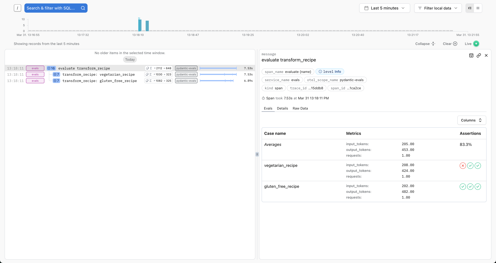
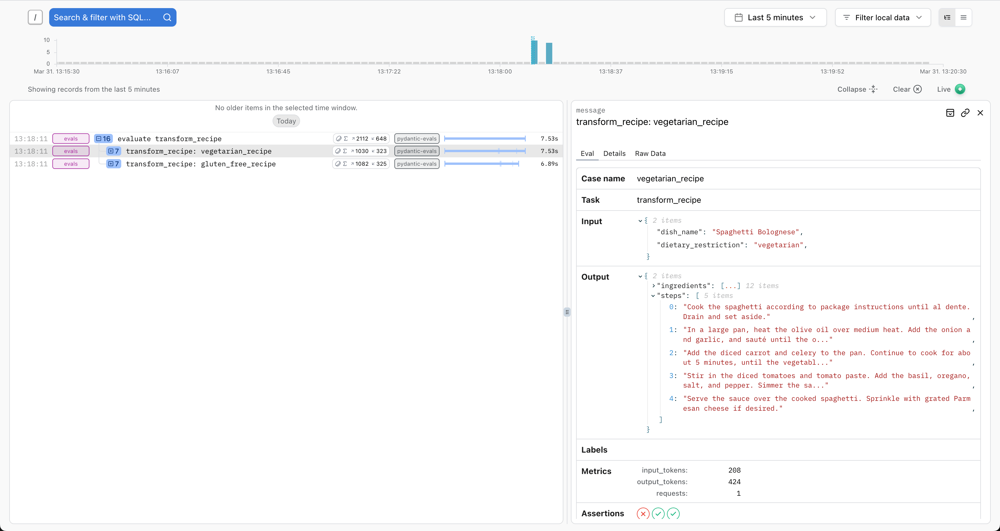
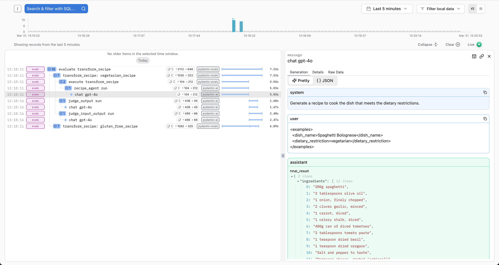

# Logfire Integration

Visualize and analyze evaluation results using Pydantic Logfire.

## Overview

Pydantic Evals uses OpenTelemetry to record traces of the evaluation process. These traces contain all the information from your evaluation reports, plus full tracing from the execution of your task function.

You can send these traces to any OpenTelemetry-compatible backend, including [Pydantic Logfire](https://logfire.pydantic.dev/docs/guides/web-ui/evals/).

## Installation

Install the optional logfire dependency:

```bash
pip install 'pydantic-evals[logfire]'
```

## Basic Setup

Configure Logfire before running evaluations:

```python {title="basic_logfire_setup.py"}
import logfire

from pydantic_evals import Case, Dataset

# Configure Logfire
logfire.configure(
    send_to_logfire='if-token-present',  # (1)!
)


# Your evaluation code
def my_task(inputs: str) -> str:
    return f'result for {inputs}'


dataset = Dataset(cases=[Case(name='test', inputs='example')])
report = dataset.evaluate_sync(my_task)
```

1. Sends data to Logfire only if the `LOGFIRE_TOKEN` environment variable is set

That's it! Your evaluation traces will now appear in the Logfire web UI.

## Configuration Options

### Environment-Based Configuration

```python
import logfire

logfire.configure(
    send_to_logfire='if-token-present',  # (1)!
    environment='development',  # (2)!
    service_name='evals',  # (3)!
)
```

1. The `send_to_logfire` argument controls when traces are sent. Options: `'always'`, `'if-token-present'`, or `False`
2. The `environment` argument helps filter traces by environment (e.g., 'development', 'staging', 'production')
3. The `service_name` appears in the Logfire UI to identify the source of traces

### Project Configuration

Or use environment variables:

```bash
export LOGFIRE_TOKEN=your_token_here
export LOGFIRE_PROJECT=my-ai-project
```

## What Gets Sent to Logfire

When you run an evaluation, Logfire receives:

1. **Evaluation metadata**

   - Dataset name
   - Number of cases
   - Evaluator names

2. **Per-case data**

   - Inputs and outputs
   - Expected outputs
   - Metadata
   - Execution duration

3. **Evaluation results**

   - Scores, assertions, and labels
   - Reasons (if included)
   - Evaluator failures

4. **Task execution traces**

   - All OpenTelemetry spans from your task function
   - Tool calls (for Pydantic AI agents)
   - API calls, database queries, etc.

## Viewing Results in Logfire

### Evaluation Overview

Logfire provides a special table view for evaluation results on the root evaluation span:



This view shows:

- Case names
- Pass/fail status
- Scores and assertions
- Execution duration
- Quick filtering and sorting

### Individual Case Details

Click any case to see detailed inputs and outputs:



### Full Trace View

View the complete execution trace including all spans generated during evaluation:



This is especially useful for:
- Debugging failed cases
- Understanding performance bottlenecks
- Analyzing tool usage patterns
- Writing span-based evaluators

## Practical Examples

### Development Environment

Only send traces when testing:

```python
import logfire

from pydantic_evals import Case, Dataset

logfire.configure(
    send_to_logfire='if-token-present',
    environment='development',
)


def task(inputs: str) -> str:
    return f'result for {inputs}'


dataset = Dataset(cases=[Case(name='test', inputs='example')])
# Only sends data if LOGFIRE_TOKEN is set
dataset.evaluate_sync(task)
```

### Production Monitoring

Always send traces in production:

```python
import logfire

logfire.configure(
    send_to_logfire='always',
    environment='production',
    service_name='production-evals',
)
```

### Separate Projects

Use different Logfire projects for different eval suites by setting environment variables:

```bash
# Run evaluations for feature A
export LOGFIRE_PROJECT=feature-a-evals
python run_feature_a_evals.py

# Run evaluations for feature B
export LOGFIRE_PROJECT=feature-b-evals
python run_feature_b_evals.py
```

### Conditional Sending

Control sending programmatically:

```python
import os

import logfire

send_to_logfire = os.getenv('CI') == 'true'  # Only in CI

logfire.configure(
    send_to_logfire='always' if send_to_logfire else False,
)
```

## Analyzing Traces

### Filtering by Metadata

Use case metadata to filter results in Logfire:

```python
from pydantic_evals import Case, Dataset

dataset = Dataset(
    cases=[
        Case(
            name='easy_case',
            inputs='test',
            metadata={'difficulty': 'easy', 'category': 'basic'},
        ),
        Case(
            name='hard_case',
            inputs='complex test',
            metadata={'difficulty': 'hard', 'category': 'advanced'},
        ),
    ],
)
```

In Logfire, filter by:

- `attributes.difficulty = 'hard'`
- `attributes.category = 'basic'`

### Comparing Runs

Run the same evaluation multiple times and compare in Logfire:

```python
from pydantic_evals import Case, Dataset


def original_task(inputs: str) -> str:
    return f'original result for {inputs}'


def improved_task(inputs: str) -> str:
    return f'improved result for {inputs}'


dataset = Dataset(cases=[Case(name='test', inputs='example')])

# Run 1: Original implementation
report1 = dataset.evaluate_sync(original_task)

# Run 2: Improved implementation
report2 = dataset.evaluate_sync(improved_task)

# Compare in Logfire by filtering by timestamp or attributes
```

### Debugging Failed Cases

Find failed cases quickly:

1. Filter traces by `status = error`
2. View the full span tree to see where the failure occurred
3. Inspect attributes and logs for error messages

## Span-Based Evaluation

Logfire integration enables powerful span-based evaluators. See [Span-Based Evaluation](../evaluators/span-based.md) for details.

Example: Verify specific tools were called:

```python
import logfire

from pydantic_evals import Case, Dataset
from pydantic_evals.evaluators import HasMatchingSpan

logfire.configure(send_to_logfire='if-token-present')


def my_agent(inputs: str) -> str:
    return f'result for {inputs}'


dataset = Dataset(
    cases=[Case(name='test', inputs='example')],
    evaluators=[
        HasMatchingSpan(
            query={'name_contains': 'search_tool'},
            evaluation_name='used_search',
        ),
    ],
)

report = dataset.evaluate_sync(my_agent)
```

The span tree is available in both:

- Your evaluator code (via `ctx.span_tree`)
- Logfire UI (visual trace view)

## Privacy & Security

### Filtering Sensitive Data

Logfire sees all data in your evaluation traces. To filter sensitive information:

```python
from pydantic_evals import Case

user_id = 'user123'

# Don't include PII in inputs/outputs
case = Case(
    name='test',
    inputs={'user_query': 'What is AI?'},  # OK
    metadata={'user_id': hash(user_id)},  # Hash sensitive IDs
)
```

### Local-Only Mode

Run evaluations without sending to Logfire:

```python
import logfire

from pydantic_evals import Case, Dataset

logfire.configure(send_to_logfire=False)


def task(inputs: str) -> str:
    return f'result for {inputs}'


dataset = Dataset(cases=[Case(name='test', inputs='example')])
# Spans are still captured for local evaluators
dataset.evaluate_sync(task)
```

This is useful for:
- Testing evaluation logic
- Working with sensitive data
- Offline development

## Cost Considerations

Logfire pricing is based on data volume. To reduce costs:

### 1. Sampling

Only send a subset of evaluation runs:

```python
import random

import logfire

if random.random() < 0.1:  # 10% sampling
    logfire.configure(send_to_logfire='always')
else:
    logfire.configure(send_to_logfire=False)
```

### 2. Filter Small Evaluations

Only send large evaluation runs:

```python
import logfire

from pydantic_evals import Case, Dataset

dataset = Dataset(cases=[Case(name='test', inputs='example')])

# Only send if more than 10 cases
send = len(dataset.cases) > 10

logfire.configure(
    send_to_logfire='always' if send else False,
)
```

### 3. Reduce Span Detail

Configure Logfire to send less detailed spans:

```python
import logfire

logfire.configure(
    send_to_logfire='if-token-present',
    console=False,  # Reduce console logging
)
```

## Troubleshooting

### No Data Appearing in Logfire

Check:

1. **Token is set**: `echo $LOGFIRE_TOKEN`
2. **Configuration is correct**:
   ```python
   import logfire

   logfire.configure(send_to_logfire='always')  # Force sending
   ```
3. **Network connectivity**: Check firewall settings
4. **Project exists**: Verify project name in Logfire UI

### Traces Missing Spans

If some spans are missing:

1. **Ensure logfire is configured before imports**:
   ```python
   import logfire

   logfire.configure()  # Must be first
   ```

2. **Check instrumentation**: Ensure your code uses Logfire spans:
   ```python
   import logfire

   with logfire.span('my_operation'):
       # This will appear in traces
       pass
   ```

### High Data Volume

If traces are too large:

1. **Limit case count**: Evaluate fewer cases
2. **Reduce metadata**: Only include essential metadata
3. **Filter evaluators**: Use fewer evaluators
4. **Sample traces**: Send only a percentage of runs

## Best Practices

### 1. Configure Early

Always configure Logfire before running evaluations:

```python
import logfire

from pydantic_evals import Case, Dataset

logfire.configure(send_to_logfire='if-token-present')


# Now import and run evaluations
def task(inputs: str) -> str:
    return f'result for {inputs}'


dataset = Dataset(cases=[Case(name='test', inputs='example')])
dataset.evaluate_sync(task)
```

### 2. Use Descriptive Service Names

```python
import logfire

logfire.configure(
    service_name='rag-pipeline-evals',  # Descriptive
    environment='staging',
)
```

### 3. Tag Experiments

Use metadata to identify experiments:

```python
from pydantic_evals import Case, Dataset
from pydantic_evals.evaluators import EqualsExpected

dataset = Dataset(
    cases=[Case(name='test', inputs='example', expected_output='example', metadata={})],
    evaluators=[EqualsExpected()],
)

# Add experiment ID to all cases
for case in dataset.cases:
    case.metadata['experiment_id'] = 'exp_2024_03_20'
```

### 4. Review Periodically

- Check Logfire regularly to identify patterns
- Look for consistently failing cases
- Analyze performance trends
- Adjust evaluators based on insights

## Next Steps

- **[Span-Based Evaluation](../evaluators/span-based.md)** - Use OpenTelemetry spans in evaluators
- **[Logfire Documentation](https://logfire.pydantic.dev/docs/guides/web-ui/evals/)** - Complete Logfire guide
- **[Metrics & Attributes](metrics-attributes.md)** - Add custom data to traces
