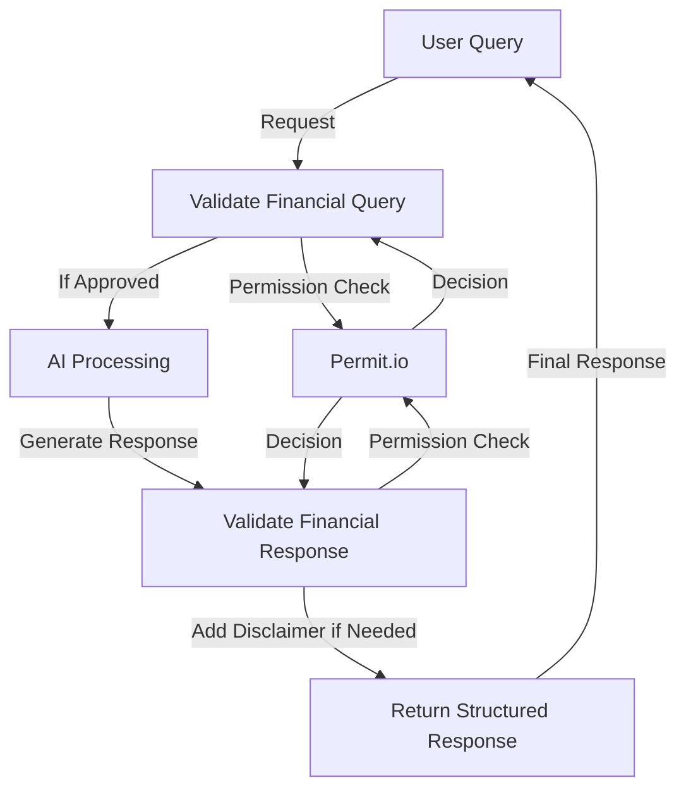

# AI Access Control

Example of implementing access control security for AI agents using PydanticAI and Permit.io

Demonstrates:

- [tools](../tools.md)
- [agent dependencies](../dependencies.md)
- [structured `result_type`](../results.md#structured-result-validation)
- [result validation](../results.md#result-validators-functions)
- Permit.io [AI Access Control] (https://www.permit.io/ai-access-control)

In this `Financial Advisor` agent example, the user can ask for financial advice, and the agent will use the `validate_financial_query` and `validate_financial_response` tools to check permissions and validate responses.
The raw user query is transformed into a `FinancialQuery` object that includes user context (such as their permission tier).
This structured data allows us to carry out permission checks before the AI generates a response, and the output is strictly validated with `FinancialResponse`.



## Running the Example

### Setup Access Control Configuration
To run this example, you need a Permit.io API key and a running Permit authorization microservice

- Get a free API key [here](https://app.permit.io) set it as an environment variable with the key `PERMIT_KEY`
- Run a local Policy Decision Point (PDP):

```bash
docker pull permitio/pdp-v2:latest
docker run -it \\
    -p 7766:7000 \\
    --env PDP_API_KEY=<YOUR_API_KEY> \\
    --env PDP_DEBUG=True \\
    permitio/pdp-v2:latest
```

Run the following command to set up our Permit.io financial advisor policy configuration:

```bash
python/uv-run -m pydantic_ai_examples.secure-ai-config
```

### Run the Example

With [dependencies installed and environment variables set](./index.md#usage), run the following command to run the example:

```bash
python/uv-run -m pydantic_ai_examples.secure-ai-agent
```

## Example code

```python {title="pydantic_ai_examples/secure-ai-agent.py"}
#! examples/pydantic_ai_examples/secure-ai-agent.py
```

## Configuration code

```python {title="pydantic_ai_examples/secure-ai-config.py"}
#! examples/pydantic_ai_examples/secure-ai-config.py
```

## Demo

Watch how PydanticAI ensures secure financial advice:


## Further Reading

With PydanticAI's tools and structured response system with Permit.io's permission checks, AI developers can implement fine-grained AI Access Control with minimal effort.

In the following blog post, we cover more in-depth topics in AI Access Control using PydanticAI and Permit.io: https://www.permit.io/blog/ai-agents-access-control-with-pydantic-ai
