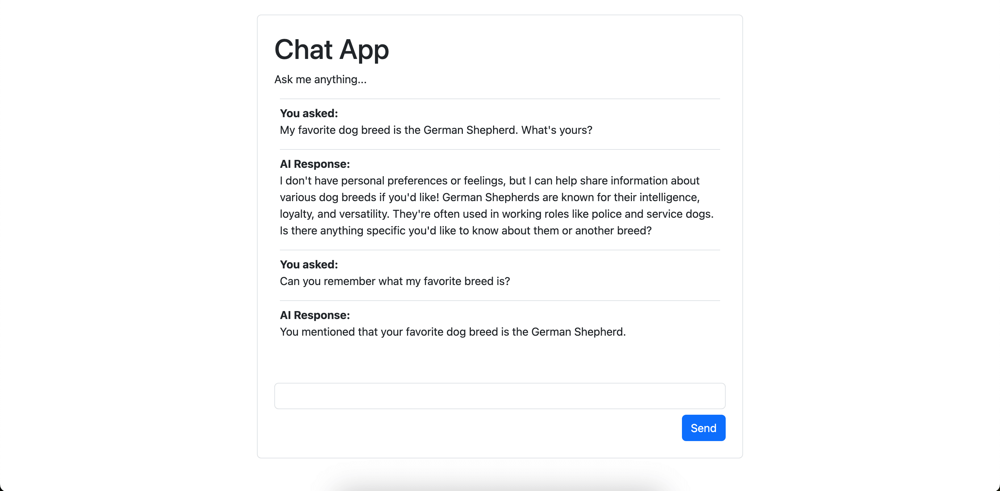

# Chat App with FastAPI

Simple chat app example build with FastAPI.

Demonstrates:

* [reusing chat history](../message-history.md)
* [serializing messages](../message-history.md#accessing-messages-from-results)
* [streaming responses](../output.md#streamed-results)

This demonstrates storing chat history between requests and using it to give the model context for new responses.

Most of the complex logic here is between `chat_app.py` which streams the response to the browser,
and `chat_app.ts` which renders messages in the browser.

## Running the Example

With [dependencies installed and environment variables set](./index.md#usage), run:

```bash
python/uv-run -m pydantic_ai_examples.chat_app
```

Then open the app at [localhost:8000](http://localhost:8000).



## Example Code

Python code that runs the chat app:

```snippet {path="/examples/pydantic_ai_examples/chat_app.py"}```

Simple HTML page to render the app:

```snippet {path="/examples/pydantic_ai_examples/chat_app.py"}```

TypeScript to handle rendering the messages, to keep this simple (and at the risk of offending frontend developers) the typescript code is passed to the browser as plain text and transpiled in the browser.

```snippet {path="/examples/pydantic_ai_examples/chat_app.ts"}```
