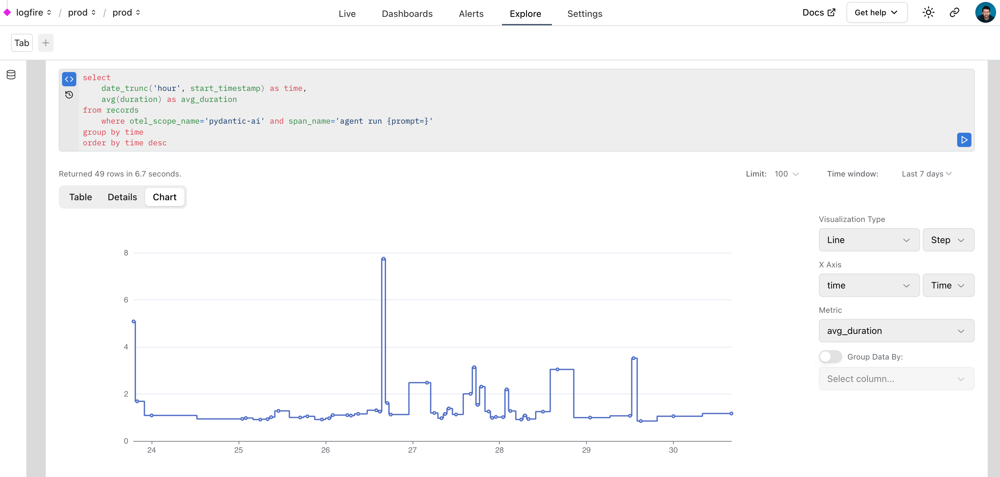
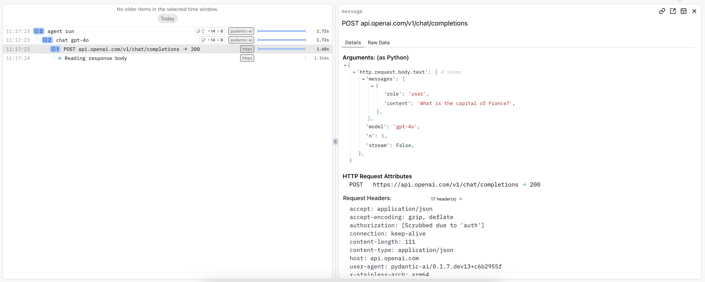
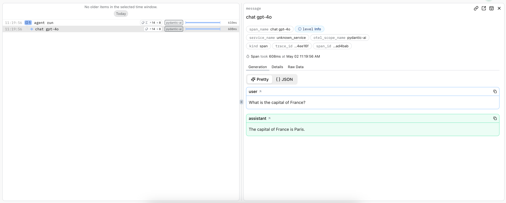

# Debugging and Monitoring

Applications that use LLMs have some challenges that are well known and understood: LLMs are **slow**, **unreliable** and **expensive**.

These applications also have some challenges that most developers have encountered much less often: LLMs are **fickle** and **non-deterministic**. Subtle changes in a prompt can completely change a model's performance, and there's no `EXPLAIN` query you can run to understand why.

!!! danger "Warning"
    From a software engineers point of view, you can think of LLMs as the worst database you've ever heard of, but worse.

    If LLMs weren't so bloody useful, we'd never touch them.

To build successful applications with LLMs, we need new tools to understand both model performance, and the behavior of applications that rely on them.

LLM Observability tools that just let you understand how your model is performing are useless: making API calls to an LLM is easy, it's building that into an application that's hard.

## Pydantic Logfire

[Pydantic Logfire](https://pydantic.dev/logfire) is an observability platform developed by the team who created and maintain Pydantic and PydanticAI. Logfire aims to let you understand your entire application: Gen AI, classic predictive AI, HTTP traffic, database queries and everything else a modern application needs.

!!! tip "Pydantic Logfire is a commercial product"
    Logfire is a commercially supported, hosted platform with an extremely generous and perpetual [free tier](https://pydantic.dev/pricing/).
    You can sign up and start using Logfire in a couple of minutes.

PydanticAI has built-in (but optional) support for Logfire. That means if the `logfire` package is installed and configured and agent instrumentation is enabled then detailed information about agent runs is sent to Logfire. Otherwise there's virtually no overhead and nothing is sent.

Here's an example showing details of running the [Weather Agent](examples/weather-agent.md) in Logfire:


## Using Logfire

To use logfire, you'll need a logfire [account](https://logfire.pydantic.dev), and logfire installed:

```bash
pip/uv-add 'pydantic-ai[logfire]'
```

Then authenticate your local environment with logfire:

```bash
py-cli logfire auth
```

And configure a project to send data to:

```bash
py-cli logfire projects new
```

(Or use an existing project with `logfire projects use`)

Then add logfire to your code:

```python {title="adding_logfire.py"}
import logfire

logfire.configure()
```

and enable instrumentation in your agent:

```python {title="instrument_agent.py"}
from pydantic_ai import Agent

agent = Agent('openai:gpt-4o', instrument=True)
# or instrument all agents to avoid needing to add `instrument=True` to each agent:
Agent.instrument_all()
```

The [logfire documentation](https://logfire.pydantic.dev/docs/) has more details on how to use logfire,
including how to instrument other libraries like [Pydantic](https://logfire.pydantic.dev/docs/integrations/pydantic/),
[HTTPX](https://logfire.pydantic.dev/docs/integrations/http-clients/httpx/) and [FastAPI](https://logfire.pydantic.dev/docs/integrations/web-frameworks/fastapi/).

Since Logfire is built on [OpenTelemetry](https://opentelemetry.io/), you can use the Logfire Python SDK to send data to any OpenTelemetry collector.

Once you have logfire set up, there are two primary ways it can help you understand your application:

* **Debugging** — Using the live view to see what's happening in your application in real-time.
* **Monitoring** — Using SQL and dashboards to observe the behavior of your application, Logfire is effectively a SQL database that stores information about how your application is running.

### Debugging

To demonstrate how Logfire can let you visualise the flow of a PydanticAI run, here's the view you get from Logfire while running the [chat app examples](examples/chat-app.md):

{{ video('a764aff5840534dc77eba7d028707bfa', 25) }}

### Monitoring Performance

We can also query data with SQL in Logfire to monitor the performance of an application. Here's a real world example of using Logfire to monitor PydanticAI runs inside Logfire itself:



### Monitoring HTTPX Requests

In order to monitor HTTPX requests made by models, you can use `logfire`'s [HTTPX](https://logfire.pydantic.dev/docs/integrations/http-clients/httpx/) integration.

Instrumentation is as easy as adding the following three lines to your application:

```py {title="instrument_httpx.py" test="skip" lint="skip"}
import logfire
logfire.configure()
logfire.instrument_httpx(capture_all=True)  # (1)!
```

1. See the [logfire docs](https://logfire.pydantic.dev/docs/integrations/http-clients/httpx/) for more `httpx` instrumentation details.

In particular, this can help you to trace specific requests, responses, and headers:

```py {title="instrument_httpx_example.py", test="skip" lint="skip"}
import logfire
from pydantic_ai import Agent

logfire.configure()
logfire.instrument_httpx(capture_all=True)  # (1)!

agent = Agent('openai:gpt-4o', instrument=True)
result = agent.run_sync('What is the capital of France?')
print(result.data)
# > The capital of France is Paris.
```

1. Capture all of headers, request body, and response body.

=== "With `httpx` instrumentation"

    

=== "Without `httpx` instrumentation"

    

!!! tip
    `httpx` instrumentation might be of particular utility if you're using a custom `httpx` client in your model in order to get insights into your custom requests.

## Using OpenTelemetry

PydanticAI's instrumentation uses [OpenTelemetry](https://opentelemetry.io/), which Logfire is based on. You can use the Logfire SDK completely freely and follow the [Alternative backends](https://logfire.pydantic.dev/docs/how-to-guides/alternative-backends/) guide to send the data to any OpenTelemetry collector, such as a self-hosted Jaeger instance. Or you can skip Logfire entirely and use the OpenTelemetry Python SDK directly.

## Data format

PydanticAI follows the [OpenTelemetry Semantic Conventions for Generative AI systems](https://opentelemetry.io/docs/specs/semconv/gen-ai/), with one caveat. The semantic conventions specify that messages should be captured as individual events (logs) that are children of the request span. By default, PydanticAI instead collects these events into a JSON array which is set as a single large attribute called `events` on the request span. To change this, use [`InstrumentationSettings(event_mode='logs')`][pydantic_ai.agent.InstrumentationSettings].

```python {title="instrumentation_settings_event_mode.py"}
from pydantic_ai import Agent
from pydantic_ai.agent import InstrumentationSettings

instrumentation_settings = InstrumentationSettings(event_mode='logs')

agent = Agent('openai:gpt-4o', instrument=instrumentation_settings)
# or instrument all agents:
Agent.instrument_all(instrumentation_settings)
```

For now, this won't look as good in the Logfire UI, but we're working on it.

If you have very long conversations, the `events` span attribute may be truncated. Using `event_mode='logs'` will help avoid this issue.

Note that the OpenTelemetry Semantic Conventions are still experimental and are likely to change.

## Setting OpenTelemetry SDK providers

By default, the global `TracerProvider` and `EventLoggerProvider` are used. These are set automatically by `logfire.configure()`. They can also be set by the `set_tracer_provider` and `set_event_logger_provider` functions in the OpenTelemetry Python SDK. You can set custom providers with [`InstrumentationSettings`][pydantic_ai.models.instrumented.InstrumentationSettings].

```python {title="instrumentation_settings_providers.py"}
from opentelemetry.sdk._events import EventLoggerProvider
from opentelemetry.sdk.trace import TracerProvider

from pydantic_ai.agent import InstrumentationSettings

instrumentation_settings = InstrumentationSettings(
    tracer_provider=TracerProvider(),
    event_logger_provider=EventLoggerProvider(),
)
```

## Instrumenting a specific `Model`

```python {title="instrumented_model_example.py"}
from pydantic_ai import Agent
from pydantic_ai.models.instrumented import InstrumentationSettings, InstrumentedModel

settings = InstrumentationSettings()
model = InstrumentedModel('gpt-4o', settings)
agent = Agent(model)
```
