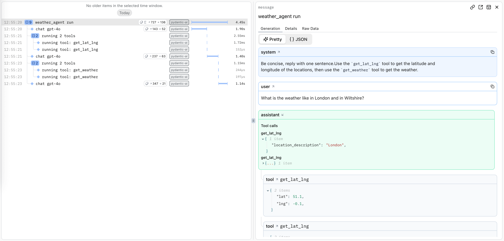

# Debugging and Monitoring

Applications that use LLMs have some challenges that are well known and understood: LLMs are **slow**, **unreliable** and **expensive**.

These applications also have some challenges that most developers have encountered much less often: LLMs are **fickle** and **non-deterministic**. Subtle changes in a prompt can completely change a model's performance, and there's no `EXPLAIN` query you can run to understand why.

!!! danger "Warning"
    From a software engineers point of view, you can think of LLMs as the worst database you've ever heard of, but worse.

    If LLMs weren't so bloody useful, we'd never touch them.

To build successful applications with LLMs, we need new tools to understand both model performance, and the behavior of applications that rely on them.

LLM Observability tools that just let you understand how your model is performing are useless: making API calls to an LLM is easy, it's building that into an application that's hard.

## Pydantic Logfire

[Pydantic Logfire](https://pydantic.dev/logfire) is an observability platform developed by the team who created and maintain Pydantic and PydanticAI. Logfire aims to let you understand your entire application: Gen AI, classic predictive AI, HTTP traffic, database queries and everything else a modern application needs.

!!! tip "Pydantic Logfire is a commercial product"
    Logfire is a commercially supported, hosted platform with an extremely generous and perpetual [free tier](https://pydantic.dev/pricing/).
    You can sign up and start using Logfire in a couple of minutes.

PydanticAI has built-in (but optional) support for Logfire via the [`logfire-api`](https://github.com/pydantic/logfire/tree/main/logfire-api) no-op package.

That means if the `logfire` package is installed and configured, detailed information about agent runs is sent to Logfire. But if the `logfire` package is not installed, there's virtually no overhead and nothing is sent.

Here's an example showing details of running the [Weather Agent](examples/weather-agent.md) in Logfire:



## Using Logfire

To use logfire, you'll need a logfire [account](https://logfire.pydantic.dev), and logfire installed:

```bash
pip/uv-add 'pydantic-ai[logfire]'
```

Then authenticate your local environment with logfire:

```bash
py-cli logfire auth
```

And configure a project to send data to:

```bash
py-cli logfire projects new
```

(Or use an existing project with `logfire projects use`)

The last step is to add logfire to your code:

```python {title="adding_logfire.py"}
import logfire

logfire.configure()
```

The [logfire documentation](https://logfire.pydantic.dev/docs/) has more details on how to use logfire, including how to instrument other libraries like Pydantic, HTTPX and FastAPI.

Since Logfire is build on [OpenTelemetry](https://opentelemetry.io/), you can use the Logfire Python SDK to send data to any OpenTelemetry collector.

Once you have logfire set up, there are two primary ways it can help you understand your application:

* **Debugging** — Using the live view to see what's happening in your application in real-time.
* **Monitoring** — Using SQL and dashboards to observe the behavior of your application, Logfire is effectively a SQL database that stores information about how your application is running.

### Debugging

To demonstrate how Logfire can let you visualise the flow of a PydanticAI run, here's the view you get from Logfire while running the [chat app examples](examples/chat-app.md):

{{ video('a764aff5840534dc77eba7d028707bfa', 25) }}

### Monitoring Performance

We can also query data with SQL in Logfire to monitor the performance of an application. Here's a real world example of using Logfire to monitor PydanticAI runs inside Logfire itself:


