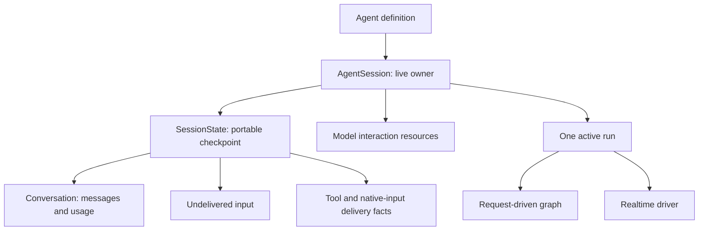

# Sessions

Use [`Agent.session()`][pydantic_ai.agent.Agent.session] when a conversation needs one live owner across multiple runs. A session keeps history, cumulative usage, pending input, and model interaction resources together. A run still owns its dependencies, hooks, tool execution, cancellation, and result.

!!! note "Discussion prototype"
    This API is a working prototype for [#9945](https://github.com/pydantic/pydantic-ai/issues/9945), not a requirement to migrate existing applications. The existing `Agent.run(...)`, `conversation=`, and `agent.realtime(...).session()` entry points remain available.

## Sequential runs

```python {title="sequential_session.py"}
from pydantic_ai import Agent
from pydantic_ai.models.test import TestModel

agent = Agent(TestModel())

async def main():
    async with agent.session() as session:
        first = await session.run('Help me plan a workshop.')
        second = await session.run('Include time for questions.')
        assert first.run_id != second.run_id
        assert first.conversation_id == second.conversation_id
        assert second.usage.requests == 2
        assert first.usage.requests == 1
```

The same owner supports `iter()`, `run_stream()`, and `run_stream_events()`. Pass default `deps=` and `model=` when creating it; individual runs can override them. Enter it once with `async with` on one event loop. Its synchronous run methods are intentionally rejected: use ordinary `agent.run_sync(...)` with `conversation=` for synchronous applications.

The session owns `conversation`, `message_history`, `conversation_id`, and `usage`; do not pass replacements to its run methods. Start from `agent.session(conversation=saved_conversation)` or `agent.session(state=saved_state)` instead. Both inputs are copied. Its `conversation` and `state` properties return detached snapshots, not mutable control surfaces.

Only one ordinary or realtime run may write to a session at a time. Overlapping runs fail with `UserError`; separate sessions can use the same agent concurrently. A completed result stays fixed when subsequent runs extend the session. Closing the owner cancels and drains active work before releasing its resources.

## Input and cancellation

- `session.enqueue(...)` sends input to the active driver's boundary queue, or keeps it for the next run while idle. It does not start a run. See [injecting messages mid-run](message-history.md#injecting-messages-mid-run) for content and priority semantics.
- `session.cancel()` cancels the active run, including setup and lifecycle hooks. It does not close the owner or undo tool effects. It is a no-op while idle.
- `await session.steer(...)` submits provider-native mid-response input when the active transport supports it. It never silently falls back to `enqueue`. See [Responses native steering](models/openai.md#native-steering).

An enqueue ID identifies queued content. A native steering ID identifies a send, not consumption. Neither is a replacement for the provider response ID or the run ID.

## Ownership model



A connection is a runtime resource, not the conversation itself. Ordinary models use the same owner without needing persistent transport support. Models can implement [`Model.open_session()`][pydantic_ai.models.Model.open_session] to return a session-bound model; the default yields the model unchanged. Wrappers and fallback models preserve this scope. [OpenAI Responses WebSocket sessions](models/openai.md#responses-websocket-sessions) provide a concrete persistent transport.

Tools record logical execution separately from delivery of their normalized results. Internal pure transitions decide allowed actions; graph and realtime drivers perform those actions. A completed effect is not run again merely because sending its result failed. These records are observable recovery facts, not an automatic exactly-once executor.

## Realtime runs

For one continuous live run, use `session.realtime(model).session()`. This is the existing realtime interface attached to the common owner. Close it before the next run. Its speech turns, model responses, and tool calls all belong to that one run.

For multiple runs on one live connection, use [`connect()`][pydantic_ai.agent.AgentRealtime.connect] and explicit [`run()`][pydantic_ai.session.RealtimeAgentSession.run] blocks:

```python {title="persistent_realtime_runs.py" test="skip"}
import asyncio

from pydantic_ai import Agent

agent = Agent()

async def main():
    async with agent.session() as session:
        async with session.realtime('openai:gpt-realtime').connect() as live:
            for question in ('What is a solar eclipse?', 'And a lunar eclipse?'):
                async with asyncio.timeout(60):
                    async with live.run() as run:
                        await run.send(question)
                assert run.result is not None
                print(run.result.output)
```

This example requires a live provider. The connection is opened lazily by the first run that reaches the model; a cached or short-circuited run does not dial. Normal run exit waits for outstanding replies, tool work, and input transcripts. Stop audio producers before leaving a run, and set an application deadline when the provider might never finish. A run is not an acoustic turn or a playback acknowledgement.

Each run receives a revocable [`RealtimeRun`][pydantic_ai.realtime.RealtimeRun] handle. Sending, streaming, enqueueing, and turn control have the same semantics as on `RealtimeSession`, but a saved handle cannot control a later run. Results and message snapshots remain readable. Tools and hooks use [`ctx.realtime_run`][pydantic_ai.tools.RunContext.realtime_run]; the old [`ctx.realtime_session`][pydantic_ai.tools.RunContext.realtime_session] remains reserved for the existing one-run session interface. Code supporting both can select `ctx.realtime_run or ctx.realtime_session`.

### Connection boundaries

- Dependencies, metadata, hooks, and tool resources are resolved afresh for each run. Instructions, advertised tool schemas, and wire settings must stay unchanged on a connection. Open a new attachment to change them.
- The connection keeps receiving while idle. Usage and reconnect notifications are connection facts; prior results are not rewritten. Unexpected model output while no run owns it fails the connection instead of attributing it to a later run.
- Cancellation, an exceptional run exit, or `run.close()` aborts the connection. Open another attachment rather than continuing from an uncertain provider state. The common session owner remains available after the attachment closes.
- An open realtime attachment reserves the owner even between runs. Close it before starting an ordinary run or a different live attachment. History then remains available to either driver.
- Provider reconnect/resumption remains governed by [realtime connection lifecycle](realtime/lifecycle.md). Reusing a connection in process does not provide cross-process live resumption.

## Checkpoints and durable execution

Use [`SessionStateTypeAdapter`][pydantic_ai.session.SessionStateTypeAdapter] to save `session.state`. The checkpoint contains no sockets, tasks, dependencies, or execution stack. See [session checkpoints](persistence.md#session-checkpoints) for serialization and [explicit reconciliation](persistence.md#reconciling-interrupted-work) for interrupted effects and uncertain deliveries.

[Temporal, DBOS, and Prefect](durable_execution/overview.md) retain their own execution journals. Ordinary sessions inside their workflows reconstruct state while recorded model/tool operations are replayed; they do not import an active checkpoint as permission to repeat effects. Realtime/Live runs are rejected inside these durable containers, through both legacy wrappers and durability capabilities. A persistent session does not make an unbounded duplex socket replay-safe.

## Compatibility and migration

| Existing code | Prototype behavior | When adopting sessions |
| --- | --- | --- |
| `agent.run(...)`, `iter()`, streaming and sync APIs | Existing entry points remain; no explicit session required | Use an entered owner for sequential async runs |
| Passing `conversation=` between requests | Remains supported | Pass it once to `agent.session(conversation=...)` |
| `agent.realtime(...).session()` | Still one run and returns `RealtimeSession` | Choose `.connect()` on a session owner only when separate live runs are needed |
| `ctx.realtime_session` annotations and consumers | Retains `RealtimeSession \| None` | Explicit persistent runs use the additive `ctx.realtime_run` field |
| `enqueue(...)` | Boundary delivery remains the default | `steer(...)` is a separate, opt-in native operation |
| OpenAI Responses HTTP | Remains the default transport | Select `transport='websocket'` explicitly |
| Existing `Conversation` JSON | Remains readable | Store `SessionState` only if pending input and operation facts must survive |

Two corrections also affect existing entry points: realtime history preserves successful tool outcomes after delivery failure, and streamed completion hooks see the output-tool returns already present in the result. See the [compatibility impact and migration note](changelog.md#session-first-prototype-unreleased).

No released entry point is intentionally removed or renamed. The new owner deliberately rejects overlapping writes, replacing session-owned history per run, synchronous session runs, and importing unresolved checkpoints. These are constraints of opting into a live owner, not new requirements on existing `Agent.run` callers.

The prototype is exercised on asyncio. It does not establish Trio support for the existing lifecycle hooks or persistent realtime driver. Live Responses connection reuse has been verified against a configured gateway; successful native steering and live Realtime have not been verified there because that gateway rejected those requests. Deterministic protocol tests cover the implemented success and failure paths, but are not a substitute for provider acceptance.
