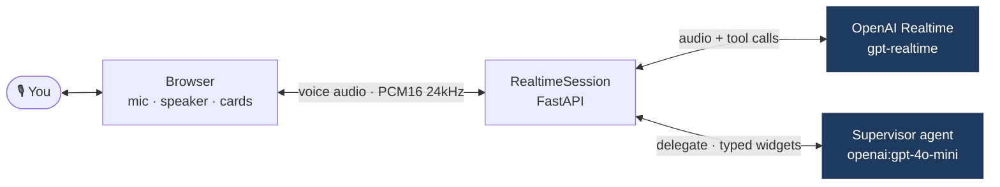
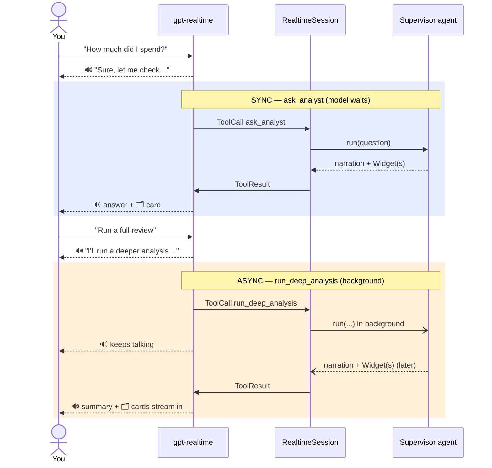

# Realtime finance voice demo

Talk to the model with your voice and hear it answer in **its own generated voice** — true
speech-to-speech. The browser streams your microphone audio into an **OpenAI Realtime** session; the
model listens, acknowledges out loud ("let me check that"), and delegates to a **supervisor** text
agent whose tools return typed Pydantic data that the UI renders as **cards in the chat**. The model
then speaks the answer back.

This is the showcase for `pydantic_ai.realtime` and the **delegation pattern**, with both subagent
dispatch modes:

- **sync** — `ask_analyst` for a quick question; the model waits for the answer.
- **async / background** — `run_deep_analysis` and `plan_savings_goal` for longer scenarios; the model
  keeps talking while a multi-step run happens, and the result cards stream in when ready.

Realtime models can't do structured output or heavy reasoning, so the voice front hands off to a
normal `Agent` whose tool outputs are typed `Widget`s rendered as cards.

## Setup

Everything runs on a single **`OPENAI_API_KEY`** (used for both the realtime voice and the
supervisor). Put it in a `.env` file at the repo root:

```dotenv
OPENAI_API_KEY=sk-...   # needs OpenAI Realtime API access
# optional overrides:
# FINANCE_SUPERVISOR_MODEL=openai:gpt-4o-mini
# FINANCE_REALTIME_MODEL=gpt-realtime
# FINANCE_REALTIME_VOICE=alloy
```

## Run

```bash
uv run --all-packages uvicorn pydantic_ai_examples.realtime_finance.app:app
```

Open <http://localhost:8000>, click the mic, and just talk. Try:

- *"How much did I spend last month?"* — sync, one card.
- *"Run a full review of my finances."* — async, several cards stream in.
- *"Can I save \$20k in 2 years?"* — async, projection + budget + insights.

You can also type. The server prints the resolved models on startup
(`[finance demo] supervisor: … | realtime: … (voice)`).

## How it works

The browser streams your voice to the realtime model; the model speaks back and delegates the
finance work to a supervisor agent, whose typed widgets render as cards.



## Sync vs async tools

The voice model decides which tool to call. `ask_analyst` runs **synchronously** — the model waits
for the answer. `run_deep_analysis` and `plan_savings_goal` are **background** tools — the model keeps
talking while the work runs, and the result (plus its cards) streams in when ready. The session keys
each tool's widgets by call id, so an async run and a later sync run never mix their cards.



## Files

- `data.py` — mocked user finances (accounts, transactions, holdings, subscriptions, history).
- `widgets.py` — typed Pydantic tool outputs (accounts, spending, portfolio, net worth, transactions, subscriptions, budget, projection, insights).
- `supervisor.py` — the analyst agent; its tools return `Widget`s and narrate the result.
- `voice.py` — the voice front with `ask_analyst` (sync) + `run_deep_analysis` / `plan_savings_goal` (async).
- `app.py` — FastAPI server: streams browser audio into a realtime session and the model's audio back; forwards typed messages.
- `index.html` — the UI (WebAudio mic + playback, ordered transcript, inline widget cards).
